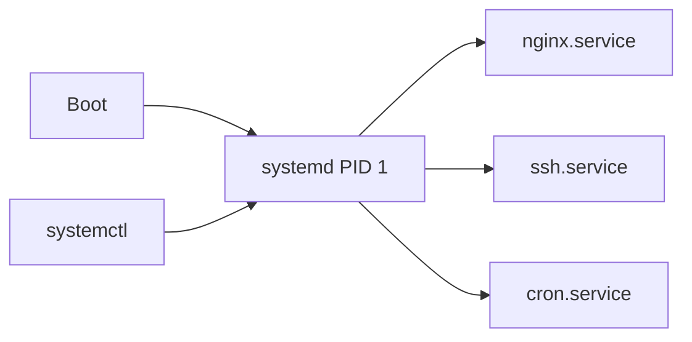

# systemd Services

## 1. What Is This?

**systemd** is the init system and service manager on most modern Linux distros (PID 1). You control services (long-running background programs) with **`systemctl`**.

## 2. Why Is This Needed?

Services like web servers, databases, and SSH must start at boot, restart on failure, and be easy to stop/start/inspect. systemd standardizes all of that.

## 3. Simple Layman Explanation

systemd is the **building manager** who turns the lights and machines on when the building opens (boot), keeps them running, and switches them off on request. `systemctl` is the control panel you use to talk to the manager.

## 4. Technical Explanation

- A **unit** describes something systemd manages; **service units** (`.service`) are the common kind.
- Units live in `/lib/systemd/system/` (packages) and `/etc/systemd/system/` (your overrides).
- **enabled** = starts at boot; **active (running)** = running now. These are independent.
- `journalctl` reads each service's logs (Module 09).

## 5. Real-World Example

After installing Nginx: `sudo systemctl enable --now nginx` makes it run now **and** at every boot. If it crashes, systemd can auto-restart it. To apply a config change: `sudo systemctl reload nginx`.

## 6. Diagram



## 7. Commands

```bash
systemctl status nginx          # is it running? recent logs
sudo systemctl start nginx      # start now
sudo systemctl stop nginx       # stop now
sudo systemctl restart nginx    # stop then start
sudo systemctl reload nginx     # reload config without full restart
sudo systemctl enable nginx     # start at boot
sudo systemctl disable nginx    # don't start at boot
sudo systemctl enable --now nginx   # enable AND start
systemctl is-active nginx       # active/inactive
systemctl is-enabled nginx      # enabled/disabled
systemctl list-units --type=service --state=running
```

## 8. Command Explanation

- `status` → shows active state, PID, uptime, and the last log lines — your first check.
- `start`/`stop`/`restart` → control the running state now.
- `reload` → re-reads config without dropping connections (if the service supports it).
- `enable`/`disable` → control boot behavior (does **not** start/stop immediately).
- `enable --now` → the common one-shot to enable + start.
- `is-active`/`is-enabled` → scriptable yes/no checks.

Expected `status` (trimmed):

```
● nginx.service - A high performance web server
   Active: active (running) since Sat 2026-06-28 10:00:00; 5min ago
```

## 9. Practice Tasks

1. `systemctl status cron` (or `ssh`).
2. `sudo systemctl restart cron` and re-check status.
3. `systemctl is-enabled ssh`.
4. `systemctl list-units --type=service --state=running | head`.

## 10. Common Mistakes

- Thinking `enable` starts the service now — it only affects boot. Use `--now` to do both.
- Editing unit files in `/lib/systemd/system` (overwritten on update) instead of `/etc/systemd/system`.
- Forgetting `sudo systemctl daemon-reload` after changing a unit file.

## 11. Troubleshooting

- **Service won't start** → `systemctl status <svc>` then `journalctl -u <svc> -e` (Module 09).
- **Changes to a unit ignored** → run `sudo systemctl daemon-reload`.
- **Service starts but dies** → check the app's config/logs; `systemctl status` shows the exit code.

(See [service-troubleshooting.md](./service-troubleshooting.md) for a full walkthrough.)

## 12. Best Practices

- Use `enable --now` for services that must survive reboots.
- Prefer `reload` over `restart` for zero-downtime config changes.
- Put custom units/overrides in `/etc/systemd/system/`.

## 13. Quick Recap

- systemd manages services; `systemctl` controls them.
- `start/stop/restart/reload` = now; `enable/disable` = boot.
- `status` + `journalctl -u` are your debugging duo.

## 14. References

- systemd: https://www.freedesktop.org/wiki/Software/systemd/
- `man systemctl`, `man systemd.service`
