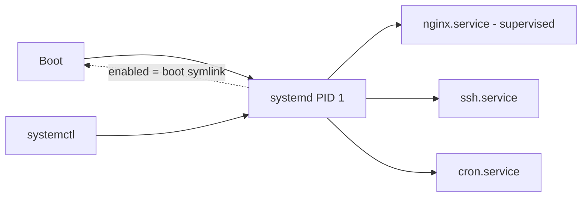

# systemd Services

## 1. What Is This?

**systemd** is the init system and service manager on most modern Linux distros (PID 1). You control services (long-running background programs) with **`systemctl`**.

## 2. Why Is This Needed?

Services like web servers, databases, and SSH must start at boot, restart on failure, and be easy to stop/start/inspect. systemd standardizes all of that.

## 3. Simple Layman Explanation

systemd is the **building manager** who turns the lights and machines on when the building opens (boot), keeps them running, and switches them off on request. `systemctl` is the control panel you use to talk to the manager.

## 4. Technical Explanation

- A **unit** describes something systemd manages; **service units** (`.service`) are the common kind.
- Units live in `/lib/systemd/system/` (packages) and `/etc/systemd/system/` (your overrides).
- **enabled** = starts at boot; **active (running)** = running now. These are independent.
- `journalctl` reads each service's logs (Module 09).

## 5. How It Works Under the Hood

systemd is **PID 1** — the first process the kernel starts, the root of the whole process tree (see [Process Basics](process-basics.md)). Everything else is forked from it, which is *why* it's the natural place to manage services. Two ideas unlock the rest:

- **A service is a process systemd supervises, not just launches.** When you `start nginx`, systemd forks the process, records its PID, and *keeps watching it*. If it exits, systemd knows immediately and — if the unit says `Restart=on-failure` — re-launches it. This supervision is the difference between "I ran a program" and "I have a service": crash recovery, dependency ordering, and resource limits are all systemd holding the process's leash.
- **"enabled" and "active" are genuinely separate, because they answer different questions.** *Active* = "is it running right now?" (runtime state). *Enabled* = "should it start at next boot?" (a symlink systemd creates so the service is pulled in during startup). They're independent: a service can be **active but disabled** (running now, won't survive reboot) or **enabled but inactive** (will start at boot, not running yet). Beginners burn hours because they `enable` a service and wonder why it isn't running — `enable` only wrote the boot symlink. `enable --now` does both.

Under the hood systemd also places each service in its own **cgroup** (the same mechanism containers use — Module 13), which is how it accurately tracks *all* of a service's child processes and can enforce CPU/memory limits. So `systemctl` is a front-end to: fork+supervise, boot-time symlinks, and cgroup accounting.

## 6. Diagram



## 7. Real-World Examples

**1. The everyday case.** After installing Nginx: `sudo systemctl enable --now nginx` makes it run now **and** at every boot. If it crashes, systemd can auto-restart it. To apply a config change: `sudo systemctl reload nginx`.

**2. Reading `status` — active vs enabled at a glance:**

```
$ systemctl status nginx
● nginx.service - A high performance web server
     Loaded: loaded (/lib/systemd/system/nginx.service; enabled; preset: enabled)
     Active: active (running) since Tue 2026-07-02 06:00:11 UTC; 3h ago
   Main PID: 712 (nginx)
      Tasks: 3 (limit: 4915)
     Memory: 8.4M
        CPU: 220ms
     CGroup: /system.slice/nginx.service     # its cgroup — Section 5
             ├─712 nginx: master process
             └─713 nginx: worker process
```

Line 2 says `enabled` (boot) and line 3 says `active (running)` (now) — two independent facts, both green here.

**3. War story — "I enabled it but it's not running."** After deploying a new app, an engineer ran `systemctl enable myapp` and closed the ticket. Monitoring showed the app down. `systemctl status myapp` read `enabled; inactive (dead)` — enabling only wrote the boot symlink (Section 5); nothing started it *now*, and there'd been no reboot. `systemctl start myapp` (or `enable --now` in the first place) fixed it. The enabled≠active confusion is one of the most common systemd gotchas.

## 8. Worked Walkthrough

Drive a service through its states and read each transition:

```
$ systemctl is-enabled cron ; systemctl is-active cron
enabled
active
$ sudo systemctl stop cron
$ systemctl is-active cron
inactive                              # stopped NOW, but...
$ systemctl is-enabled cron
enabled                               # ...still set to start at boot (independent!)
$ sudo systemctl start cron
$ systemctl is-active cron
active
$ sudo systemctl restart cron         # stop + start in one step
$ systemctl status cron | head -3
● cron.service - Regular background program processing daemon
     Loaded: loaded (...; enabled; ...)
     Active: active (running) since Tue 2026-07-02 09:20:41 UTC; 2s ago
```

Watch `is-enabled` stay `enabled` while `is-active` flipped to `inactive` and back — the clearest demonstration of Section 5's two-independent-states point.

## 9. Commands

```bash
systemctl status nginx          # is it running? recent logs
sudo systemctl start nginx      # start now
sudo systemctl stop nginx       # stop now
sudo systemctl restart nginx    # stop then start
sudo systemctl reload nginx     # reload config without full restart
sudo systemctl enable nginx     # start at boot (writes boot symlink only)
sudo systemctl disable nginx    # don't start at boot
sudo systemctl enable --now nginx   # enable AND start
systemctl is-active nginx       # active/inactive
systemctl is-enabled nginx      # enabled/disabled
systemctl list-units --type=service --state=running
```

Sample output for each (dummy values, for reference):

```text
$ sudo systemctl restart nginx
# (no output = success)

$ systemctl is-active nginx
active

$ systemctl is-enabled nginx
enabled

$ systemctl status nginx | head -3
● nginx.service - A high performance web server
     Loaded: loaded (/lib/systemd/system/nginx.service; enabled)
     Active: active (running) since Tue 2026-07-02 06:00:11 UTC; 3h ago

$ systemctl list-units --type=service --state=running | head -4
  UNIT              LOAD   ACTIVE SUB     DESCRIPTION
  cron.service      loaded active running Regular background program...
  nginx.service     loaded active running A high performance web server
  ssh.service       loaded active running OpenBSD Secure Shell server
```

## 10. Command Explanation

- `status` → shows active state, enabled state, PID, uptime, cgroup, and last log lines — your first check.
- `start`/`stop`/`restart` → control the running state *now*.
- `reload` → re-reads config without dropping connections (if the service supports it — often SIGHUP under the hood, Module 05 signals).
- `enable`/`disable` → control **boot** behavior (writes/removes a symlink); does **not** start/stop immediately.
- `enable --now` → the common one-shot to enable + start.
- `is-active`/`is-enabled` → scriptable yes/no checks for the two independent states.

## 11. In Production (DevOps Context)

- **Every production daemon is a systemd unit:** nginx, postgres, docker, your app — all started, supervised, and auto-restarted by systemd with `Restart=on-failure`.
- **Custom app units** in `/etc/systemd/system/myapp.service` give your app crash recovery, log capture (journald), resource limits (via cgroups), and boot startup — for free.
- **`enable --now`** is standard in provisioning (cloud-init/Ansible) so services survive reboots; forgetting `--now` (or `enable`) is a classic "works until the box reboots" bug.
- **Kubernetes' `kubelet`** is itself a systemd service on each node; when nodes go `NotReady`, `journalctl -u kubelet` is the first stop (Module 13).

## 12. Practice Tasks

1. `systemctl status cron` (or `ssh`) and identify the `enabled` and `active` lines.
2. `sudo systemctl stop cron`, then check `is-active` (inactive) vs `is-enabled` (still enabled).
3. `sudo systemctl start cron` and re-check status.
4. `systemctl list-units --type=service --state=running | head`.

## 13. Common Mistakes

- Thinking `enable` starts the service now — it only affects boot (the war story). Use `--now` to do both.
- Editing unit files in `/lib/systemd/system` (overwritten on package update) instead of `/etc/systemd/system`.
- Forgetting `sudo systemctl daemon-reload` after changing a unit file.
- Using `restart` (drops connections) when `reload` would apply config with zero downtime.

## 14. Troubleshooting

- **Service won't start** → `systemctl status <svc>` then `journalctl -u <svc> -e` (Module 09).
- **Changes to a unit ignored** → run `sudo systemctl daemon-reload`, then restart.
- **Service starts but dies** → check the app's config/logs; `systemctl status` shows the exit code and last lines.
- **"enabled but not running"** → you never `start`ed it (or no reboot since `enable`); use `start` / `enable --now`.

## 15. Best Practices

- Use `enable --now` for services that must survive reboots.
- Prefer `reload` over `restart` for zero-downtime config changes.
- Put custom units/overrides in `/etc/systemd/system/`; run `daemon-reload` after edits.
- Set `Restart=on-failure` in custom units for resilience.

## 16. Connects To

- **Prev:** [Kill and Signals](kill-signals.md). **Next:** [Service Troubleshooting](service-troubleshooting.md).
- **Why PID 1 matters:** [Process Basics](process-basics.md).
- **Reading service logs:** [journalctl Basics](../09-logs-monitoring-troubleshooting/journalctl-basics.md).
- **Deep failure method:** [Service Troubleshooting](service-troubleshooting.md).
- **cgroups & containers:** [Linux for Kubernetes](../13-real-world-linux-for-devops/linux-for-kubernetes.md).

## 17. Quick Recap

- systemd (PID 1) manages and **supervises** services; `systemctl` controls them.
- `start/stop/restart/reload` = now; `enable/disable` = boot — **independent** states (`enable --now` does both).
- `status` + `journalctl -u` are your debugging duo; each service runs in its own cgroup.

## 18. References

- systemd: https://www.freedesktop.org/wiki/Software/systemd/
- `man systemctl`, `man systemd.service`

<!-- NAV-FOOTER -->

---

### 🧭 Navigation

| Previous | Up | Next |
|:---|:---:|---:|
| ⬅️ Prev: [Kill and Signals](kill-signals.md) | ⬆️ Module: [Module 05 — Processes & Services](README.md) | ➡️ Next: [Service Troubleshooting](service-troubleshooting.md) |
