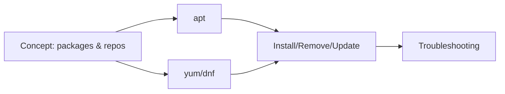

# Module 06 — Package Management

## What You Will Learn

- What package managers are and why they exist.
- Using **apt** (Ubuntu/Debian) to install, remove, update software.
- Using **yum/dnf** (RHEL/CentOS/Fedora).
- The install/remove/update/search workflow.
- Troubleshooting package and repository errors.

## Why This Module Matters

You can't run software you haven't installed. Package managers are how Linux installs, updates, and removes programs safely, handling dependencies for you.

## Real-World Use Case

Setting up a server, you'll install Nginx, Git, curl, and monitoring tools; keep them patched for security; and clean up unused packages — all through the package manager.

## Topics Covered

| File | What It Covers |
|------|----------------|
| [package-management-concept.md](./package-management-concept.md) | Packages, repos, dependencies |
| [apt-ubuntu-debian.md](./apt-ubuntu-debian.md) | apt commands |
| [yum-dnf-rhel-centos.md](./yum-dnf-rhel-centos.md) | yum/dnf commands |
| [install-remove-update-packages.md](./install-remove-update-packages.md) | The common workflow |
| [package-troubleshooting.md](./package-troubleshooting.md) | Fixing package errors |

## Learning Flow

## Hands-On Practice

Update your package index, install a small tool (like `tree` or `htop`), verify it, then remove it cleanly.

## Common Mistakes

- Forgetting `apt update` before installing.
- Running unverified third-party install scripts as root.

## Troubleshooting

- "Unable to locate package" → run `apt update`, check spelling/repo.
- "Could not get lock" → another package process is running.

## Best Practices

- Keep systems patched: `apt update && apt upgrade` regularly.
- Install from official repositories where possible.

## Quick Revision

- apt = Debian/Ubuntu; dnf/yum = RHEL/Fedora.
- Workflow: update index → install → upgrade → remove.

## Next Module

➡️ [07 — Networking Basics](../07-networking-basics/).

<!-- NAV-FOOTER -->

---

### 🧭 Navigation

| Previous | Up | Next |
|:---|:---:|---:|
| ⬅️ Prev: [Service Troubleshooting](../05-processes-and-services/service-troubleshooting.md) | ⬆️ Home: [Learning Linux](../README.md) | ➡️ Next: [Package Management Concept](package-management-concept.md) |
