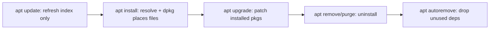

# apt (Ubuntu / Debian)

## 1. What Is This?

**apt** (Advanced Package Tool) is the package manager for Debian and Ubuntu. It installs, updates, and removes `.deb` packages and resolves dependencies automatically.

## 2. Why Is This Needed?

Ubuntu/Debian are the most common beginner and cloud distros. apt is how you install nearly everything on them, from `git` to `nginx`.

## 3. Simple Layman Explanation

apt is the **app store command** for Ubuntu. `update` refreshes the catalog, `install` adds an app, `upgrade` updates everything, `remove` uninstalls.

## 4. Technical Explanation

- `apt` is the modern, user-friendly front end (use this).
- `apt-get`/`apt-cache` are older but still valid (common in scripts).
- `dpkg` is the low-level tool that installs individual `.deb` files.
- The local index lives under `/var/lib/apt/`; repos are configured in `/etc/apt/sources.list` and `/etc/apt/sources.list.d/`.

## 5. How It Works Under the Hood

The single most misunderstood thing about apt is that **`apt update` and `apt upgrade` are completely different actions** — and Section 5 of [the concept topic](package-management-concept.md) explains why:

- **`apt update` only refreshes the local index.** It contacts each repo in `/etc/apt/sources.list(.d)`, downloads the current list of available packages/versions, and caches it under `/var/lib/apt/lists/`. It installs and changes *nothing* on your system — it just updates apt's *knowledge* of what's out there. Skip it and apt resolves against a stale catalog → "Unable to locate package" or an outdated version.
- **`apt upgrade` acts on that knowledge**, downloading and installing newer versions of already-installed packages. So the canonical `apt update && apt upgrade` means "learn what's new, *then* apply it."
- **apt is the resolver; dpkg does the placing.** `apt install nginx` computes the full dependency graph, downloads every `.deb`, and hands them to `dpkg` to unpack into the filesystem and run each package's config scripts. That's why a raw `dpkg -i foo.deb` (no resolver) can leave "unmet dependencies" that `apt install -f` repairs.
- **The lock exists to protect the package database.** Only one apt/dpkg operation can modify the system at a time, so apt takes a lock on `/var/lib/dpkg/lock`. If Ubuntu's background `unattended-upgrades` is running, your manual `apt` waits — hence the "Could not get lock" message (which means *be patient*, not *delete the lock*).
- **`remove` vs `purge`:** remove deletes the program's files but *keeps* its config (so reinstalling restores your settings); `purge` deletes config too. `autoremove` then sweeps up dependencies nothing needs anymore.

## 6. Diagram



## 7. Real-World Examples

**1. The everyday case — fresh cloud server setup:**
```bash
sudo apt update && sudo apt upgrade -y
sudo apt install -y nginx git curl htop
```
Three lines and the server has a web server, version control, and tools — patched and ready.

**2. Watching update vs install:**

```
$ sudo apt update
Hit:1 http://archive.ubuntu.com/ubuntu jammy InRelease
Get:2 http://archive.ubuntu.com/ubuntu jammy-updates InRelease [119 kB]
Fetched 119 kB in 1s
5 packages can be upgraded. Run 'apt list --upgradable' to see them.   # NOTHING installed yet
$ sudo apt install -y tree
The following NEW packages will be installed:
  tree
Setting up tree (2.0.2-1) ...                                          # dpkg placing files
$ dpkg -L tree | grep bin
/usr/bin/tree
```

`update` merely reported "5 can be upgraded"; the actual change happened at `install` — the Section 5 distinction, live.

**3. War story — "Unable to locate package" on a brand-new VM.** An engineer launched a fresh Ubuntu instance and immediately ran `sudo apt install nginx` → `E: Unable to locate package nginx`. Panic about "broken image." The real cause: a fresh image ships with an **empty/stale package index** — apt didn't yet know nginx existed. `sudo apt update` (refresh the index) then `apt install nginx` worked instantly. This is the #1 apt gotcha, and it's pure Section 5: no `update`, no knowledge of the catalog.

## 8. Worked Walkthrough

The full lifecycle of a package, with verification at each step:

```
$ sudo apt update                          # 1. refresh index (always first)
...
$ apt search '^tree$' 2>/dev/null          # 2. confirm exact name
tree/jammy 2.0.2-1 amd64
  displays an indentation list of files
$ sudo apt install -y tree                 # 3. install (resolves deps, dpkg places files)
$ which tree && tree --version             # 4. verify it's there
/usr/bin/tree
tree v2.0.2
$ apt show tree 2>/dev/null | grep -E 'Version|Depends'
Version: 2.0.2-1
$ sudo apt remove -y tree                  # 5. remove (keeps any config)
$ sudo apt autoremove -y                   # 6. sweep unused dependencies
$ which tree || echo "removed"
removed
```

Notice the order: **update → search → install → verify → remove → autoremove**. That's the muscle-memory workflow for every package.

## 9. Commands

```bash
sudo apt update                 # refresh package index (do this first)
sudo apt upgrade -y             # upgrade all installed packages
sudo apt install nginx          # install a package
sudo apt install -y git curl    # install multiple, auto-yes
sudo apt remove nginx           # remove package (keep config)
sudo apt purge nginx            # remove package AND its config
sudo apt autoremove             # remove unused dependencies
apt search htop                 # search for a package
apt show nginx                  # package details
apt list --installed            # list installed packages
sudo dpkg -i package.deb        # install a local .deb file
```

Sample output for each (dummy values, for reference):

```text
$ sudo apt update
Hit:1 http://archive.ubuntu.com/ubuntu jammy InRelease
Reading package lists... Done
12 packages can be upgraded.

$ sudo apt install -y git
Setting up git (1:2.34.1-1ubuntu1.11) ...

$ apt show htop 2>/dev/null | head -4
Package: htop
Version: 3.0.5-7
Priority: optional
Section: utils

$ apt list --installed 2>/dev/null | wc -l
1843

$ sudo dpkg -i ./mytool_1.0_amd64.deb
Selecting previously unselected package mytool.
# if deps are missing: "dpkg: dependency problems" → run: sudo apt install -f
```

## 10. Command Explanation

- `apt update` → downloads the latest list of available packages. **Always run before installing.** It does **not** upgrade anything (Section 5).
- `apt upgrade -y` → installs newer versions of installed packages; `-y` auto-confirms.
- `apt install <pkg>` → resolves and installs a package + dependencies.
- `apt remove` vs `apt purge` → remove keeps config files; purge deletes them too.
- `apt autoremove` → cleans up dependencies no longer needed.
- `dpkg -i file.deb` → installs a downloaded `.deb` (no dependency resolution); fix missing deps with `sudo apt install -f`.

## 11. In Production (DevOps Context)

- **Dockerfiles** use `apt-get` (stable machine output) with the classic one-liner `apt-get update && apt-get install -y --no-install-recommends <pkgs> && rm -rf /var/lib/apt/lists/*` to keep image layers small (Module 13).
- **Provisioning** (Ansible `apt` module, cloud-init) declares packages so every server is identical and patched.
- **Unattended-upgrades** auto-applies security patches — and is the usual holder of the apt lock you'll occasionally wait on (Section 5).
- **`apt-get` in scripts, `apt` interactively:** `apt`'s pretty output isn't guaranteed stable, so automation prefers `apt-get`/`apt-cache`.

## 12. Practice Tasks

1. `sudo apt update` and read which repos it hit.
2. `apt search tree` then `sudo apt install -y tree`.
3. `apt show tree` and `which tree`; find the version and a dependency.
4. `sudo apt remove tree && sudo apt autoremove`.
5. Compare: run `sudo apt install <pkg>` *without* a prior `update` on a fresh box and observe (may fail); then `update` and retry.

## 13. Common Mistakes

- Skipping `apt update`, then "Unable to locate package" (the war story).
- Confusing `remove` with `purge` and leaving config behind.
- Running `dpkg -i` and being surprised by "unmet dependencies" — follow with `apt install -f`.
- Running `apt upgrade` on production without reviewing `apt list --upgradable` first.

## 14. Troubleshooting

- **"Unable to locate package X"** → run `apt update`; check spelling (`apt search`); the package may need an extra repo/PPA.
- **"Could not get lock /var/lib/dpkg/lock"** → another apt/unattended-upgrade is running; wait, or find it with `ps aux | grep -E 'apt|dpkg'`.
- **Broken/half-configured** → `sudo apt install -f` then `sudo dpkg --configure -a`.
- **Install fails midway** → check free disk with `df -h` (Module 08); a full disk aborts installs.

## 15. Best Practices

- `sudo apt update && sudo apt upgrade` regularly for security.
- Use `apt` interactively; `apt-get` in scripts (stable output).
- Prefer official repos; review any PPA/third-party repo before adding.

## 16. Connects To

- **Prev:** [Package Management Concept](package-management-concept.md). **Next:** [yum / dnf (RHEL/CentOS/Fedora)](yum-dnf-rhel-centos.md).
- **The other family:** [yum/dnf](yum-dnf-rhel-centos.md); **side-by-side:** [Install/Remove/Update](install-remove-update-packages.md).
- **When it breaks:** [Package Troubleshooting](package-troubleshooting.md).
- **In images:** [Linux for Docker](../13-real-world-linux-for-devops/linux-for-docker.md).

## 17. Quick Recap

- Workflow: `update` (refresh index only) → `install`/`upgrade` → `remove`/`purge` → `autoremove`.
- `update` ≠ `upgrade`; always `apt update` first, or you search a stale catalog.
- apt resolves dependencies; `dpkg -i` doesn't (use `apt install -f` to repair).

## 18. References

- Ubuntu package management: https://ubuntu.com/server/docs/package-management
- `man apt`, `man dpkg`

<!-- NAV-FOOTER -->

---

### 🧭 Navigation

| Previous | Up | Next |
|:---|:---:|---:|
| ⬅️ Prev: [Package Management Concept](package-management-concept.md) | ⬆️ Module: [Module 06 — Package Management](README.md) | ➡️ Next: [yum / dnf (RHEL / CentOS / Fedora)](yum-dnf-rhel-centos.md) |
