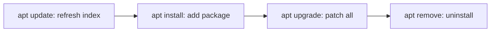

# apt (Ubuntu / Debian)

## 1. What Is This?

**apt** (Advanced Package Tool) is the package manager for Debian and Ubuntu. It installs, updates, and removes `.deb` packages and resolves dependencies automatically.

## 2. Why Is This Needed?

Ubuntu/Debian are the most common beginner and cloud distros. apt is how you install nearly everything on them, from `git` to `nginx`.

## 3. Simple Layman Explanation

apt is the **app store command** for Ubuntu. `update` refreshes the catalog, `install` adds an app, `upgrade` updates everything, `remove` uninstalls.

## 4. Technical Explanation

- `apt` is the modern, user-friendly front end (use this).
- `apt-get`/`apt-cache` are older but still valid (common in scripts).
- `dpkg` is the low-level tool that installs individual `.deb` files.
- The local index lives under `/var/lib/apt/`; repos are configured in `/etc/apt/sources.list` and `/etc/apt/sources.list.d/`.

## 5. Real-World Example

Fresh Ubuntu cloud server setup:
```bash
sudo apt update && sudo apt upgrade -y
sudo apt install -y nginx git curl htop
```
Three lines and the server has a web server, version control, and tools — patched and ready.

## 6. Diagram



## 7. Commands

```bash
sudo apt update                 # refresh package index (do this first)
sudo apt upgrade -y             # upgrade all installed packages
sudo apt install nginx          # install a package
sudo apt install -y git curl    # install multiple, auto-yes
sudo apt remove nginx           # remove package (keep config)
sudo apt purge nginx            # remove package AND its config
sudo apt autoremove             # remove unused dependencies
apt search htop                 # search for a package
apt show nginx                  # package details
apt list --installed            # list installed packages
sudo dpkg -i package.deb        # install a local .deb file
```

## 8. Command Explanation

- `apt update` → downloads the latest list of available packages. **Always run before installing.** It does **not** upgrade anything.
- `apt upgrade -y` → installs newer versions of installed packages; `-y` auto-confirms.
- `apt install <pkg>` → installs a package + dependencies.
- `apt remove` vs `apt purge` → remove keeps config files; purge deletes them too.
- `apt autoremove` → cleans up dependencies no longer needed.
- `dpkg -i file.deb` → installs a downloaded `.deb`; fix missing deps with `sudo apt install -f`.

## 9. Practice Tasks

1. `sudo apt update`.
2. `apt search tree` then `sudo apt install -y tree`.
3. `apt show tree` and `which tree`.
4. `sudo apt remove tree && sudo apt autoremove`.

## 10. Common Mistakes

- Skipping `apt update`, then "Unable to locate package".
- Confusing `remove` with `purge` and leaving config behind.
- Running `apt upgrade` on production without reviewing changes.

## 11. Troubleshooting

- **"Unable to locate package X"** → run `apt update`; check spelling; the package may need an extra repo.
- **"Could not get lock /var/lib/dpkg/lock"** → another apt/unattended-upgrade is running; wait or find it with `ps aux | grep apt`.
- **Broken dependencies** → `sudo apt install -f` then `sudo dpkg --configure -a`.

## 12. Best Practices

- `sudo apt update && sudo apt upgrade` regularly for security.
- Use `apt` interactively; `apt-get` in scripts (stable output).
- Prefer official repos; review any PPA/third-party repo before adding.

## 13. Quick Recap

- Workflow: `update` → `install`/`upgrade` → `remove`/`purge` → `autoremove`.
- Always `apt update` first.
- `dpkg -i` for local `.deb` files.

## 14. References

- Ubuntu package management: https://ubuntu.com/server/docs/package-management
- `man apt`, `man dpkg`
