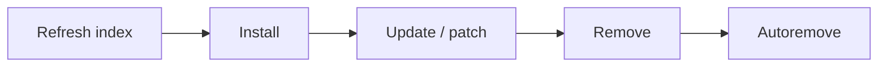

# Install, Remove, Update Packages

## 1. What Is This?

The **common workflow** for managing software, side by side for apt (Ubuntu/Debian) and dnf (RHEL/Fedora), so you can work on either family.

## 2. Why Is This Needed?

You'll switch between distros in real jobs. Knowing the equivalent commands means you're never stuck just because the server isn't Ubuntu.

## 3. Simple Layman Explanation

It's the same four actions everywhere — **refresh the catalog, install, update, uninstall** — just typed slightly differently depending on the system.

## 4. Technical Explanation: apt vs dnf

| Task | apt (Ubuntu/Debian) | dnf (RHEL/Fedora) |
|------|---------------------|-------------------|
| Refresh index | `sudo apt update` | (automatic) |
| Install | `sudo apt install pkg` | `sudo dnf install pkg` |
| Upgrade all | `sudo apt upgrade` | `sudo dnf update` |
| Remove | `sudo apt remove pkg` | `sudo dnf remove pkg` |
| Remove + config | `sudo apt purge pkg` | `sudo dnf remove pkg` |
| Search | `apt search pkg` | `dnf search pkg` |
| Info | `apt show pkg` | `dnf info pkg` |
| List installed | `apt list --installed` | `dnf list installed` |
| Clean unused | `sudo apt autoremove` | `sudo dnf autoremove` |
| Local file | `sudo dpkg -i file.deb` | `sudo rpm -i file.rpm` |

## 5. Real-World Example

You're handed a CentOS box but only know apt. With this table you translate instantly: `apt install nginx` → `dnf install nginx`. The mental model transfers; only the tool name changes.

## 6. Diagram



## 7. Commands

```bash
# Ubuntu/Debian
sudo apt update && sudo apt install -y htop
sudo apt upgrade -y
sudo apt remove -y htop && sudo apt autoremove -y

# RHEL/Fedora
sudo dnf install -y htop
sudo dnf update -y
sudo dnf remove -y htop && sudo dnf autoremove -y
```

## 8. Command Explanation

- The `-y` flag auto-confirms prompts — useful in scripts, but review changes on production.
- `&&` chains commands so the next runs only if the previous succeeded.
- `autoremove` cleans up dependencies left behind after removals.

## 9. Practice Tasks

1. Install `htop` with your system's command.
2. Confirm with `which htop` and `htop --version`.
3. Remove it and run `autoremove`.
4. Write the apt↔dnf equivalent of each command you used.

## 10. Common Mistakes

- Using `-y` blindly on production upgrades.
- Forgetting `apt update` on Debian/Ubuntu before install.
- Expecting `dnf update` to only refresh metadata (it also upgrades).

## 11. Troubleshooting

- **Install fails** → refresh index (apt), check repos, verify the package name.
- **Lock errors** → wait for background updates to finish (Module 06 troubleshooting).
- **Wrong version installed** → check enabled repos; you may need a specific repo.

## 12. Best Practices

- Patch regularly; reboot after kernel updates.
- Script installs with `-y`, but review production changes first.
- Remove unused packages to reduce attack surface.

## 13. Quick Recap

- Four actions: refresh, install, update, remove.
- apt and dnf mirror each other; only names differ.
- `autoremove` keeps systems clean.

## 14. References

- `man apt`, `man dnf`
- [apt-ubuntu-debian.md](./apt-ubuntu-debian.md), [yum-dnf-rhel-centos.md](./yum-dnf-rhel-centos.md)
