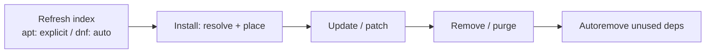

# Install, Remove, Update Packages

## 1. What Is This?

The **common workflow** for managing software, side by side for apt (Ubuntu/Debian) and dnf (RHEL/Fedora), so you can work on either family.

## 2. Why Is This Needed?

You'll switch between distros in real jobs. Knowing the equivalent commands means you're never stuck just because the server isn't Ubuntu.

## 3. Simple Layman Explanation

It's the same four actions everywhere — **refresh the catalog, install, update, uninstall** — just typed slightly differently depending on the system.

## 4. Technical Explanation: apt vs dnf

| Task | apt (Ubuntu/Debian) | dnf (RHEL/Fedora) |
|------|---------------------|-------------------|
| Refresh index | `sudo apt update` | (automatic) |
| Install | `sudo apt install pkg` | `sudo dnf install pkg` |
| Upgrade all | `sudo apt upgrade` | `sudo dnf update` |
| Remove | `sudo apt remove pkg` | `sudo dnf remove pkg` |
| Remove + config | `sudo apt purge pkg` | `sudo dnf remove pkg` |
| Search | `apt search pkg` | `dnf search pkg` |
| Info | `apt show pkg` | `dnf info pkg` |
| List installed | `apt list --installed` | `dnf list installed` |
| Clean unused | `sudo apt autoremove` | `sudo dnf autoremove` |
| Local file | `sudo dpkg -i file.deb` | `sudo rpm -i file.rpm` |

## 5. How It Works Under the Hood

Why do the commands map so cleanly? Because **every mainstream package manager solves the same underlying problem the same way** — only the file format and tool name differ:

- **The mental model is identical:** high-level resolver (`apt`/`dnf`) reads a **repo-backed index**, computes a **dependency graph**, downloads packages, then a low-level placer (`dpkg`/`rpm`) unpacks files into standard FHS paths and runs install scripts. Learn it once and you've learned all of them (see [Package Management Concept](package-management-concept.md)).
- **The one genuine difference to internalize** is the index refresh: apt splits it out (`apt update` first), dnf folds it in (auto-refresh). So the *only* row in the table that isn't a straight rename is "Refresh index." Everything else is a vocabulary swap.
- **The gotchas are symmetrical too:** apt's "purge vs remove" (config kept or deleted) has no exact dnf twin (dnf remove leaves some config as `.rpmsave`); "local file" install (`dpkg -i`/`rpm -i`) skips resolution on *both*, so both need a repair step (`apt install -f` / re-run via `dnf install ./file.rpm`).
- **`-y` is the automation switch** on both: it pre-answers the "Is this OK? [y/N]" confirmation so scripts don't hang waiting for a human. Powerful and identical across families — and equally risky to use blindly on production upgrades.

So the table isn't rote memorization: it's one algorithm wearing two sets of command names, with a single real behavioral difference (index refresh).

## 6. Diagram



## 7. Real-World Examples

**1. The everyday case.** You're handed a CentOS box but only know apt. With the table you translate instantly: `apt install nginx` → `dnf install nginx`. The mental model transfers; only the tool name changes.

**2. The same task on both families, side by side:**

```
# Ubuntu/Debian
$ sudo apt update && sudo apt install -y htop
Setting up htop (3.0.5-7) ...
$ which htop && htop --version | head -1
/usr/bin/htop
htop 3.0.5

# RHEL/Rocky/Fedora
$ sudo dnf install -y htop          # (no separate 'update' — auto-refreshed)
Installed: htop-3.2.1-1.el9.x86_64
$ which htop && htop --version | head -1
/usr/bin/htop
htop 3.2.1
```

Identical outcome, one behavioral difference (the missing `update` on dnf) — exactly Section 5.

**3. War story — the deploy script that only ran on Ubuntu.** A team's setup script hard-coded `apt-get install -y ...`. When they expanded to Amazon Linux (dnf/yum) servers, every deploy failed with `apt-get: command not found`. The fix was a tiny distro check driven by `/etc/os-release`'s `ID_LIKE` (Section 5's "one model, two names") that picked `apt-get` or `dnf` accordingly. Portable automation reads the family first, then uses the matching verbs from the table — which is why knowing *both* dialects matters in real jobs.

## 8. Worked Walkthrough

Detect the family, then run the right dialect from one flow:

```
$ . /etc/os-release; echo "$ID / $ID_LIKE"
ubuntu / debian                       # → apt family (would be 'rhel fedora' for dnf)

# Debian/Ubuntu path:
$ sudo apt update && sudo apt install -y tree
$ which tree && tree --version
/usr/bin/tree
tree v2.0.2
$ sudo apt remove -y tree && sudo apt autoremove -y

# RHEL/Fedora path (equivalent):
#   sudo dnf install -y tree
#   which tree && tree --version
#   sudo dnf remove -y tree && sudo dnf autoremove -y
```

The `. /etc/os-release` line loads `ID`/`ID_LIKE` into shell variables so a script can branch — the portable pattern from the war story. The verbs after that come straight from the Section 4 table.

## 9. Commands

```bash
# Ubuntu/Debian
sudo apt update && sudo apt install -y htop
sudo apt upgrade -y
sudo apt remove -y htop && sudo apt autoremove -y

# RHEL/Fedora
sudo dnf install -y htop
sudo dnf update -y
sudo dnf remove -y htop && sudo dnf autoremove -y
```

Sample output for each (dummy values, for reference):

```text
$ sudo apt install -y htop
Setting up htop (3.0.5-7) ...

$ sudo apt upgrade -y
The following packages will be upgraded:
  libssl3 openssl ...
12 upgraded, 0 newly installed.

$ sudo dnf install -y htop
Installed: htop-3.2.1-1.el9.x86_64

$ sudo dnf update -y
Upgraded: openssl-3.0.7-24.el9.x86_64 ...

$ which htop && htop --version | head -1
/usr/bin/htop
htop 3.2.1
```

## 10. Command Explanation

- The `-y` flag auto-confirms prompts — useful in scripts, but review changes on production.
- `&&` chains commands so the next runs only if the previous succeeded (e.g., don't install if `update` failed).
- `autoremove` cleans up dependencies left behind after removals (both families).
- Remember the one asymmetry: on apt you *must* `update` first; on dnf it's automatic.

## 11. In Production (DevOps Context)

- **Portable provisioning:** Ansible's `package` module (and `ansible_pkg_mgr` fact) abstracts apt/dnf so one playbook targets mixed fleets — the automated version of the war-story fix.
- **Dockerfiles** pick the base image's manager (`apt-get` for Debian/Ubuntu bases, `dnf`/`microdnf` for Red Hat/UBI bases) and clean caches to shrink layers (Module 13).
- **Patch management** across a fleet is `apt upgrade`/`dnf update` on a schedule, often with `-y` and a maintenance window; kernel updates need a reboot.
- **`-y` in CI** keeps pipelines non-interactive; pinning versions keeps builds reproducible.

## 12. Practice Tasks

1. Detect your family: `. /etc/os-release; echo $ID $ID_LIKE`.
2. Install `htop` with your system's command; confirm with `which htop` and `htop --version`.
3. Remove it and run `autoremove`.
4. Write the apt↔dnf equivalent of each command you used (fill in the Section 4 table from memory).

## 13. Common Mistakes

- Using `-y` blindly on production upgrades (review `apt list --upgradable` / `dnf check-update` first).
- Forgetting `apt update` on Debian/Ubuntu before install.
- Expecting `dnf update` to only refresh metadata (it also upgrades — Section 5).
- Hard-coding one manager in "portable" scripts (the war story).

## 14. Troubleshooting

- **Install fails** → refresh index (apt), check enabled repos, verify the exact package name.
- **Lock errors (apt)** → wait for background updates to finish ([Package Troubleshooting](package-troubleshooting.md)).
- **Wrong version installed** → check enabled repos; you may need a specific/extra repo (e.g., EPEL, a PPA).
- **`command not found` for the manager itself** → you're on the other family; branch on `/etc/os-release`.

## 15. Best Practices

- Patch regularly; reboot after kernel updates.
- Script installs with `-y`, but review production changes first.
- Remove unused packages to reduce attack surface.
- Detect the distro family in portable scripts instead of hard-coding a manager.

## 16. Connects To

- **Prev:** [yum / dnf](yum-dnf-rhel-centos.md). **Next:** [Package Troubleshooting](package-troubleshooting.md).
- **The shared model:** [Package Management Concept](package-management-concept.md).
- **Each dialect:** [apt](apt-ubuntu-debian.md), [dnf/yum](yum-dnf-rhel-centos.md).
- **Distro detection:** [What Is Linux?](../00-getting-started/what-is-linux.md).
- **In images/CI:** [Linux for Docker](../13-real-world-linux-for-devops/linux-for-docker.md), [Linux for CI/CD](../13-real-world-linux-for-devops/linux-for-ci-cd.md).

## 17. Quick Recap

- Four actions everywhere: refresh, install, update, remove — one algorithm, two command sets.
- The only real difference: apt needs an explicit `update`; dnf auto-refreshes.
- `-y` automates confirmations; `&&` guards chaining; detect the family for portable scripts.

## 18. References

- `man apt`, `man dnf`
- [apt-ubuntu-debian.md](./apt-ubuntu-debian.md), [yum-dnf-rhel-centos.md](./yum-dnf-rhel-centos.md)

<!-- NAV-FOOTER -->

---

### 🧭 Navigation

| Previous | Up | Next |
|:---|:---:|---:|
| ⬅️ Prev: [yum / dnf (RHEL / CentOS / Fedora)](yum-dnf-rhel-centos.md) | ⬆️ Module: [Module 06 — Package Management](README.md) | ➡️ Next: [Package Troubleshooting](package-troubleshooting.md) |
