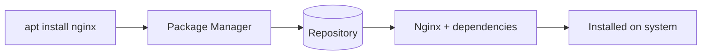

# Package Management Concept

## 1. What Is This?

A **package** is a bundled, ready-to-install piece of software plus its metadata. A **package manager** installs, updates, and removes packages, automatically handling **dependencies** (other packages it needs). **Repositories** are the online stores packages come from.

## 2. Why Is This Needed?

Installing software manually means hunting for files, compiling, and resolving dependencies by hand. Package managers do all of this reliably and let you update everything with one command.

## 3. Simple Layman Explanation

A package manager is like an **app store for your server**. You ask for an app by name; it fetches it, installs everything it needs to work, and can update or uninstall it cleanly later.

## 4. Technical Explanation

| Term | Meaning |
|------|---------|
| Package | Software + metadata (`.deb` for Debian/Ubuntu, `.rpm` for RHEL) |
| Dependency | Another package required for it to work |
| Repository | A server hosting packages, listed in your config |
| Package index | A local list of what's available (refreshed by `update`) |
| Package manager | Tool that ties it together: `apt`, `dnf`, `yum` |

Families:
- **Debian/Ubuntu** → `.deb`, tools: `apt`, `dpkg`.
- **RHEL/CentOS/Fedora** → `.rpm`, tools: `dnf`, `yum`, `rpm`.

## 5. Real-World Example

You run `apt install nginx`. apt checks the repos, sees Nginx needs certain libraries, downloads Nginx **and** those libraries, installs them in the right order, and sets up the service — all automatically.

## 6. Diagram



## 7. Commands

```bash
cat /etc/os-release          # which distro -> which package manager
which apt dnf yum            # see which tools exist
apt-cache policy             # (Debian) configured repositories
dnf repolist                 # (RHEL/Fedora) configured repositories
```

## 8. Command Explanation

- `cat /etc/os-release` → tells you the distro family, hence apt vs dnf.
- `which apt dnf yum` → shows which package tools are present.
- `apt-cache policy` / `dnf repolist` → list the repositories your system trusts.

## 9. Practice Tasks

1. Identify your distro and package manager via `/etc/os-release`.
2. List your configured repositories (`apt-cache policy` or `dnf repolist`).
3. Explain "dependency" in your own words.

## 10. Common Mistakes

- Mixing package managers/distros (don't use `.rpm` instructions on Ubuntu).
- Installing software by piping random internet scripts into `sudo bash`.
- Ignoring the local index being stale (always `update` first).

## 11. Troubleshooting

- Wrong tool? Confirm distro with `/etc/os-release`.
- No repos listed? The system may be misconfigured or offline.

## 12. Best Practices

- Prefer official repositories; verify third-party repos before adding them.
- Keep the index fresh and the system patched.
- Understand dependencies before removing shared packages.

## 13. Quick Recap

- Packages come from repositories; managers handle dependencies.
- Debian/Ubuntu = apt/.deb; RHEL/Fedora = dnf-yum/.rpm.
- Refresh the index before installing.

## 14. References

- Debian packages: https://www.debian.org/doc/manuals/debian-reference/ch02.en.html
- DNF: https://dnf.readthedocs.io/
