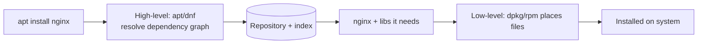

# Package Management Concept

## 1. What Is This?

A **package** is a bundled, ready-to-install piece of software plus its metadata. A **package manager** installs, updates, and removes packages, automatically handling **dependencies** (other packages it needs). **Repositories** are the online stores packages come from.

## 2. Why Is This Needed?

Installing software manually means hunting for files, compiling, and resolving dependencies by hand. Package managers do all of this reliably and let you update everything with one command.

## 3. Simple Layman Explanation

A package manager is like an **app store for your server**. You ask for an app by name; it fetches it, installs everything it needs to work, and can update or uninstall it cleanly later.

## 4. Technical Explanation

| Term | Meaning |
|------|---------|
| Package | Software + metadata (`.deb` for Debian/Ubuntu, `.rpm` for RHEL) |
| Dependency | Another package required for it to work |
| Repository | A server hosting packages, listed in your config |
| Package index | A local list of what's available (refreshed by `update`) |
| Package manager | Tool that ties it together: `apt`, `dnf`, `yum` |

Families:
- **Debian/Ubuntu** → `.deb`, tools: `apt`, `dpkg`.
- **RHEL/CentOS/Fedora** → `.rpm`, tools: `dnf`, `yum`, `rpm`.

## 5. How It Works Under the Hood

A package manager is really doing three jobs, and understanding the split explains every command and error:

- **A package is an archive + metadata.** A `.deb`/`.rpm` is a bundle of files to drop onto the filesystem (into FHS paths — `/usr/bin`, `/etc`, `/lib`) *plus* a manifest listing its version, the files it owns, and — critically — its **dependencies** (other packages it needs) and install scripts. The metadata is what makes it more than a zip.
- **Dependency resolution is the hard part.** Software X needs library Y, which needs Z. The manager reads the **local package index** (a cached copy of everything the repos offer), computes the full dependency graph, and downloads/installs everything in the right order. Doing this by hand is the "dependency hell" package managers were invented to end.
- **Two layers of tooling.** The *low-level* tool (`dpkg`/`rpm`) installs a single file but **does not fetch dependencies** — it just fails if they're missing. The *high-level* tool (`apt`/`dnf`) sits on top: it knows the repos, resolves the graph, downloads everything, then calls the low-level tool to place files. This is why `dpkg -i foo.deb` can leave you with "unmet dependencies" that `apt install -f` then repairs.
- **The index is a cache, so it goes stale.** `apt update` doesn't install anything — it just refreshes that local list from the repos. Skip it and the manager searches an outdated catalog → "Unable to locate package." (dnf refreshes automatically, which is why there's no separate step.)

So: packages carry metadata; the high-level manager resolves+downloads dependencies from repos; the low-level tool places files; the index must be fresh for resolution to see new packages.

## 6. Diagram



## 7. Real-World Examples

**1. The everyday case.** You run `apt install nginx`. apt checks the repos, sees Nginx needs certain libraries, downloads Nginx **and** those libraries, installs them in the right order, and sets up the service — all automatically.

**2. Seeing dependencies and file ownership:**

```
$ apt-cache depends nginx | head -4
nginx
  Depends: nginx-core
  Depends: nginx-common
$ dpkg -L nginx-common | grep etc | head -2      # which files this package OWNS
/etc/nginx/nginx.conf
/etc/nginx/mime.types
$ dpkg -S /usr/sbin/nginx                        # which package owns a given file
nginx-core: /usr/sbin/nginx
```

The manager tracks exactly which package owns which file — the metadata from Section 5 that makes clean upgrades and removals possible.

**3. War story — the `curl | sudo bash` that couldn't be updated.** A team installed a tool by piping an install script from the internet into `sudo bash`. It worked — but months later it had a security flaw, and nobody could patch it: it wasn't a *package*, so the package manager didn't know it existed, couldn't track its files, and couldn't update or cleanly remove it. Reinstalling from the distro repo (`apt install <tool>`) put it under management, where `apt upgrade` patches it automatically. Lesson: prefer real packages so software stays tracked, updatable, and removable (Section 5's metadata is the whole benefit).

## 8. Worked Walkthrough

Identify your package system and inspect the dependency/metadata model:

```
$ grep '^ID' /etc/os-release
ID=ubuntu
ID_LIKE=debian                         # → this box uses apt / .deb
$ command -v apt dnf yum
/usr/bin/apt                           # apt present; dnf/yum absent → Debian family
$ apt-cache policy | head -4           # which repositories are trusted
Package files:
 500 http://archive.ubuntu.com/ubuntu jammy/main amd64 Packages
$ apt show curl 2>/dev/null | grep -E 'Version|Depends' | head -3
Version: 7.81.0-1ubuntu1.16
Depends: libc6 (>= 2.34), libcurl4 (= 7.81.0-1ubuntu1.16), ...
```

`ID_LIKE=debian` picks the tool family (Section 5), `apt-cache policy` shows the repos the index came from, and `apt show` reveals the version + dependency list the resolver uses.

## 9. Commands

```bash
cat /etc/os-release          # which distro -> which package manager
command -v apt dnf yum       # see which tools exist
apt-cache policy             # (Debian) configured repositories
dnf repolist                 # (RHEL/Fedora) configured repositories
dpkg -S /path/to/file        # (Debian) which package owns a file
dnf provides /path/to/file   # (RHEL) which package owns a file
```

Sample output for each (dummy values, for reference):

```text
$ grep '^ID' /etc/os-release
ID=ubuntu
ID_LIKE=debian

$ command -v apt dnf yum
/usr/bin/apt

$ apt-cache policy | head -3
Package files:
 100 /var/lib/dpkg/status
 500 http://archive.ubuntu.com/ubuntu jammy/main amd64 Packages

$ dnf repolist              # (on a Red Hat box)
repo id            repo name
baseos             Rocky Linux 9 - BaseOS
appstream          Rocky Linux 9 - AppStream

$ dpkg -S /usr/bin/curl
curl: /usr/bin/curl
```

## 10. Command Explanation

- `cat /etc/os-release` → tells you the distro family (via `ID`/`ID_LIKE`), hence apt vs dnf.
- `command -v apt dnf yum` → shows which package tools are present.
- `apt-cache policy` / `dnf repolist` → list the repositories your system trusts (the source of the index).
- `dpkg -S` / `dnf provides` → reverse-lookup: which package owns a file — invaluable when a command is missing.

## 11. In Production (DevOps Context)

- **Reproducible servers:** provisioning (cloud-init, Ansible) installs a fixed list of packages so every server is identical — the manager guarantees the same versions + dependencies.
- **Docker images** are built by a package manager: `RUN apt-get update && apt-get install -y ...` in a Dockerfile — the same concepts, baked into an image layer (Module 13).
- **Security patching** is `apt upgrade`/`dnf update` across a fleet; software installed *outside* the manager (the war story) becomes an unpatchable liability.
- **Internal mirrors/repos:** companies host private repositories so builds are fast, offline-capable, and version-pinned; `apt-cache policy`/`dnf repolist` show which are trusted.

## 12. Practice Tasks

1. Identify your distro and package manager via `/etc/os-release` (`ID`/`ID_LIKE`).
2. List your configured repositories (`apt-cache policy` or `dnf repolist`).
3. Find which package owns `/usr/bin/curl` (`dpkg -S` or `dnf provides`).
4. Explain "dependency" and "package index" in your own words.

## 13. Common Mistakes

- Mixing package managers/distros (don't use `.rpm` instructions on Ubuntu).
- Installing software by piping random internet scripts into `sudo bash` (the war story) — it escapes management.
- Ignoring that the local index goes stale (always `apt update` first on Debian/Ubuntu).

## 14. Troubleshooting

- **Wrong tool?** Confirm distro family with `/etc/os-release`.
- **No repos listed?** The system may be misconfigured or offline; check `apt-cache policy` / `dnf repolist`.
- **Missing command, unsure which package?** `dpkg -S` / `dnf provides` finds the owning package.
- Deeper install/lock/repo errors → [Package Troubleshooting](package-troubleshooting.md).

## 15. Best Practices

- Prefer official repositories; verify third-party repos before adding them.
- Keep the index fresh and the system patched.
- Understand dependencies before removing shared packages.
- Install via packages (not ad-hoc scripts) so software stays updatable and removable.

## 16. Connects To

- **Prev:** [Module 06 — Package Management](README.md). **Next:** [apt (Ubuntu/Debian)](apt-ubuntu-debian.md).
- **The tool families:** [apt](apt-ubuntu-debian.md), [dnf/yum](yum-dnf-rhel-centos.md), [side-by-side workflow](install-remove-update-packages.md).
- **Where files land:** [Linux Filesystem Overview](../02-linux-basics/linux-file-system-overview.md).
- **Library layer this feeds:** [Linux Architecture](../02-linux-basics/linux-architecture.md).
- **When it breaks:** [Package Troubleshooting](package-troubleshooting.md).

## 17. Quick Recap

- Packages = files + metadata (deps, ownership); managers resolve dependencies from **repositories**.
- High-level (`apt`/`dnf`) resolves+downloads; low-level (`dpkg`/`rpm`) just places files.
- Debian/Ubuntu = apt/.deb; RHEL/Fedora = dnf-yum/.rpm; refresh the index before installing.

## 18. References

- Debian packages: https://www.debian.org/doc/manuals/debian-reference/ch02.en.html
- DNF: https://dnf.readthedocs.io/

<!-- NAV-FOOTER -->

---

### 🧭 Navigation

| Previous | Up | Next |
|:---|:---:|---:|
| ⬅️ Prev: [Module 06 — Package Management](README.md) | ⬆️ Module: [Module 06 — Package Management](README.md) | ➡️ Next: [apt (Ubuntu / Debian)](apt-ubuntu-debian.md) |
