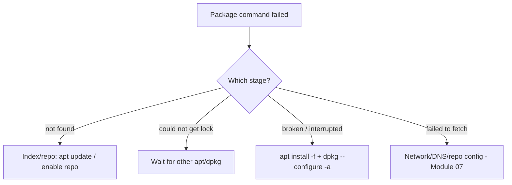

# Package Troubleshooting

## 1. What Is This?

How to fix the common package-manager errors: package not found, lock errors, broken dependencies, and repository/network failures.

## 2. Why Is This Needed?

Package errors block installs and updates, stalling everything else. A few known fixes resolve the vast majority.

## 3. Simple Layman Explanation

If the app store won't work, the usual causes are: outdated catalog, the store is already busy, a half-finished install, or the store's address is wrong. Each has a standard fix.

## 4. Technical Explanation

Most issues fall into four buckets:
1. **Stale index** → refresh it.
2. **Lock held** → another package process is running.
3. **Broken/half-configured packages** → repair them.
4. **Repo/network** → fix sources or connectivity.

## 5. How It Works Under the Hood

Each error class maps to one stage of the install pipeline (index → lock → resolve/place → repo fetch), so the message tells you *where* it broke:

- **"Unable to locate package" / "No match for argument" = the index/resolve stage.** The manager searched its **local catalog** and didn't find the name. On apt that catalog is a *cache* refreshed by `apt update` — stale cache = can't see new packages. Or the package lives in a repo you haven't enabled (EPEL/PPA). It's a *knowledge* failure, not a network one.
- **"Could not get lock" = the safety stage.** Only one process may modify the package database at a time (see [apt topic](apt-ubuntu-debian.md)), so a lock file guards `/var/lib/dpkg/`. If Ubuntu's `unattended-upgrades` is mid-run, your command waits. The lock is *protecting* you from two writers corrupting the DB — which is why force-deleting it mid-operation is dangerous.
- **"Broken dependencies" / "dpkg was interrupted" = the place stage half-finished.** An install was cut off (power loss, killed process, full disk) after unpacking some files but before configuring them, leaving the package database *inconsistent*. `apt install -f` / `dpkg --configure -a` re-run the resolver/configure step to reconcile it.
- **"Failed to fetch" / "Could not resolve host" = the download stage.** The manager knows *what* to get but can't *reach* the repo — DNS, network, proxy, or a dead/expired mirror. This is really a Module 07 networking problem wearing a package-manager message.

So diagnosis is: read *which* message → identify the stage → apply that stage's fix. A "not found" is never solved by fixing the network, and a "failed to fetch" is never solved by `apt update`.

## 6. Diagram



## 7. Real-World Examples

**1. The everyday case.** `apt install nginx` → "Unable to locate package nginx" on a fresh box. `sudo apt update` refreshes the index, and the install then succeeds — a stale-index (Section 5) fix.

**2. Recognizing each error by its message:**

```
$ sudo apt install nginx
E: Unable to locate package nginx                       # index/resolve stage
$ sudo apt install tree
E: Could not get lock /var/lib/dpkg/lock-frontend       # lock stage (something else running)
$ ps aux | grep -E '[a]pt|[d]pkg|unattended'
root  3021  ... /usr/bin/unattended-upgrade             # ← the culprit; just wait
$ sudo apt install -f                                   # repair stage
Correcting dependencies... Done
$ sudo apt update
Err:1 http://archive.ubuntu.com/ubuntu jammy InRelease
  Temporary failure resolving 'archive.ubuntu.com'      # fetch/network stage (DNS)
```

Four different messages, four different stages (Section 5) — the message *is* the diagnosis.

**3. War story — the failed install that was really a full disk.** A nightly job kept failing with `dpkg was interrupted` and broken-dependency errors. Repeated `apt install -f` didn't stick. The real cause: `/` was at 100% (`df -h` showed `0 avail`), so dpkg couldn't finish writing files and left the database half-configured every time (Section 5's "place stage half-finished"). Freeing disk space (Module 08), then `sudo dpkg --configure -a`, resolved it permanently. Lesson: a repeating "broken package" is often a *disk* problem, not a package one — always check `df -h`.

## 8. Worked Walkthrough

Reproduce a "not found", diagnose it, and repair a half-configured state safely:

```
$ sudo apt install ngnx                     # deliberate typo
E: Unable to locate package ngnx
$ apt-cache search '^nginx' | head -1       # find the real name
nginx - small, powerful, scalable web/proxy server
$ sudo apt update                           # ensure the index is fresh
Reading package lists... Done
$ sudo apt install -y nginx                 # correct name → works
Setting up nginx (1.18.0-6ubuntu14) ...

# If a previous install was interrupted, reconcile the package DB:
$ sudo apt install -f                        # fix broken deps
$ sudo dpkg --configure -a                   # finish half-configured packages
$ df -h /                                    # and always confirm you're not out of disk
Filesystem      Size  Used Avail Use% Mounted on
/dev/root       7.6G  4.1G  3.2G  57% /
```

The habit: read the message → map to a stage → fix that stage (name/index, then repair, then verify disk). Don't spray random commands.

## 9. Commands

```bash
sudo apt update                       # refresh index (apt "not found" fix)
apt-cache search <name>               # confirm exact package name
dnf repolist                          # (dnf) are the needed repos enabled?
ps aux | grep -E '[a]pt|[d]pkg'       # find the process holding the lock
sudo apt install -f                   # fix broken dependencies
sudo dpkg --configure -a              # finish half-configured packages
df -h /                               # rule out a full disk (Module 08)
sudo dnf clean all && sudo dnf makecache   # (dnf) rebuild metadata cache
```

Sample output for each (dummy values, for reference):

```text
$ apt-cache search '^htop$'
htop - interactive processes viewer

$ ps aux | grep -E '[a]pt|[d]pkg'
root  3021  0.5 1.2 ... /usr/bin/unattended-upgrade

$ sudo apt install -f
Reading package lists... Done
0 upgraded, 0 newly installed, 0 to remove and 0 not upgraded.

$ sudo dpkg --configure -a
Setting up mytool (1.0) ...

$ df -h /
Filesystem      Size  Used Avail Use% Mounted on
/dev/root       7.6G  4.1G  3.2G  57% /
```

## 10. Command Explanation

- `apt update` → refreshes the index; the fix for apt "Unable to locate package" (stale catalog).
- `apt-cache search` / `dnf search` → confirm the exact package name (typos are common).
- `ps aux | grep -E '[a]pt|[d]pkg'` → identify the process holding the lock (the `[a]` trick hides the grep line itself).
- `apt install -f` → re-resolves and fixes broken dependencies.
- `dpkg --configure -a` → completes packages left half-configured by an interruption.
- `df -h /` → checks disk; a full disk causes repeating "broken package" errors (the war story).

## 11. In Production (DevOps Context)

- **CI/Docker builds** fail on stale indexes if `apt-get update` and `apt-get install` are split across cached layers — the classic "works locally, fails in CI" package bug (Module 13).
- **Fleet patching** trips on the lock when automated upgrades overlap with a deploy; orchestration should serialize package operations.
- **Air-gapped/proxied environments** hit "failed to fetch" constantly — the fix is internal mirrors and correct proxy config, a Module 07 concern.
- **Disk hygiene** matters: `/var/cache/apt` and `/var/lib/docker` fill disks and cause the interrupted-install failures (Module 08) — monitored in production.

## 12. Practice Tasks

1. Run `sudo apt update` and read which sources it hits.
2. Intentionally typo a package name, observe "Unable to locate", then find the real name with `apt-cache search` and fix it.
3. Run `apt list --installed | wc -l` to count installed packages.
4. Check `df -h /` and note free space — connect it to why installs can fail.

## 13. Common Mistakes

- Deleting lock files while apt is genuinely running (can corrupt the package DB — Section 5).
- Adding untrusted repos just to "find" a package.
- Treating a "failed to fetch" (network) as a "not found" (index), or vice versa — the message tells you the stage.
- Ignoring disk-full as a cause of failed/interrupted installs (the war story).

## 14. Troubleshooting

**Scenario A — "Unable to locate package" / "No match for argument"**
- **Symptoms:** `E: Unable to locate package X` (apt) or `No match for argument: X` (dnf).
- **Causes:** stale index (apt), typo, or the package needs an extra repo (EPEL/PPA).
- **Check:** `sudo apt update`; `apt-cache search <name>`; `dnf repolist`.
- **Fix:** ① apt: `sudo apt update`, retry. ② Verify exact name. ③ Enable the providing repo, retry.
- **Prevention:** always `apt update` before installing; know which repos provide what.

**Scenario B — "Could not get lock" (apt)**
- **Symptoms:** `Could not get lock /var/lib/dpkg/lock-frontend ... resource temporarily unavailable`.
- **Causes:** another apt/dpkg or `unattended-upgrades` is running.
- **Check:** `ps aux | grep -E '[a]pt|[d]pkg|unattended'`.
- **Fix:** ① Wait — background updates usually finish. ② Let the identified process complete. ③ Only if truly stuck and nothing is running: `sudo rm /var/lib/apt/lists/lock` and `sudo dpkg --configure -a` (last resort).
- **Prevention:** don't run parallel apt commands; let auto-updates finish.

**Scenario C — Broken dependencies / half-configured**
- **Symptoms:** `dpkg was interrupted`, `unmet dependencies`, failed `apt` runs.
- **Check/Fix:** `sudo apt install -f`; then `sudo dpkg --configure -a`; then `sudo apt update && sudo apt upgrade`.
- **Prevention:** don't interrupt installs; ensure free disk space (`df -h`, Module 08 — the war story).

**Scenario D — Repo/metadata download fails**
- **Symptoms:** `Failed to fetch`, `Could not resolve host`, `Failed to download metadata`.
- **Causes:** no internet, DNS failure, proxy, or a bad/expired repo.
- **Check:** `ping -c 3 archive.ubuntu.com` (Module 07); `cat /etc/apt/sources.list`; `ls /etc/yum.repos.d/`.
- **Fix:** ① Confirm network/DNS. ② Fix or disable the broken repo entry. ③ dnf: `sudo dnf clean all && sudo dnf makecache`.
- **Prevention:** reliable mirrors; valid repo configs; correct proxy if behind one.

## 15. Best Practices

- Refresh index before installing; keep repos clean and trusted.
- Let automatic updates finish before manual runs (don't fight the lock).
- Maintain free disk space so installs don't fail mid-way.
- Read the message to identify the stage before acting.

## 16. Connects To

- **Prev:** [Install, Remove, Update Packages](install-remove-update-packages.md). **Next:** [Module 07 — Networking Basics](../07-networking-basics/README.md).
- **The pipeline these errors map to:** [Package Management Concept](package-management-concept.md), [apt](apt-ubuntu-debian.md), [dnf/yum](yum-dnf-rhel-centos.md).
- **Network/DNS failures:** [Module 07 — Networking](../07-networking-basics/README.md).
- **Disk-full causes:** [Disk Full Troubleshooting](../08-storage-and-disk-management/disk-full-troubleshooting.md).
- **Quick lookup:** [Troubleshooting Cheatsheet](../16-cheatsheets/troubleshooting-cheatsheet.md).

## 17. Quick Recap

- Four stages, four fixes: **not found** → `apt update`/enable repo; **lock** → wait for the other process; **broken** → `apt install -f` + `dpkg --configure -a`; **fetch fail** → check network/DNS/sources.
- The error message tells you which stage broke — match the fix to the stage.
- A repeating "broken package" is often a full disk (`df -h`).

## 18. References

- `man apt`, `man dpkg`, `man dnf`
- Ubuntu apt docs: https://ubuntu.com/server/docs/package-management

<!-- NAV-FOOTER -->

---

### 🧭 Navigation

| Previous | Up | Next |
|:---|:---:|---:|
| ⬅️ Prev: [Install, Remove, Update Packages](install-remove-update-packages.md) | ⬆️ Module: [Module 06 — Package Management](README.md) | ➡️ Next: [Module 07 — Networking Basics](../07-networking-basics/README.md) |
