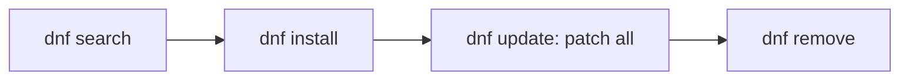

# yum / dnf (RHEL / CentOS / Fedora)

## 1. What Is This?

**dnf** (and its predecessor **yum**) is the package manager for the Red Hat family: RHEL, CentOS, Rocky/Alma Linux, and Fedora. It handles `.rpm` packages and dependencies.

## 2. Why Is This Needed?

A huge share of enterprise servers run RHEL/CentOS. Knowing dnf/yum lets you work on those systems, which behave differently from Ubuntu's apt.

## 3. Simple Layman Explanation

dnf is the **app store command** for Red Hat systems. The verbs are almost the same as apt — `install`, `update`, `remove`, `search` — just a different tool name.

## 4. Technical Explanation

- `dnf` is the modern tool (Fedora, RHEL 8+). `yum` is the older tool (RHEL 7); on modern systems `yum` is a symlink to `dnf`.
- `rpm` is the low-level tool for single `.rpm` files (like `dpkg`).
- Repos are configured in `/etc/yum.repos.d/*.repo`.
- Note: on dnf, `update` upgrades packages (there's no separate "refresh index" command — it refreshes automatically).

## 5. Real-World Example

Setting up a RHEL web server:
```bash
sudo dnf -y update
sudo dnf -y install nginx git curl
sudo systemctl enable --now nginx
```
Equivalent to the Ubuntu flow, with dnf instead of apt.

## 6. Diagram



## 7. Commands

```bash
sudo dnf update                 # update all packages (also refreshes metadata)
sudo dnf install nginx          # install a package
sudo dnf install -y git curl    # install multiple, auto-yes
sudo dnf remove nginx           # remove a package
dnf search htop                 # search
dnf info nginx                  # package details
dnf list installed              # list installed packages
sudo dnf autoremove             # remove unused dependencies
sudo rpm -i package.rpm         # install a local .rpm
dnf provides /usr/bin/htop      # which package provides a file
```

(Replace `dnf` with `yum` on older RHEL/CentOS 7 — same subcommands.)

## 8. Command Explanation

- `dnf update` → upgrades installed packages and refreshes metadata in one step.
- `dnf install <pkg>` → installs with dependencies.
- `dnf remove <pkg>` → uninstalls.
- `dnf provides <path>` → finds which package owns a file (very handy).
- `rpm -i file.rpm` → installs a downloaded rpm; `rpm -q <pkg>` queries if installed.

## 9. Practice Tasks

(On a RHEL/CentOS/Fedora system or container)
1. `sudo dnf -y install tree`.
2. `dnf info tree` and `which tree`.
3. `dnf provides /usr/bin/tree`.
4. `sudo dnf remove tree`.

## 10. Common Mistakes

- Running `apt` commands on a Red Hat system (wrong family).
- Looking for a separate "update index" step (dnf does it automatically).
- Confusing `dnf update` (upgrade packages) with apt's `apt update` (refresh index only).

## 11. Troubleshooting

- **"No match for argument"** → spelling or the package isn't in enabled repos (`dnf repolist`).
- **"Failed to download metadata"** → repo/network/proxy issue; check `/etc/yum.repos.d/`.
- **Cache problems** → `sudo dnf clean all && sudo dnf makecache`.

## 12. Best Practices

- Keep systems patched: `sudo dnf update` regularly.
- Use official repos (BaseOS/AppStream) and trusted ones like EPEL.
- Use `dnf provides` to find the package behind a missing command.

## 13. Quick Recap

- dnf/yum = Red Hat family; verbs mirror apt.
- `dnf update` both refreshes and upgrades.
- `rpm` for single files; `dnf provides` to find owners.

## 14. References

- DNF docs: https://dnf.readthedocs.io/
- Red Hat package management: https://access.redhat.com/documentation/
