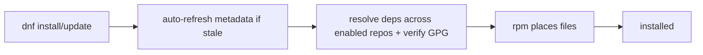

# yum / dnf (RHEL / CentOS / Fedora)

## 1. What Is This?

**dnf** (and its predecessor **yum**) is the package manager for the Red Hat family: RHEL, CentOS, Rocky/Alma Linux, and Fedora. It handles `.rpm` packages and dependencies.

## 2. Why Is This Needed?

A huge share of enterprise servers run RHEL/CentOS. Knowing dnf/yum lets you work on those systems, which behave differently from Ubuntu's apt.

## 3. Simple Layman Explanation

dnf is the **app store command** for Red Hat systems. The verbs are almost the same as apt — `install`, `update`, `remove`, `search` — just a different tool name.

## 4. Technical Explanation

- `dnf` is the modern tool (Fedora, RHEL 8+). `yum` is the older tool (RHEL 7); on modern systems `yum` is a symlink to `dnf`.
- `rpm` is the low-level tool for single `.rpm` files (like `dpkg`).
- Repos are configured in `/etc/yum.repos.d/*.repo`.
- Note: on dnf, `update` upgrades packages (there's no separate "refresh index" command — it refreshes automatically).

## 5. How It Works Under the Hood

dnf follows the same high-level/low-level split as apt (see [the concept topic](package-management-concept.md)), but with two Red-Hat-specific behaviors that trip up people coming from Ubuntu:

- **There is no separate `update`-the-index step.** dnf checks whether its cached metadata is older than a freshness window and, if so, **auto-refreshes it before any operation**. So `dnf install`/`dnf update` transparently update the catalog first. This is *why* `dnf update` means "upgrade all my packages" — a false friend for apt users, where `apt update` only refreshes the index. On Red Hat, the "refresh + upgrade" that Ubuntu splits into two commands is one command.
- **Repos are files, not one list.** Each repository is a `.repo` file in `/etc/yum.repos.d/` with its own enable flag, base URL, and GPG key. dnf merges all enabled repos into the graph it resolves. Adding EPEL (Extra Packages for Enterprise Linux) is literally dropping in a `.repo` file — which is how packages "missing" from base RHEL become available.
- **dnf resolves; rpm places.** `dnf install httpd` computes the dependency graph across enabled repos, downloads the `.rpm`s, verifies their **GPG signatures** (Red Hat is strict about signed packages), then calls `rpm` to unpack files into FHS paths and run scriptlets. A raw `rpm -i foo.rpm` skips resolution and fails on missing deps — the `dpkg` parallel.
- **`dnf provides` is the killer feature:** because rpm metadata records every file each package owns, you can ask "which package would give me `/usr/bin/htop`?" *before* installing.

So mentally: dnf = apt's resolver with auto-refreshed metadata; `.repo` files = the trusted sources; `rpm` = the file placer; signatures verified along the way.

## 6. Diagram



## 7. Real-World Examples

**1. The everyday case — RHEL web server:**
```bash
sudo dnf -y update
sudo dnf -y install nginx git curl
sudo systemctl enable --now nginx
```
Equivalent to the Ubuntu flow, with dnf instead of apt (and no separate index refresh).

**2. Finding and owning files:**

```
$ dnf provides /usr/bin/htop          # which package would provide this command?
htop-3.2.1-1.el9.x86_64 : Interactive process viewer
Repo        : epel
$ sudo dnf -y install htop
Installed:
  htop-3.2.1-1.el9.x86_64
$ rpm -qf /usr/bin/htop               # which installed package owns this file?
htop-3.2.1-1.el9.x86_64
$ rpm -q --requires htop | head -3    # its dependencies
libc.so.6()(64bit)
libncursesw.so.6()(64bit)
```

`dnf provides` told us htop lives in the **epel** repo *before* installing — Section 5's file-ownership metadata at work.

**3. War story — "No match for argument: htop" on stock RHEL.** An engineer tried `dnf install htop` on a fresh RHEL box and got `No match for argument: htop`. Not a typo, not a stale index (dnf auto-refreshes) — htop simply **isn't in RHEL's base repos**; it lives in **EPEL**. `dnf provides '*/htop'` confirmed the package/repo, `sudo dnf install -y epel-release` added the repo, and `dnf install htop` then worked. Lesson unique to Red Hat: many common tools require enabling EPEL first (Section 5's "repos are files" point).

## 8. Worked Walkthrough

Install, verify, trace ownership, and remove on a Red Hat system:

```
$ cat /etc/os-release | grep '^ID'
ID="rocky"
ID_LIKE="rhel centos fedora"          # → dnf / .rpm family
$ dnf repolist                        # which repos are enabled
repo id      repo name
appstream    Rocky Linux 9 - AppStream
baseos       Rocky Linux 9 - BaseOS
$ sudo dnf -y install tree
Installed:
  tree-1.8.0-10.el9.x86_64
$ which tree && tree --version
/usr/bin/tree
tree v1.8.0
$ rpm -qf /usr/bin/tree               # confirm the owning package
tree-1.8.0-10.el9.x86_64
$ sudo dnf -y remove tree
Removed:
  tree-1.8.0-10.el9.x86_64
```

Note there was no `dnf update` needed before `install` — dnf refreshed metadata on its own (Section 5). On RHEL 7 you'd type `yum` instead of `dnf` with identical subcommands.

## 9. Commands

```bash
sudo dnf update                 # update all packages (also refreshes metadata)
sudo dnf install nginx          # install a package
sudo dnf install -y git curl    # install multiple, auto-yes
sudo dnf remove nginx           # remove a package
dnf search htop                 # search
dnf info nginx                  # package details
dnf list installed              # list installed packages
sudo dnf autoremove             # remove unused dependencies
sudo rpm -i package.rpm         # install a local .rpm
dnf provides /usr/bin/htop      # which package provides a file
```

(Replace `dnf` with `yum` on older RHEL/CentOS 7 — same subcommands.)

Sample output for each (dummy values, for reference):

```text
$ sudo dnf -y install nginx
Dependencies resolved.
Installed:
  nginx-1.20.1-14.el9.x86_64  nginx-core-1.20.1-14.el9.x86_64

$ dnf info nginx | head -5
Name         : nginx
Version      : 1.20.1
Release      : 14.el9
Architecture : x86_64
Size         : 40 M

$ dnf provides /usr/bin/htop
htop-3.2.1-1.el9.x86_64 : Interactive process viewer
Repo : epel

$ rpm -q nginx
nginx-1.20.1-14.el9.x86_64
```

## 10. Command Explanation

- `dnf update` → upgrades installed packages **and** refreshes metadata in one step (unlike apt).
- `dnf install <pkg>` → resolves and installs with dependencies (verifying GPG signatures).
- `dnf remove <pkg>` → uninstalls.
- `dnf provides <path>` → finds which package owns/would provide a file (very handy — the EPEL detective in the war story).
- `rpm -i file.rpm` → installs a downloaded rpm (no resolution); `rpm -q <pkg>` queries if installed; `rpm -qf <file>` finds the owning package.

## 11. In Production (DevOps Context)

- **Enterprise fleets** run RHEL/Rocky/Alma; dnf + subscription/satellite repos manage patching at scale with signed packages.
- **EPEL** is near-universal on RHEL servers to get common tooling (the war story) — enabling it is a standard first step.
- **UBI/`FROM rockylinux` images** use `dnf` in Dockerfiles; `dnf clean all` keeps layers small (Module 13).
- **`dnf provides`** is the fastest way to answer "what package do I install to get command X?" — a daily reflex on unfamiliar Red Hat boxes.
- **Version pinning & modules** (`dnf module`) let teams lock language/runtime streams for reproducibility.

## 12. Practice Tasks

(On a RHEL/CentOS/Rocky/Fedora system or container)
1. `sudo dnf -y install tree`.
2. `dnf info tree` and `which tree`.
3. `dnf provides /usr/bin/tree` and `rpm -qf /usr/bin/tree`.
4. `sudo dnf remove tree`.
5. If a tool is "not found", try `dnf provides '*/<tool>'` to see which repo (e.g., EPEL) has it.

## 13. Common Mistakes

- Running `apt` commands on a Red Hat system (wrong family).
- Looking for a separate "update index" step (dnf does it automatically — Section 5).
- Confusing `dnf update` (upgrades packages) with apt's `apt update` (refresh index only).
- Assuming every common tool is in base repos — many need EPEL (the war story).

## 14. Troubleshooting

- **"No match for argument"** → spelling, or the package isn't in enabled repos; try `dnf provides '*/<name>'` and enable the repo (often `epel-release`).
- **"Failed to download metadata"** → repo/network/proxy issue; check `/etc/yum.repos.d/` and DNS (Module 07).
- **GPG/signature errors** → the repo's key is missing/untrusted; import the correct key or fix the `.repo` file.
- **Cache problems** → `sudo dnf clean all && sudo dnf makecache`.

## 15. Best Practices

- Keep systems patched: `sudo dnf update` regularly.
- Use official repos (BaseOS/AppStream) and trusted ones like EPEL; keep GPG checking on.
- Use `dnf provides` to find the package behind a missing command.

## 16. Connects To

- **Prev:** [apt (Ubuntu/Debian)](apt-ubuntu-debian.md). **Next:** [Install, Remove, Update Packages](install-remove-update-packages.md).
- **The concept & dependency model:** [Package Management Concept](package-management-concept.md).
- **apt↔dnf side-by-side:** [Install/Remove/Update](install-remove-update-packages.md).
- **When it breaks:** [Package Troubleshooting](package-troubleshooting.md).

## 17. Quick Recap

- dnf/yum = Red Hat family (`.rpm`); verbs mirror apt, but `dnf update` refreshes **and** upgrades.
- Repos are `.repo` files in `/etc/yum.repos.d/`; many tools need EPEL enabled.
- `rpm` handles single files; `dnf provides` / `rpm -qf` find owning packages.

## 18. References

- DNF docs: https://dnf.readthedocs.io/
- Red Hat package management: https://access.redhat.com/documentation/

<!-- NAV-FOOTER -->

---

### 🧭 Navigation

| Previous | Up | Next |
|:---|:---:|---:|
| ⬅️ Prev: [apt (Ubuntu / Debian)](apt-ubuntu-debian.md) | ⬆️ Module: [Module 06 — Package Management](README.md) | ➡️ Next: [Install, Remove, Update Packages](install-remove-update-packages.md) |
