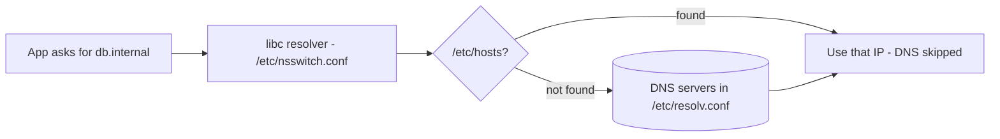

# IP, Hostname, and DNS

## 1. What Is This?

Managing a host's **IP address**, its **hostname** (its name), and **DNS** (the system that turns names into IPs).

## 2. Why Is This Needed?

You constantly need to know a server's IP, set or read its hostname, and verify that name resolution works — DNS is behind a huge fraction of "it won't connect" issues.

## 3. Simple Layman Explanation

- **IP** = your house's coordinates.
- **Hostname** = your house's nickname ("the blue house").
- **DNS** = the directory that maps nicknames and names to coordinates.

## 4. Technical Explanation

- `ip` is the modern tool for addresses/routes (replaces old `ifconfig`).
- Hostname is stored in `/etc/hostname`; `hostnamectl` manages it on systemd systems.
- Name resolution order: `/etc/hosts` (local overrides) → DNS servers in `/etc/resolv.conf`.
- Tools: `dig`, `nslookup`, `host`, `getent` query DNS.

## 5. How It Works Under the Hood

When a program calls "connect me to `db.internal`", it doesn't talk to DNS directly — it asks the C library's **resolver**, which follows a configured order set in `/etc/nsswitch.conf` (the `hosts:` line). The default order is the key to everything:

1. **`/etc/hosts` first.** This local file of `IP  name` lines is checked *before* any DNS server. A match here wins immediately and DNS is never consulted. That's powerful (instant local overrides) and dangerous (a stale entry silently masks the real DNS record — a classic "why is it going to the wrong server?!" bug).
2. **DNS servers next**, taken from `/etc/resolv.conf` (`nameserver` lines). The resolver sends a UDP query to each in turn and caches the answer for its **TTL** (time-to-live). This is why a DNS change can take minutes to propagate — you're waiting out cached TTLs, not a "slow internet."

Two gotchas fall out of this design:
- **`ping name` failing while `ping 8.8.8.8` works** proves the *network* is fine and the *resolver* is broken — you've isolated the fault to step 1/2 without touching anything else.
- **`/etc/resolv.conf` is often auto-managed** (by `systemd-resolved`, NetworkManager, or DHCP/cloud-init). Hand-editing it "works" until the manager rewrites it on the next network event — which is why your fix mysteriously reverts.

Meanwhile, the **hostname** (what `hostname`/`hostnamectl` show) is just the machine's own name label — separate from DNS. Setting it doesn't create a DNS record; it's cosmetic identity plus what appears in prompts and logs.

## 6. Diagram



## 7. Real-World Examples

**1. The everyday case.** An app can't reach `db.internal`. `getent hosts db.internal` returns nothing → DNS isn't resolving it. You add a temporary `/etc/hosts` entry to confirm the app otherwise works, then fix the real DNS record.

**2. Reading address, route, and resolution:**

```
$ ip -brief a
lo    UNKNOWN  127.0.0.1/8
eth0  UP       10.0.4.12/24                 # this host's IP
$ ip route | grep default
default via 10.0.4.1 dev eth0               # the gateway packets leave through
$ getent hosts github.com
140.82.121.4    github.com                   # resolver returned an IP → DNS works
$ dig +short github.com
140.82.121.4
```

`ip` shows *where you are*, `ip route` shows *how you get out*, `getent`/`dig` prove *name resolution works* — the three questions this topic answers.

**3. War story — the stale `/etc/hosts` line that broke a migration.** After moving a database to a new server, an app kept connecting to the *old* IP even though DNS was updated correctly (`dig db.internal` showed the new IP). The cause: months earlier someone had pinned `10.0.4.50 db.internal` in `/etc/hosts` for testing. Because `/etc/hosts` is checked **before** DNS (Section 5), the app never saw the new record. Removing the stale line fixed it instantly. Lesson: when name resolution defies DNS, check `/etc/hosts` first — it overrides everything.

## 8. Worked Walkthrough

Trace resolution and prove the `/etc/hosts`-before-DNS rule yourself:

```
$ cat /etc/resolv.conf
nameserver 127.0.0.53                        # systemd-resolved stub (auto-managed!)
$ getent hosts example.com
93.184.216.34   example.com                  # resolves via DNS
$ dig +short example.com @8.8.8.8            # cross-check against a public resolver
93.184.216.34
# Now demonstrate the override precedence:
$ echo "127.0.0.1 example.com" | sudo tee -a /etc/hosts
$ getent hosts example.com
127.0.0.1       example.com                  # /etc/hosts WON — DNS never consulted
$ sudo sed -i '/127.0.0.1 example.com/d' /etc/hosts   # clean up the test line
$ getent hosts example.com
93.184.216.34   example.com                  # back to DNS
```

You just watched `/etc/hosts` hijack a name that DNS resolves differently — the exact mechanism behind the war story (Section 5).

## 9. Commands

```bash
ip a                         # show IP addresses
ip route                     # routing table / default gateway
hostname                     # current hostname
hostnamectl                  # detailed host info
sudo hostnamectl set-hostname web01   # set hostname
cat /etc/hosts               # local name->IP overrides (checked first)
cat /etc/resolv.conf         # configured DNS servers
getent hosts example.com     # resolve via the system resolver (hosts + DNS)
dig example.com              # detailed DNS query
dig +short example.com @8.8.8.8   # query a specific resolver
```

Sample output for each (dummy values, for reference):

```text
$ ip -brief a
lo    UNKNOWN  127.0.0.1/8 ::1/128
eth0  UP       10.0.4.12/24

$ ip route
default via 10.0.4.1 dev eth0 proto dhcp
10.0.4.0/24 dev eth0 proto kernel scope link src 10.0.4.12

$ hostnamectl
   Static hostname: web01
   Operating System: Ubuntu 22.04.4 LTS

$ getent hosts github.com
140.82.121.4    github.com

$ dig +short github.com
140.82.121.4
```

## 10. Command Explanation

- `ip a` / `ip route` → addresses and the default gateway (how packets leave).
- `hostnamectl set-hostname web01` → permanently sets the hostname (cosmetic identity, not a DNS record).
- `/etc/hosts` → manual name→IP mappings, checked **before** DNS (Section 5).
- `/etc/resolv.conf` → lists DNS servers (`nameserver ...`); often auto-managed.
- `getent hosts` → uses the *full* system resolution path (hosts + DNS) — the truest test of "what will my app resolve?".
- `dig` → shows the resolved IP, answer section, and timing; `@8.8.8.8` forces a specific resolver to isolate faults.

## 11. In Production (DevOps Context)

- **Service discovery** in microservices is DNS: services call each other by name, and internal DNS (CoreDNS in Kubernetes, Route 53 in AWS) resolves them. A DNS outage looks like "everything is down" (Module 13).
- **`/etc/hosts` in containers** is written by the runtime; Kubernetes injects service DNS via `/etc/resolv.conf` search domains — the same resolver order applies.
- **TTL awareness** matters for zero-downtime cutovers: low TTLs before a migration let DNS changes propagate fast.
- **Cloud metadata & DHCP** manage `resolv.conf`; hand-edits get overwritten (Section 5) — the supported fix is the network manager's config, not the file.

## 12. Practice Tasks

1. `ip a` and `ip route` — find your IP and gateway.
2. `hostname` and `hostnamectl`.
3. `cat /etc/resolv.conf` — note your DNS servers (is it the systemd stub `127.0.0.53`?).
4. `dig +short github.com` and `getent hosts github.com`.
5. Add `127.0.0.1 myapp.local` to `/etc/hosts`, `getent hosts myapp.local`, then remove it — observe the override.

## 13. Common Mistakes

- Editing `/etc/resolv.conf` directly when it's auto-managed (changes get overwritten — Section 5).
- Forgetting `/etc/hosts` is checked first — a stale entry masks real DNS (the war story).
- Confusing the hostname with a DNS record (setting one doesn't create the other).
- Using deprecated `ifconfig` instead of `ip`.

## 14. Troubleshooting

- **Name fails, IP works** → DNS issue: check `/etc/resolv.conf`, try `dig name @8.8.8.8`.
- **Wrong IP returned** → stale `/etc/hosts` entry or cached DNS (wait out the TTL).
- **Fix to resolv.conf reverts** → it's auto-managed; change the network manager/systemd-resolved config instead.
- **No default route** → `ip route` shows no `default`; networking misconfigured.

## 15. Best Practices

- Use `/etc/hosts` only for deliberate, documented local overrides.
- Test DNS against a known public resolver (`dig ... @8.8.8.8`) to isolate resolver vs. record issues.
- Set meaningful hostnames (e.g., `web01-prod`); manage `resolv.conf` via the proper tool.

## 16. Connects To

- **Prev:** [Networking Fundamentals](networking-fundamentals.md). **Next:** [ping, curl, wget](ping-curl-wget.md).
- **The four-layer model:** [Networking Fundamentals](networking-fundamentals.md).
- **Testing resolution/reachability:** [ping, curl, wget](ping-curl-wget.md).
- **Layered method:** [Network Troubleshooting](network-troubleshooting.md).
- **Service DNS at scale:** [Linux for Kubernetes](../13-real-world-linux-for-devops/linux-for-kubernetes.md).

## 17. Quick Recap

- `ip a`/`ip route` for addresses/gateway; `hostnamectl` for the (cosmetic) name.
- Resolution order: `/etc/hosts` (wins first) → DNS servers in `/etc/resolv.conf` (cached by TTL).
- `getent`/`dig` test resolution; `resolv.conf` is often auto-managed — edit the right layer.

## 18. References

- `man ip`, `man hostnamectl`, `man dig`, `man resolv.conf`, `man nsswitch.conf`
- systemd-resolved: https://www.freedesktop.org/software/systemd/man/systemd-resolved.html

<!-- NAV-FOOTER -->

---

### 🧭 Navigation

| Previous | Up | Next |
|:---|:---:|---:|
| ⬅️ Prev: [Networking Fundamentals](networking-fundamentals.md) | ⬆️ Module: [Module 07 — Networking Basics](README.md) | ➡️ Next: [ping, curl, wget](ping-curl-wget.md) |
