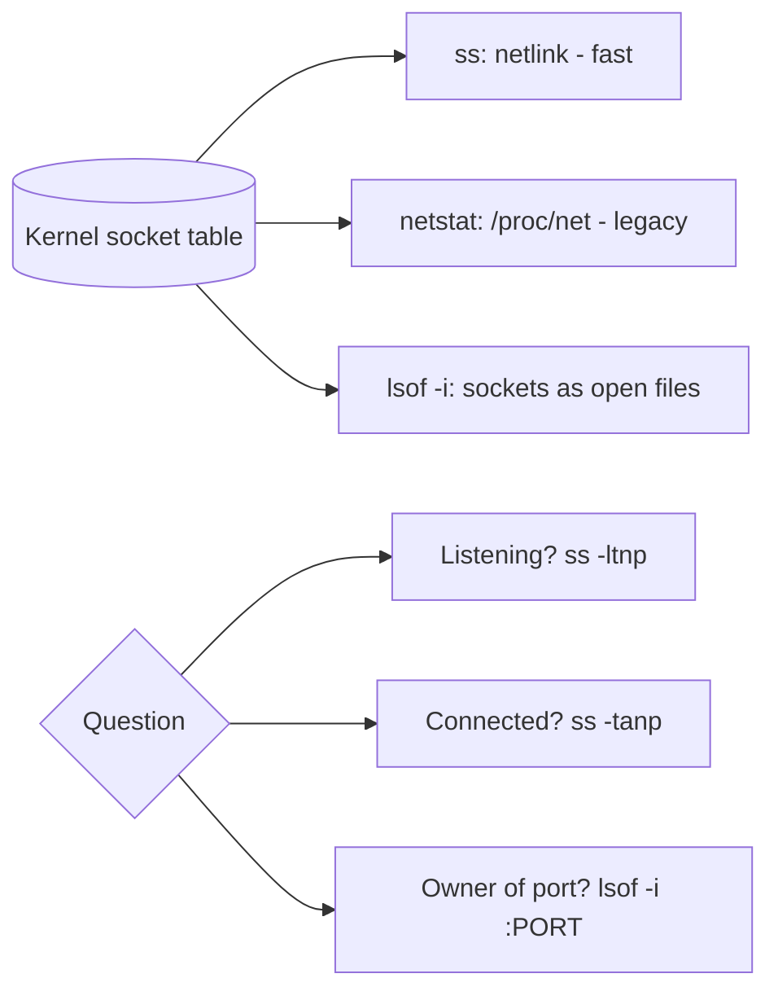

# netstat, ss, and lsof

## 1. What Is This?

Tools to **inspect network connections and ports**: `ss` (modern), `netstat` (legacy), and `lsof` (lists open files, including network sockets).

## 2. Why Is This Needed?

To answer "what's listening?", "who's connected?", and "which process owns this port?" — the backbone of network and service troubleshooting.

## 3. Simple Layman Explanation

These are the **switchboard logs** of your server: they show every open phone line — who's waiting for calls (listening), who's mid-call (established), and which department owns each line.

## 4. Technical Explanation

| Tool | Status | Note |
|------|--------|------|
| `ss` | Preferred | Fast, modern replacement for netstat |
| `netstat` | Legacy | Still common; from `net-tools` |
| `lsof` | Versatile | "List open files" incl. sockets (`-i`) |

Sockets have states: `LISTEN`, `ESTAB` (established), `TIME-WAIT`, `CLOSE-WAIT`, etc.

## 5. How It Works Under the Hood

These tools don't probe the network — they read the kernel's **socket table**, its live record of every connection. Understanding two things makes their output readable:

- **Where the data comes from (and why `ss` beats `netstat`).** The kernel exposes socket state via a netlink API and the `/proc/net/` files. Old `netstat` parses `/proc/net/tcp` line by line — slow on a busy server with tens of thousands of connections. `ss` uses the netlink interface directly, so it's dramatically faster and richer. Same underlying data, better access method — which is why `ss` is the modern default. On both, adding `-p` asks the kernel "which process owns this socket?", and that mapping is only visible for *your* sockets unless you're root (hence `sudo`).
- **Socket states tell a story (the TCP lifecycle).** Every TCP connection moves through states the kernel tracks: `LISTEN` (waiting for clients), `ESTAB` (active), and closing states like `TIME-WAIT` and `CLOSE-WAIT`. Two are commonly misread:
  - **`TIME-WAIT`** is *normal* — after *you* close a connection, the kernel holds the socket briefly (to catch stray late packets) before fully releasing it. Thousands of TIME-WAIT on a busy web server is healthy, not a leak.
  - **`CLOSE-WAIT`** means *the other side closed, but your application hasn't called `close()`*. Growing `CLOSE-WAIT` counts are a real **application bug** (leaked sockets/file descriptors) — the app will eventually run out of file descriptors and fail to accept connections.

So reading these tools is: pick the right question (`-l` listeners vs `-a` all), add `-n` to skip slow DNS, `-p`+`sudo` for owners, and interpret the *state* — normal (TIME-WAIT) vs bug (CLOSE-WAIT).

## 6. Diagram



## 7. Real-World Examples

**1. The everyday case.** "Why is this app holding 500 connections?" `ss -tan state established | wc -l` counts them; `ss -tanp` shows the owning process. You discover a connection leak and restart the app.

**2. Reading listeners and a summary:**

```
$ ss -ltnp
State  Local Address:Port  Process
LISTEN 0.0.0.0:22          users:(("sshd",pid=700,fd=3))
LISTEN 127.0.0.1:5432      users:(("postgres",pid=810,fd=5))
$ ss -s
Total: 240
TCP:   38 (estab 12, closed 18, timewait 15)      # timewait is normal
$ ss -tan state established | wc -l
13
```

`ss -s` gives a fast health summary; the TIME-WAIT count here is expected churn, not a problem (Section 5).

**3. War story — the CLOSE-WAIT leak that ran a service out of file descriptors.** An API gradually stopped accepting new connections; restarts fixed it for a few hours, then it recurred. `ss -tan | grep CLOSE-WAIT | wc -l` showed the number climbing into the thousands. Per Section 5, CLOSE-WAIT means *the app never called `close()`* on sockets the client had already closed — a socket/file-descriptor leak in the code. `lsof -p <pid> | wc -l` confirmed the process nearing its FD limit. The real fix was a code change to close responses; the interim was scheduled restarts. Reading the socket *state* diagnosed a bug that "connections are high" never would.

## 8. Worked Walkthrough

Inspect listeners, map a port to its process, and watch states:

```
$ python3 -m http.server 8080 &
[1] 9300
$ ss -ltnp | grep 8080
LISTEN 0 5 0.0.0.0:8080 users:(("python3",pid=9300,fd=3))     # who listens on 8080
$ sudo lsof -i :8080 -nP                                       # same answer via lsof (-n -P = no DNS/port lookup, fast)
COMMAND  PID  USER FD TYPE NODE NAME
python3  9300 alice 3u IPv4 TCP *:8080 (LISTEN)
$ curl -s http://127.0.0.1:8080 >/dev/null &                   # create a brief connection
$ ss -tan '( sport = :8080 or dport = :8080 )'                 # see it as ESTAB / then TIME-WAIT
State   Local Address:Port  Peer Address:Port
ESTAB   127.0.0.1:8080      127.0.0.1:54012
$ kill 9300
$ ss -ltnp | grep 8080 || echo "8080 free"
8080 free
```

You watched a `LISTEN` socket, mapped it to its PID with both `ss` and `lsof`, and saw a connection appear as `ESTAB` — the socket-table view from Section 5.

## 9. Commands

```bash
ss -ltnp                 # listening TCP + process
ss -tanp                 # all TCP connections + process
ss -s                    # summary stats of sockets
ss -tan state established # only established connections
ss -tan state close-wait  # spot leaked sockets (app bug)
netstat -tlnp            # legacy: listening TCP + process
sudo lsof -i             # all network connections
sudo lsof -i :443        # who's on port 443
sudo lsof -i -nP | grep LISTEN   # listeners, numeric
```

Sample output for each (dummy values, for reference):

```text
$ ss -ltnp
LISTEN 0 128 0.0.0.0:22 users:(("sshd",pid=700,fd=3))
LISTEN 0 511 0.0.0.0:80 users:(("nginx",pid=900,fd=6))

$ ss -s
Total: 210
TCP:   34 (estab 10, closed 15, timewait 12)

$ ss -tan state established | head -3
ESTAB 0 0 10.0.4.12:22   198.51.100.7:54990
ESTAB 0 0 10.0.4.12:443  203.0.113.9:51120

$ sudo lsof -i :443 -nP
COMMAND PID     USER FD TYPE NODE NAME
nginx   900 www-data 8u IPv4 TCP *:443 (LISTEN)
```

## 10. Command Explanation

- `ss` flags: `-l` listening, `-t` tcp, `-u` udp, `-a` all, `-n` numeric, `-p` process.
- `ss -s` → quick totals (how many TCP, established, time-wait) — a fast health read.
- `ss -tan state close-wait` → surfaces leaked sockets (an app bug — Section 5).
- `netstat -tlnp` → the classic equivalent of `ss -ltnp` (parses `/proc/net`, slower).
- `lsof -i :PORT` → maps a port to its process; `-n` no DNS, `-P` no port-name lookup (faster).
- Run with `sudo` to see processes owned by other users.

## 11. In Production (DevOps Context)

- **Service-start conflicts** ("Address already in use") are diagnosed with `ss -ltnp` (Module 05).
- **Connection/FD leaks** (rising `CLOSE-WAIT`) are a real incident class caught by watching socket state (the war story); metrics exporters track it.
- **`ss` in monitoring:** exporters scrape the same socket table for connection-count and state dashboards.
- **Minimal/container images** often lack `netstat` (no `net-tools`) — `ss` is the reliable choice; inside a container you may need `nsenter`/`kubectl exec` to inspect its namespace (Module 13).

## 12. Practice Tasks

1. `ss -ltnp` — list all listeners and their processes.
2. `ss -s` — read the socket summary; note the TIME-WAIT count (normal).
3. Start `python3 -m http.server 8080 &`; find it with `ss -ltnp | grep 8080` and `sudo lsof -i :8080 -nP`.
4. `ss -tan state close-wait` — check whether any sockets are stuck (ideally none).
5. Compare `netstat -tlnp` output to `ss -ltnp`.

## 13. Common Mistakes

- Expecting `netstat` to be installed by default (often absent on minimal images — use `ss`).
- Forgetting `sudo`, so process names for other users show blank.
- Reading `TIME-WAIT` sockets as a problem (they're normal post-close — Section 5).
- Ignoring rising `CLOSE-WAIT` (that one *is* a bug).

## 14. Troubleshooting

- **No process shown for a port** → run with `sudo`.
- **`netstat: command not found`** → use `ss` or `sudo apt install net-tools`.
- **Many CLOSE-WAIT** → the app isn't closing sockets (leak); restart to recover, fix the code (the war story).
- **Slow output on a busy host** → drop DNS lookups with `-n` (and prefer `ss` over `netstat`).

## 15. Best Practices

- Default to `ss`; it's faster (netlink) and present on modern systems.
- Use `-n` to avoid slow DNS lookups while debugging.
- Combine with `grep`/`wc -l` to count or filter connections and watch states.

## 16. Connects To

- **Prev:** [Ports and Sockets](ports-and-sockets.md). **Next:** [Network Troubleshooting](network-troubleshooting.md).
- **What ports/sockets are:** [Ports and Sockets](ports-and-sockets.md).
- **Port conflicts break services:** [Service Troubleshooting](../05-processes-and-services/service-troubleshooting.md).
- **FD limits & leaks:** [CPU/Memory/Disk Checks](../09-logs-monitoring-troubleshooting/cpu-memory-disk-checks.md).
- **Quick lookup:** [Networking Cheatsheet](../16-cheatsheets/networking-cheatsheet.md).

## 17. Quick Recap

- All three read the kernel's socket table; `ss` (netlink) is faster than `netstat` (/proc).
- `ss -ltnp` = listeners + owners (everyday command); `ss -tanp` = all; `ss -s` = summary; `lsof -i :PORT` = who owns a port.
- Socket states matter: TIME-WAIT is normal; growing CLOSE-WAIT is an app leak.

## 18. References

- `man ss`, `man netstat`, `man lsof`
- iproute2: https://wiki.linuxfoundation.org/networking/iproute2

<!-- NAV-FOOTER -->

---

### 🧭 Navigation

| Previous | Up | Next |
|:---|:---:|---:|
| ⬅️ Prev: [Ports and Sockets](ports-and-sockets.md) | ⬆️ Module: [Module 07 — Networking Basics](README.md) | ➡️ Next: [Network Troubleshooting](network-troubleshooting.md) |
