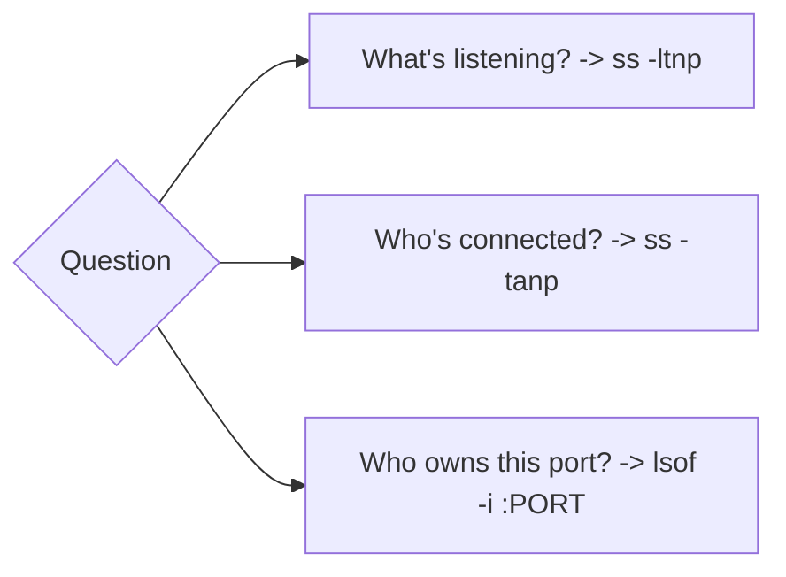

# netstat, ss, and lsof

## 1. What Is This?

Tools to **inspect network connections and ports**: `ss` (modern), `netstat` (legacy), and `lsof` (lists open files, including network sockets).

## 2. Why Is This Needed?

To answer "what's listening?", "who's connected?", and "which process owns this port?" — the backbone of network and service troubleshooting.

## 3. Simple Layman Explanation

These are the **switchboard logs** of your server: they show every open phone line — who's waiting for calls (listening), who's mid-call (established), and which department owns each line.

## 4. Technical Explanation

| Tool | Status | Note |
|------|--------|------|
| `ss` | Preferred | Fast, modern replacement for netstat |
| `netstat` | Legacy | Still common; from `net-tools` |
| `lsof` | Versatile | "List open files" incl. sockets (`-i`) |

Sockets have states: `LISTEN`, `ESTAB` (established), `TIME-WAIT`, `CLOSE-WAIT`, etc.

## 5. Real-World Example

"Why is this app holding 500 connections?" `ss -tan state established | wc -l` counts them; `ss -tanp` shows the owning process. You discover a connection leak and restart the app.

## 6. Diagram



## 7. Commands

```bash
ss -ltnp                 # listening TCP + process
ss -tanp                 # all TCP connections + process
ss -s                    # summary stats of sockets
ss -tan state established # only established connections
netstat -tlnp            # legacy: listening TCP + process
netstat -tanp            # legacy: all TCP + process
sudo lsof -i             # all network connections
sudo lsof -i :443        # who's on port 443
sudo lsof -i -nP | grep LISTEN   # listeners, numeric
```

## 8. Command Explanation

- `ss` flags: `-l` listening, `-t` tcp, `-u` udp, `-a` all, `-n` numeric, `-p` process.
- `ss -s` → quick totals (how many TCP, established, etc.).
- `netstat -tlnp` → the classic equivalent of `ss -ltnp`.
- `lsof -i :PORT` → maps a port to its process; `-n` no DNS, `-P` no port-name lookup (faster).
- Run with `sudo` to see processes owned by other users.

## 9. Practice Tasks

1. `ss -ltnp` — list all listeners and their processes.
2. `ss -s` — read the socket summary.
3. Start `python3 -m http.server 8080 &`; find it with `ss -ltnp | grep 8080` and `sudo lsof -i :8080`.
4. Compare `netstat -tlnp` output to `ss -ltnp`.

## 10. Common Mistakes

- Expecting `netstat` to be installed by default (it often isn't on minimal images — install `net-tools` or use `ss`).
- Forgetting `sudo`, so process names for other users show blank.
- Reading `TIME-WAIT` sockets as a problem (they're normal post-close).

## 11. Troubleshooting

- **No process shown for a port** → run with `sudo`.
- **`netstat: command not found`** → use `ss` or `sudo apt install net-tools`.
- **Many CLOSE-WAIT** → the app isn't closing sockets (a bug); restart and investigate.

## 12. Best Practices

- Default to `ss`; it's faster and present on modern systems.
- Use `-n` to avoid slow DNS lookups while debugging.
- Combine with `grep`/`wc -l` to count or filter connections.

## 13. Quick Recap

- `ss -ltnp` = listeners + owners (the everyday command).
- `ss -tanp` = all connections; `ss -s` = summary.
- `lsof -i :PORT` = who owns a port. `ss` > `netstat`.

## 14. References

- `man ss`, `man netstat`, `man lsof`
- iproute2: https://wiki.linuxfoundation.org/networking/iproute2
