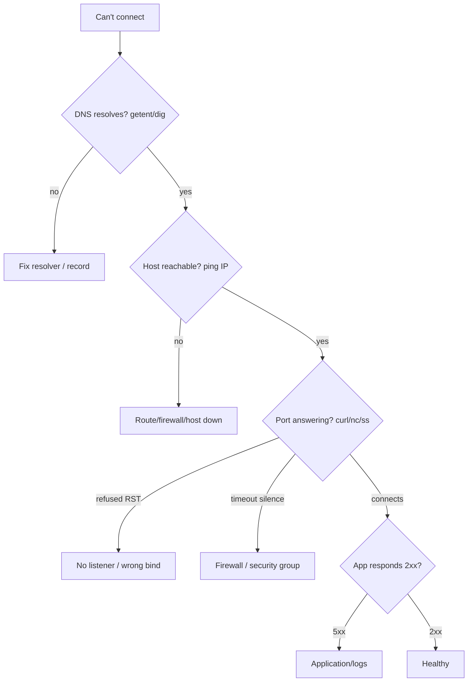

# Network Troubleshooting

## 1. What Is This?

A layered method for diagnosing network problems: DNS failures, "connection refused", "connection timed out", and "port already in use".

## 2. Why Is This Needed?

Network issues are common and confusing. A consistent top-down method finds the real cause quickly instead of guessing.

## 3. Simple Layman Explanation

When a call won't connect, you check in order: do you have the right number (DNS)? Is the line reachable (ping)? Is anyone answering that extension (port)? Is the person actually working (app)?

## 4. Technical Explanation

Debug in layers, stopping at the first failure:
1. **DNS** — does the name resolve? (`getent hosts`, `dig`)
2. **Reachability** — is the host up? (`ping <ip>`)
3. **Port** — is the service listening/reachable? (`ss`, `curl`, `nc`)
4. **Application** — does the service actually respond correctly? (`curl -v`, logs)

## 5. How It Works Under the Hood

The layered method isn't a checklist someone invented — it mirrors the **actual sequence a packet goes through** to reach a service (from [Networking Fundamentals](networking-fundamentals.md)). Each step *depends on the previous one succeeding*, so testing in order pinpoints the first broken link:

1. **DNS turns the name into an IP.** If this fails, nothing downstream can happen — so test it first (`getent hosts`). A name that won't resolve while its IP works cleanly isolates the fault to the resolver.
2. **Routing gets a packet to the host.** `ping <ip>` tests this layer (ICMP). Success = the host is reachable; failure = routing/firewall/host-down (but remember ICMP may be blocked — [ping/curl](ping-curl-wget.md)).
3. **A listening socket on the right port accepts it.** Here the two failure modes are diagnostic *because the kernel produces different responses*: if **nothing is listening**, the kernel immediately replies with a TCP RST → **"Connection refused"** (fast). If a **firewall silently drops** the packet, nothing replies at all → your side waits and eventually gives **"Connection timed out"** (slow). That RST-vs-silence distinction is why *refused ≠ timed out*: refused means "I reached the host, no one's on that port"; timed out means "something ate my packet before anyone could answer."
4. **The application processes the request.** If layers 1–3 pass but you get a `500`/`503` or wrong data, the network is fine and the *app* is the problem.

So the method works because you're walking the packet's own path and stopping at the first layer that breaks — and each failure has a *signature* (resolve error / no route / RST-refused / silent-timeout / 5xx) that names the layer without guesswork.

## 6. Diagram



## 7. Real-World Examples

**1. The everyday case.** An app can't reach an API. You test in order: `getent hosts api.internal` (resolves ✓), `ping` the IP (reachable ✓), `curl` the port (**refused**) → the service isn't listening. `systemctl status` shows it crashed. You restart it — fixed in three checks.

**2. Refused vs timed out, side by side:**

```
$ curl -sS --max-time 5 http://10.0.4.12:9999
curl: (7) Failed to connect to 10.0.4.12 port 9999: Connection refused   # RST: reached host, no listener
$ curl -sS --max-time 5 http://10.0.4.50:9999
curl: (28) Connection timed out after 5001 ms                            # silence: firewall dropped it
$ nc -zv 10.0.4.12 22 ; nc -zv 10.0.4.50 9999
Connection to 10.0.4.12 22 port [tcp/ssh] succeeded!
nc: connect to 10.0.4.50 port 9999 (tcp) timed out                       # confirms the firewall theory
```

The *fast* refused vs the *slow* timeout instantly tells you "no listener" vs "firewall" (Section 5) — before you touch anything.

**3. War story — blaming the app for a security-group block.** After a cloud migration, an app couldn't reach its database on 5432. Developers spent hours auditing DB config and credentials. The signature was the clue they missed: `curl`/`psql` **timed out** (never "refused"), and `nc -zv db 5432` also timed out — while `ss -ltnp` *on the DB host* showed Postgres happily `LISTEN`ing on `0.0.0.0:5432`. So the DB was fine; a **cloud security group** silently dropped inbound 5432 from the app subnet (Section 5's timeout signature). Adding the rule fixed it in a minute. Cloud firewalls are a *separate* gate from the host — and timeouts point right at them.

## 8. Worked Walkthrough

Walk the layers on a target, reading each result:

```
$ getent hosts github.com                 # 1. DNS
140.82.121.4    github.com                 #    resolves ✓
$ ping -c 2 140.82.121.4                   # 2. reachability (by IP)
64 bytes from 140.82.121.4: icmp_seq=1 ttl=52 time=18 ms   # reachable ✓
$ nc -zv github.com 443                    # 3. port open?
Connection to github.com 443 port [tcp/https] succeeded!    # listener + firewall OK ✓
$ curl -s -o /dev/null -w "%{http_code}\n" https://github.com   # 4. application
200                                         # app healthy ✓
```

All four layers pass → the whole path is healthy. If any step had failed, you'd stop there and fix *that* layer — never guessing about the ones below it. To practice a failure, `curl http://127.0.0.1:9999` (nothing listening → instant "refused").

## 9. Commands

```bash
getent hosts NAME; dig +short NAME   # 1. DNS
ping -c 3 HOST                       # 2. reachability
ss -ltnp; sudo lsof -i :PORT         # 3. is it listening locally?
nc -zv HOST PORT                     # 3. is the remote port open?
curl -v URL                          # 4. application (full path, verbose)
```

Sample output for each (dummy values, for reference):

```text
$ getent hosts api.internal
10.0.4.20   api.internal

$ ping -c 3 10.0.4.20
3 packets transmitted, 3 received, 0% packet loss

$ ss -ltnp | grep :8080
LISTEN 0 511 0.0.0.0:8080 users:(("gunicorn",pid=1201,fd=6))

$ nc -zv api.internal 8080
Connection to api.internal 8080 port [tcp/*] succeeded!

$ curl -s -o /dev/null -w "%{http_code}\n" http://api.internal:8080/health
200
```

## 10. Command Explanation

- `getent hosts` / `dig +short` → test layer 1 (name resolution).
- `ping -c 3` → test layer 2 (host reachability, ICMP).
- `ss -ltnp` → is the service listening locally, and on which address? `lsof -i :PORT` → who owns it.
- `nc -zv host port` → tests whether a *remote* TCP port is open without sending data — the fastest refused-vs-timeout probe (layer 3).
- `curl -v URL` → exercises the full path and shows exactly where it stops (layer 4 + everything below).

## 11. In Production (DevOps Context)

- **Cloud security groups / NACLs** are a separate firewall from the host — timeouts (not refusals) usually mean the cloud gate, not the app (the war story) (Module 13 / [Firewall Basics](../12-linux-security-basics/firewall-basics-ufw-firewalld.md)).
- **Kubernetes** adds layers (Service DNS, kube-proxy, NetworkPolicies); the same top-down method applies — resolve the service name, hit the pod IP, check the container's listener (Module 13).
- **Incident response** for "X can't reach Y" is exactly this drill; the refused/timeout signature routes the page to the right team (app vs. network) fast.
- **`nc`/`curl` in readiness checks and runbooks** codify these probes so on-call engineers don't reinvent them under pressure.

## 12. Practice Tasks

1. Simulate "connection refused": `curl http://127.0.0.1:9999` (nothing listening) — note it's *instant*.
2. Start `python3 -m http.server 9999 &`, retry the curl (now `200`).
3. `nc -zv example.com 443` to test a remote port (should succeed).
4. Break DNS: `dig +short thisdoesnotexist.invalid` and read the empty/NXDOMAIN response.
5. Walk all four layers against a real host and record which pass.

## 13. Common Mistakes

- Skipping layers and guessing instead of testing DNS → reachability → port → app.
- Treating "refused" and "timed out" as the same (they name different layers — Section 5).
- Blaming the app when a firewall/security group is silently dropping packets (the war story).
- Forgetting cloud **security groups** are a separate firewall from the host.

## 14. Troubleshooting

**Scenario A — DNS not resolving**
- **Symptoms:** `curl: Could not resolve host`; `ping name` fails but `ping 8.8.8.8` works.
- **Check:** `getent hosts NAME`; `cat /etc/resolv.conf`; `dig NAME @8.8.8.8`.
- **Fix:** ensure a valid `nameserver`; test against a public resolver; fix resolver/record; check stale `/etc/hosts`. **Prevention:** reliable DNS; don't hand-edit auto-managed resolv.conf.

**Scenario B — Connection refused (RST, fast)**
- **Symptoms:** `curl: (7) Connection refused`.
- **Cause:** nothing listening on that port, or bound to `127.0.0.1` only.
- **Check:** `ss -ltnp | grep :<port>`; `systemctl status <svc>`; `curl -v http://127.0.0.1:<port>`.
- **Fix:** start the service / fix its bind address (`0.0.0.0`), retry. **Prevention:** monitor services are up and listening on the right interface.

**Scenario C — Connection timed out (silence, slow)**
- **Symptoms:** `curl: (28) Connection timed out`; `nc` also times out.
- **Cause:** firewall/security group dropping the port, wrong route, or host down.
- **Check:** `ping -c 3 <host>`; `ss -ltnp` on the target (is it listening?); `sudo ufw status`; cloud security-group rules.
- **Fix:** open the port in host firewall / cloud security group; fix routing. **Prevention:** keep firewall rules in sync with services and documented.

**Scenario D — Port already in use**
- **Symptoms:** `Address already in use` on service start.
- **Check/Fix:** `ss -ltnp | grep :<port>` / `sudo lsof -i :<port>` → stop the holder or change ports. **Prevention:** document port assignments.

## 15. Best Practices

- Always debug top-down: DNS → ping → port → application, stopping at the first failure.
- Use the refused-vs-timeout signature to split "no listener" from "firewall" immediately.
- Use `curl -v` and `nc -zv` to pinpoint the failing layer.
- Keep firewall/security-group rules documented and minimal.

## 16. Connects To

- **Prev:** [netstat, ss & lsof](netstat-ss-lsof.md). **Next:** [Module 08 — Storage & Disk](../08-storage-and-disk-management/README.md).
- **The layers:** [Networking Fundamentals](networking-fundamentals.md); **DNS:** [IP/Hostname/DNS](ip-hostname-dns.md); **probes:** [ping/curl/wget](ping-curl-wget.md); **ports:** [Ports & Sockets](ports-and-sockets.md), [ss/lsof](netstat-ss-lsof.md).
- **Firewalls:** [Firewall Basics](../12-linux-security-basics/firewall-basics-ufw-firewalld.md).
- **Practice:** [Lab 04 — Network Debugging](../14-hands-on-labs/lab-04-network-debugging.md). **Quick lookup:** [Networking Cheatsheet](../16-cheatsheets/networking-cheatsheet.md).

## 17. Quick Recap

- Debug the packet's own path: DNS → reachability → port → application, stopping at the first break.
- Signatures name the layer: "Could not resolve" = DNS; **refused (fast RST)** = no listener/wrong bind; **timed out (slow)** = firewall/route; "in use" = port conflict; 5xx = app.
- Cloud security groups are a separate firewall — timeouts often point there.

## 18. References

- `man dig`, `man ss`, `man curl`, `man nc`
- [Module 12 firewall](../12-linux-security-basics/firewall-basics-ufw-firewalld.md)

<!-- NAV-FOOTER -->

---

### 🧭 Navigation

| Previous | Up | Next |
|:---|:---:|---:|
| ⬅️ Prev: [netstat, ss, and lsof](netstat-ss-lsof.md) | ⬆️ Module: [Module 07 — Networking Basics](README.md) | ➡️ Next: [Module 08 — Storage & Disk Management](../08-storage-and-disk-management/README.md) |
