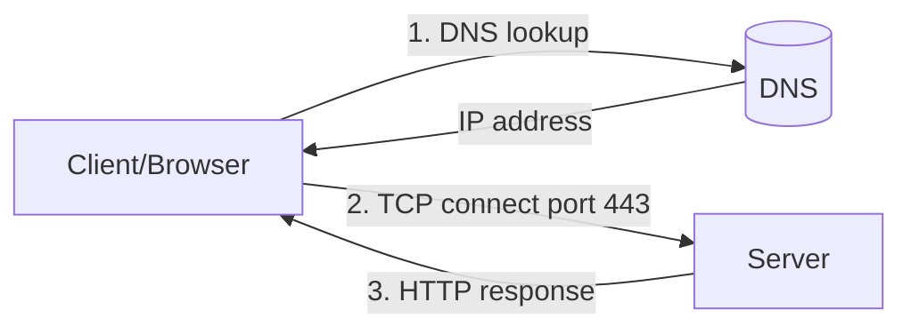
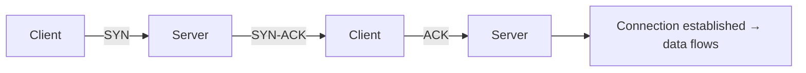

# Networking Fundamentals

## 1. What Is This?

The basic ideas behind computer networking: **IP addresses**, **ports**, **protocols** (TCP/UDP), **DNS**, and how a client talks to a server.

## 2. Why Is This Needed?

Every server interaction — web requests, SSH, databases — is networking. Understanding the fundamentals lets you reason about *why* something can't connect.

## 3. Simple Layman Explanation

- **IP address** = a building's street address.
- **Port** = a specific door/office in that building.
- **DNS** = a phonebook turning a name (google.com) into an address (IP).
- **TCP** = a reliable phone call (connection, confirmed delivery).
- **UDP** = a postcard (fast, no guarantee).

## 4. Technical Explanation

| Concept | Meaning |
|---------|---------|
| IP address | Unique address of a host (IPv4 `192.168.1.10`, IPv6 `::1`) |
| Port | Numbered endpoint (0–65535) for a service |
| TCP | Connection-oriented, reliable, ordered |
| UDP | Connectionless, fast, best-effort |
| DNS | Resolves names to IPs |
| Protocol | Agreed rules (HTTP, SSH, DNS) on top of TCP/UDP |

Common ports: 22 (SSH), 80 (HTTP), 443 (HTTPS), 53 (DNS), 3306 (MySQL).

## 5. How It Works Under the Hood

Networking is built in **layers**, each adding one envelope around your data. You don't need the formal 7-layer model — the practical picture is four steps:

1. **Name → address (DNS).** Names like `example.com` mean nothing to the network. Your machine asks a DNS resolver "what IP is this?" and gets back something like `93.184.216.34`. This is a separate step that can fail on its own — which is why `ping google.com` failing but `ping 8.8.8.8` working points straight at DNS.
2. **Address → route (IP).** The IP address identifies *which machine* on the network. Your kernel consults its **routing table** to decide where to send the packet first — usually your default gateway (router), which forwards it hop by hop toward the destination.
3. **Address → the right program (port).** One server runs many services. The **port number** is how the kernel knows a packet arriving at the machine belongs to the web server (443) versus SSH (22) versus MySQL (3306). A service **binds** to a port when it starts; the combination of *IP + port + protocol* is a **socket**, and that's what uniquely identifies one end of a connection.
4. **Reliable vs. fast (TCP vs UDP).** On top of IP you pick a transport:
   - **TCP** first performs a **three-way handshake** — `SYN` (client: "let's talk"), `SYN-ACK` (server: "ok, and you?"), `ACK` (client: "confirmed"). Only then does data flow, with sequence numbers, acknowledgements, and retransmission of anything lost. That's what "reliable, ordered" actually costs.
   - **UDP** has no handshake and no delivery guarantee — the kernel just fires the packet. Fast and cheap, used for DNS queries, video, and games where a lost packet isn't worth waiting for.

**Why this matters for debugging:** each layer fails independently and produces a different symptom. That's the whole basis of "debug in layers" — DNS resolves? host reachable? port open? service answering? — each maps to one step above.

## 6. Diagram



TCP three-way handshake (what "connecting" really is):



## 7. Real-World Examples

**1. The everyday case — loading a web page.** You type `https://example.com`: DNS resolves the name to an IP, your browser opens a TCP connection to port **443**, completes the handshake, and HTTP(S) carries the page back. If any step fails, the page doesn't load — and each step is separately debuggable.

**2. Confirming the layers with real output.** You can watch the difference between "reachable" and "service works":

```
$ ping -c 2 example.com
64 bytes from 93.184.216.34: icmp_seq=1 ttl=56 time=11.9 ms   # host is reachable (IP layer OK)
$ curl -I https://example.com
HTTP/2 200                                                    # the web SERVICE actually answered
```

A passing `ping` only proves step 2 (the host is up). The `curl -I` proves step 3–4 (the right port is open *and* the application responded).

**3. Production war story — "the site is down" that was really DNS.** An on-call engineer gets paged: users can't reach `api.internal`. The server is fine — `ping 10.0.4.12` (its IP) works instantly. But `ping api.internal` returns:

```
ping: api.internal: Name or service not known
```

Reachability is perfect; **name resolution** is broken. The cause turned out to be a stale internal DNS record after an IP change. No amount of restarting the API would have helped — the failure was in layer 1 (DNS), not the service. Debugging in layers found it in under a minute.

## 8. Worked Walkthrough

Trace a request from name to service, one layer at a time.

```
$ ip a | grep 'inet '
    inet 127.0.0.1/8 scope host lo
    inet 192.168.1.23/24 ... eth0        # this machine's own IP
```

```
$ getent hosts github.com
140.82.121.4      github.com             # layer 1: name resolved to an IP
```

```
$ ping -c 2 140.82.121.4
64 bytes from 140.82.121.4: icmp_seq=1 ttl=52 time=18.2 ms   # layer 2: host reachable
```

```
$ curl -I https://github.com
HTTP/2 200                                                   # layers 3–4: port 443 open, service answered
```

Every step passed, so the whole path is healthy. If a step had failed, you'd know *exactly* which layer to investigate — that's the payoff of understanding Section 5.

```
$ ss -ltn
State    Recv-Q   Send-Q   Local Address:Port
LISTEN   0        128            0.0.0.0:22          # your machine is a server too: SSH bound to port 22
```

`ss -ltn` shows the *sockets your own machine is listening on* — the server side of the same concept.

## 9. Commands

```bash
ip a                     # your IP addresses
getent hosts google.com  # resolve a name to IP
ping -c 3 google.com     # test reachability
curl -I https://example.com   # test HTTP response headers
ss -ltn                  # local listening TCP ports
```

Sample output for each (dummy values, for reference):

```text
$ ip a
2: eth0: <BROADCAST,MULTICAST,UP,LOWER_UP> mtu 1500 ...
    inet 192.168.1.23/24 brd 192.168.1.255 scope global eth0

$ getent hosts google.com
142.250.183.14   google.com

$ ping -c 3 google.com
PING google.com (142.250.183.14) 56(84) bytes of data.
64 bytes from 142.250.183.14: icmp_seq=1 ttl=115 time=12.1 ms
64 bytes from 142.250.183.14: icmp_seq=2 ttl=115 time=11.8 ms
64 bytes from 142.250.183.14: icmp_seq=3 ttl=115 time=12.4 ms
--- google.com ping statistics ---
3 packets transmitted, 3 received, 0% packet loss, time 2003ms

$ curl -I https://example.com
HTTP/2 200
content-type: text/html; charset=UTF-8
content-length: 1256

$ ss -ltn
State    Recv-Q   Send-Q   Local Address:Port   Peer Address:Port
LISTEN   0        128            0.0.0.0:22            0.0.0.0:*
LISTEN   0        511            0.0.0.0:80            0.0.0.0:*
```

## 10. Command Explanation

- `ip a` → lists network interfaces and their IPs.
- `getent hosts <name>` → uses the system resolver to map a name to an IP (layer 1).
- `ping` → checks if a host responds (ICMP, layer 2 reachability).
- `curl -I` → fetches just HTTP headers — confirms the *service* works (layers 3–4), not just reachability.
- `ss -ltn` → lists listening TCP ports (the server side / bound sockets).

## 11. In Production (DevOps Context)

- **Docker/Kubernetes:** containers get their own IPs and network namespaces; "connection refused" between services is almost always a port not exposed, a wrong service name (DNS inside the cluster), or nothing listening — the exact four-layer checklist above.
- **Cloud (AWS/Azure/GCP):** a **security group / firewall** can block a port even when the service is healthy. `ping` may work while `curl` to the port times out — reachability OK, port blocked.
- **Load balancers** health-check a specific *port + path*, not just reachability — mirroring the `curl -I` vs `ping` distinction.
- **Microservices** talk to each other by name; internal DNS is a real dependency, and its failure (the war story above) takes down "the app" without any app being broken.

## 12. Practice Tasks

1. Run `ip a` and find your IPv4 address.
2. `getent hosts github.com` to see its IP.
3. `ping -c 3 8.8.8.8` (IP) vs `ping -c 3 google.com` (name) — what's the difference if DNS fails, and which layer does each test?
4. `curl -I https://example.com` and identify which layers just succeeded.
5. Run `ss -ltn` and list which ports your own machine is listening on.

## 13. Common Mistakes

- Thinking IP and port are the same thing.
- Assuming a successful `ping` means the application works (it only proves reachability — layer 2).
- Forgetting DNS is a *separate* step that fails on its own.
- Confusing TCP and UDP behavior when debugging.

## 14. Troubleshooting

- **Name fails but IP works** → **DNS problem** (layer 1; next topic).
- **IP unreachable** → connectivity/firewall/routing problem (layer 2).
- **Reachable but connection refused/timeout** → nothing listening on that port, or a firewall/security group blocks it (layer 3).
- **Port open but wrong/empty response** → application/service problem (layer 4).

## 15. Best Practices

- Always debug in layers: DNS → IP reachability → port → application.
- Memorize common ports; they speed up diagnosis.
- Prefer HTTPS (443) and secure protocols.

## 16. Connects To

- **Next:** [IP, Hostname, and DNS](ip-hostname-dns.md) — layer 1 in depth.
- **Deep dives:** [Ports and Sockets](ports-and-sockets.md) (layer 3), [ping/curl/wget](ping-curl-wget.md), [netstat/ss/lsof](netstat-ss-lsof.md).
- **Applies in:** [Network Troubleshooting](network-troubleshooting.md) and [Lab 04 — Network Debugging](../14-hands-on-labs/lab-04-network-debugging.md).
- **Quick lookup:** [Networking Cheatsheet](../16-cheatsheets/networking-cheatsheet.md).

## 17. Quick Recap

- IP = address, port = door, DNS = phonebook, TCP = reliable (handshake first), UDP = fast.
- A socket = IP + port + protocol; a service **binds** a port to receive traffic.
- A web request = DNS → route to IP → TCP handshake → HTTP response.
- Each layer fails independently — so debug layer by layer.

## 18. References

- `man ip`, `man ss`, `man curl`
- Cloudflare DNS learning: https://www.cloudflare.com/learning/dns/what-is-dns/

<!-- NAV-FOOTER -->

---

### 🧭 Navigation

| Previous | Up | Next |
|:---|:---:|---:|
| ⬅️ Prev: [Module 07 — Networking Basics](README.md) | ⬆️ Module: [Module 07 — Networking Basics](README.md) | ➡️ Next: [IP, Hostname, and DNS](ip-hostname-dns.md) |
