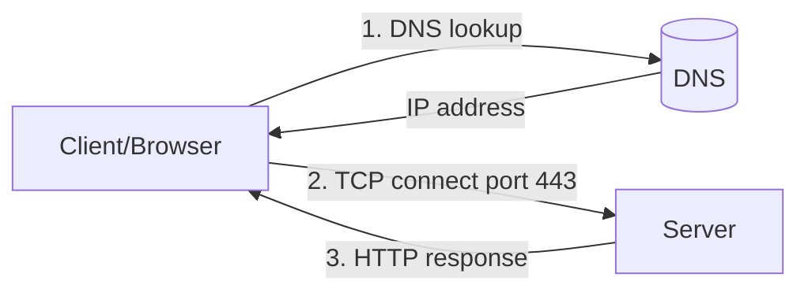

# Networking Fundamentals

## 1. What Is This?

The basic ideas behind computer networking: **IP addresses**, **ports**, **protocols** (TCP/UDP), **DNS**, and how a client talks to a server.

## 2. Why Is This Needed?

Every server interaction — web requests, SSH, databases — is networking. Understanding the fundamentals lets you reason about *why* something can't connect.

## 3. Simple Layman Explanation

- **IP address** = a building's street address.
- **Port** = a specific door/office in that building.
- **DNS** = a phonebook turning a name (google.com) into an address (IP).
- **TCP** = a reliable phone call (connection, confirmed delivery).
- **UDP** = a postcard (fast, no guarantee).

## 4. Technical Explanation

| Concept | Meaning |
|---------|---------|
| IP address | Unique address of a host (IPv4 `192.168.1.10`, IPv6 `::1`) |
| Port | Numbered endpoint (0–65535) for a service |
| TCP | Connection-oriented, reliable, ordered |
| UDP | Connectionless, fast, best-effort |
| DNS | Resolves names to IPs |
| Protocol | Agreed rules (HTTP, SSH, DNS) on top of TCP/UDP |

Common ports: 22 (SSH), 80 (HTTP), 443 (HTTPS), 53 (DNS), 3306 (MySQL).

## 5. Real-World Example

You type `https://example.com`: DNS resolves the name to an IP, your browser opens a TCP connection to port **443**, and HTTP(S) carries the page back. If any step fails, the page doesn't load — and each step is separately debuggable.

## 6. Diagram



## 7. Commands

```bash
ip a                     # your IP addresses
getent hosts google.com  # resolve a name to IP
ping -c 3 google.com     # test reachability
curl -I https://example.com   # test HTTP response headers
ss -ltn                  # local listening TCP ports
```

## 8. Command Explanation

- `ip a` → lists network interfaces and their IPs.
- `getent hosts <name>` → uses the system resolver to map a name to an IP.
- `ping` → checks if a host responds (ICMP).
- `curl -I` → fetches just HTTP headers — confirms the *service* works, not just reachability.
- `ss -ltn` → lists listening TCP ports.

## 9. Practice Tasks

1. Run `ip a` and find your IPv4 address.
2. `getent hosts github.com` to see its IP.
3. `ping -c 3 8.8.8.8` (IP) vs `ping -c 3 google.com` (name) — what's the difference if DNS fails?
4. `curl -I https://example.com`.

## 10. Common Mistakes

- Thinking IP and port are the same thing.
- Assuming a successful `ping` means the application works (it only proves reachability).
- Confusing TCP and UDP behavior when debugging.

## 11. Troubleshooting

- Name fails but IP works → **DNS problem** (next topic).
- IP unreachable → connectivity/firewall/routing problem.
- Reachable but service down → application/port problem.

## 12. Best Practices

- Always debug in layers: DNS → IP reachability → port → application.
- Memorize common ports; they speed up diagnosis.
- Prefer HTTPS (443) and secure protocols.

## 13. Quick Recap

- IP = address, port = door, DNS = phonebook, TCP = reliable, UDP = fast.
- A web request = DNS → TCP connect → HTTP response.
- Debug layer by layer.

## 14. References

- `man ip`, `man ss`, `man curl`
- Cloudflare DNS learning: https://www.cloudflare.com/learning/dns/what-is-dns/

<!-- NAV-FOOTER -->

---

### 🧭 Navigation

| Previous | Up | Next |
|:---|:---:|---:|
| ⬅️ Prev: [Module 07 — Networking Basics](README.md) | ⬆️ Module: [Module 07 — Networking Basics](README.md) | ➡️ Next: [IP, Hostname, and DNS](ip-hostname-dns.md) |
