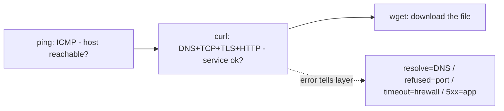

# ping, curl, wget

## 1. What Is This?

Three connectivity tools: **ping** (is the host reachable?), **curl** (talk to web services / APIs), and **wget** (download files).

## 2. Why Is This Needed?

These answer the everyday questions: "Is the server up?", "Is the API responding?", "Can I download this?" — the first checks in almost any network debugging.

## 3. Simple Layman Explanation

- `ping` = knock on the door and see if anyone answers.
- `curl` = actually have a conversation with the service inside.
- `wget` = fetch a package/file and bring it back.

## 4. Technical Explanation

| Tool | Layer | Use |
|------|-------|-----|
| `ping` | ICMP | Reachability + latency |
| `curl` | HTTP(S), many protocols | Test APIs/websites, headers, status codes |
| `wget` | HTTP(S)/FTP | Download files, mirror sites |

`ping` working ≠ app working. Always confirm the actual service with `curl`.

## 5. How It Works Under the Hood

These three tools operate at *different layers* of the four-layer model from [Networking Fundamentals](networking-fundamentals.md) — which is exactly why they answer different questions and fail with different errors:

- **`ping` uses ICMP, not TCP.** It sends an ICMP "echo request" and waits for an "echo reply" — a network-layer probe that never touches any port or application. So a successful ping proves only that *the host is powered on and routable*. Two crucial consequences: (a) ping says **nothing** about whether the web server works — the app could be crashed and ping still succeeds; and (b) many firewalls/cloud security groups **block ICMP** while allowing HTTP, so a *failed* ping doesn't even prove the host is down. Ping is a coarse first probe, not proof of service.
- **`curl` completes the whole stack:** DNS resolve → TCP handshake → (TLS) → send an HTTP request → read the status code and body. That's why `curl` failures pinpoint the layer: `Could not resolve host` = DNS (layer 1), `Connection refused` = reached the host but *nothing is listening* on that port (layer 3), `Connection timed out` = a firewall silently dropped the packet (layer 2/3), and a `503`/`500` status = the app answered but is broken (layer 4). One command, layer-specific diagnostics.
- **`wget` is curl's cousin focused on downloading** — it follows redirects, retries, and writes files to disk, making it the tool for fetching artifacts/packages.

The golden rule falls straight out: **ping tests reachability (ICMP); curl tests the actual service (the full stack).** "It pings but the site is down" is not a contradiction — they measure different layers.

## 6. Diagram



## 7. Real-World Examples

**1. The everyday case.** A site is "down". `ping example.com` succeeds (server reachable), but `curl -I https://example.com` returns `503 Service Unavailable` — so the network is fine; the **application** is the problem. That distinction saves hours.

**2. curl errors, each pointing at a layer:**

```
$ curl -I https://nope.invalid
curl: (6) Could not resolve host: nope.invalid          # layer 1: DNS
$ curl -I http://10.0.4.12:9999
curl: (7) Failed to connect ... Connection refused       # layer 3: nothing listening
$ curl -I --max-time 5 http://10.0.4.99
curl: (28) Connection timed out after 5001 ms            # layer 2/3: firewall drop
$ curl -s -o /dev/null -w "%{http_code}\n" https://example.com
200                                                       # layer 4: app answered OK
```

Four commands, four *different* failure layers — curl's error is the diagnosis (Section 5).

**3. War story — the health check fooled by ping.** A monitoring script pinged app servers and paged only if ping failed. One night users reported outages, but no page fired — because the app had crashed while the *hosts* stayed up and pingable (Section 5: ping ≠ app). Worse, on another host ping had been silently blocked by a new firewall rule, causing false "down" pages. The fix: switch the health check to `curl -sf -o /dev/null -w "%{http_code}"` against a real `/health` endpoint, alerting on non-200. Reachability checks are not service checks.

## 8. Worked Walkthrough

Layer up from reachability to a real service check:

```
$ ping -c 3 8.8.8.8                       # reachability by IP (skip DNS)
64 bytes from 8.8.8.8: icmp_seq=1 ttl=115 time=11.9 ms
3 packets transmitted, 3 received, 0% packet loss
$ ping -c 3 github.com                    # now with a name (also tests DNS)
64 bytes from 140.82.121.4: icmp_seq=1 ttl=52 time=18.1 ms
$ curl -I https://github.com              # does the SERVICE actually answer?
HTTP/2 200
$ curl -s -o /dev/null -w "code=%{http_code} time=%{time_total}s\n" https://github.com
code=200 time=0.212s                      # scriptable health-check form
$ wget -q -O /tmp/robots.txt https://github.com/robots.txt && head -1 /tmp/robots.txt
# (downloaded a file to disk)
```

Notice how each step tests a deeper layer than the last — and the `-w "%{http_code}"` form is exactly what a real health check should use (the war-story fix).

## 9. Commands

```bash
ping -c 4 google.com             # 4 packets then stop
ping -c 4 8.8.8.8                # ping an IP (bypass DNS)
curl https://example.com         # fetch page body
curl -I https://example.com      # headers only (status code)
curl -v https://example.com      # verbose: DNS/TCP/TLS/request details
curl -o page.html https://example.com   # save output to a file
curl -s -o /dev/null -w "%{http_code}\n" https://example.com  # just the status code
wget https://example.com/file.tar.gz     # download a file
wget -O out.tar.gz <url>         # download to a specific name
```

Sample output for each (dummy values, for reference):

```text
$ ping -c 4 8.8.8.8
64 bytes from 8.8.8.8: icmp_seq=1 ttl=115 time=11.9 ms
--- 8.8.8.8 ping statistics ---
4 packets transmitted, 4 received, 0% packet loss, time 3004ms

$ curl -I https://example.com
HTTP/2 200
content-type: text/html; charset=UTF-8

$ curl -s -o /dev/null -w "%{http_code}\n" https://example.com
200

$ wget https://example.com/robots.txt
'robots.txt' saved [42/42]
```

## 10. Command Explanation

- `ping -c 4` → sends 4 packets (`-c`) instead of pinging forever; shows latency and packet loss (ICMP, Section 5).
- `curl -I` → HEAD request: returns status (200/301/404/503) and headers.
- `curl -v` → shows DNS, TCP, TLS, and request/response details — the layer-by-layer debugger.
- `curl -w "%{http_code}"` → prints only the HTTP status, ideal for scripts/health checks.
- `wget -O` → saves the download under a chosen filename.

## 11. In Production (DevOps Context)

- **Health checks / readiness probes** must hit a real endpoint with `curl` (status-code based), not `ping` — Kubernetes `httpGet` probes and load-balancer checks work exactly this way (the war-story lesson) (Module 13).
- **API debugging & smoke tests** in CI/CD use `curl` to assert status codes and payloads post-deploy.
- **`ping` for reachability/latency** still matters for network-level diagnosis, but SREs know a blocked-ICMP environment makes ping unreliable for "is it up?".
- **`wget`/`curl`** fetch artifacts, install scripts, and configs in provisioning and Dockerfiles.

## 12. Practice Tasks

1. `ping -c 4 8.8.8.8` and note latency/packet loss.
2. `curl -I https://example.com` — read the status line and identify which layers just succeeded.
3. `curl -s -o /dev/null -w "%{http_code}\n" https://example.com`.
4. Trigger each curl error: `curl https://nope.invalid` (DNS) and `curl http://127.0.0.1:9999` (refused).
5. `wget` any public file and confirm it lands on disk.

## 13. Common Mistakes

- Treating a successful `ping` as proof the app works (the war story) — it's ICMP, not the service.
- Assuming a *failed* ping means the host is down (ICMP may be firewalled).
- Forgetting `-c` so `ping` runs endlessly (use `Ctrl+C`).
- Using `curl` without `-I`/`-v`/`-w` and missing the status code that names the failing layer.

## 14. Troubleshooting

- **ping by IP works, by name fails** → DNS issue (see [IP/Hostname/DNS](ip-hostname-dns.md)).
- **ping fails entirely** → host down, ICMP blocked, or no route — confirm the *service* with `curl` before concluding "down".
- **curl "Could not resolve host"** → DNS. **"Connection refused"** → nothing listening on that port. **"timed out"** → firewall/routing (each maps to a layer, Section 5).

## 15. Best Practices

- Use `curl` to verify the actual service, not just `ping`.
- In health checks, capture the HTTP status code with `curl -w` against a real endpoint.
- Prefer HTTPS; verify certificates (don't blindly use `curl -k`).

## 16. Connects To

- **Prev:** [IP, Hostname, and DNS](ip-hostname-dns.md). **Next:** [Ports and Sockets](ports-and-sockets.md).
- **The layers these test:** [Networking Fundamentals](networking-fundamentals.md).
- **"Refused" = port/listener:** [Ports and Sockets](ports-and-sockets.md), [netstat/ss/lsof](netstat-ss-lsof.md).
- **Layered method:** [Network Troubleshooting](network-troubleshooting.md).
- **Health probes:** [Linux for Kubernetes](../13-real-world-linux-for-devops/linux-for-kubernetes.md).

## 17. Quick Recap

- `ping` = reachability (ICMP, coarse); `curl` = the actual service (full DNS→TCP→TLS→HTTP stack); `wget` = download.
- curl errors name the failing layer: resolve=DNS, refused=port, timeout=firewall, 5xx=app.
- Health-check with `curl` status codes, never `ping`.

## 18. References

- curl: https://curl.se/docs/
- `man ping`, `man curl`, `man wget`

<!-- NAV-FOOTER -->

---

### 🧭 Navigation

| Previous | Up | Next |
|:---|:---:|---:|
| ⬅️ Prev: [IP, Hostname, and DNS](ip-hostname-dns.md) | ⬆️ Module: [Module 07 — Networking Basics](README.md) | ➡️ Next: [Ports and Sockets](ports-and-sockets.md) |
