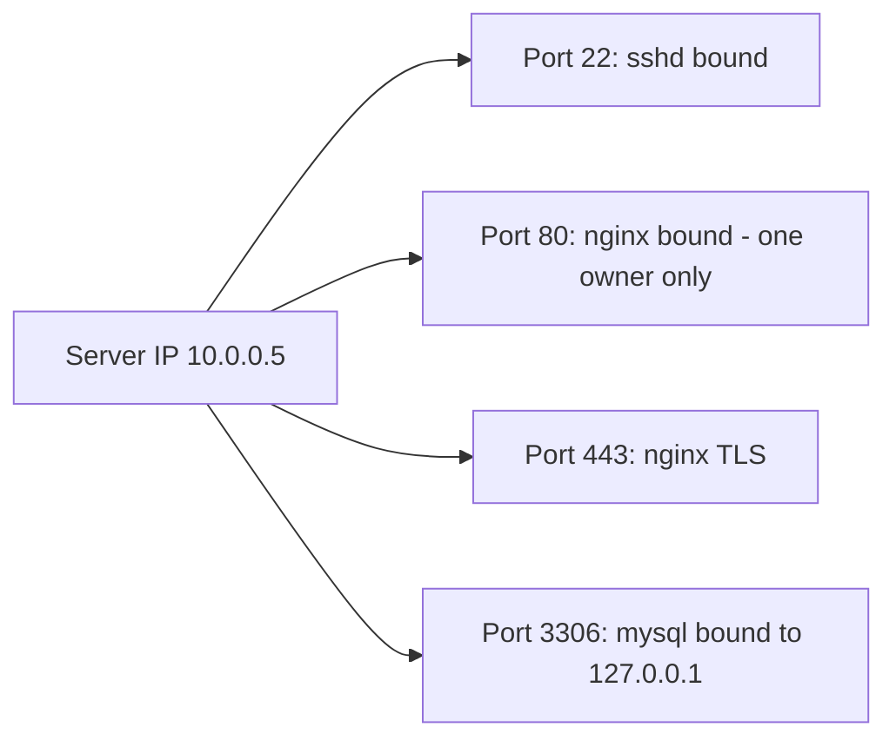

# Ports and Sockets

## 1. What Is This?

A **port** is a numbered endpoint (0–65535) that identifies a specific service on a host. A **socket** is the combination of an IP address + port + protocol that defines one end of a network connection.

## 2. Why Is This Needed?

Multiple services share one IP by using different ports. Knowing ports/sockets lets you tell *which* service a connection belongs to and spot conflicts ("port already in use").

## 3. Simple Layman Explanation

A server is an apartment building (one IP). Each **port** is an apartment number. A **socket** is a specific phone line into a specific apartment. Two services can't both claim apartment 80.

## 4. Technical Explanation

- **Well-known ports** (0–1023): standard services (22 SSH, 80 HTTP, 443 HTTPS). Binding these needs root.
- **Registered ports** (1024–49151): apps/databases (3306 MySQL, 5432 PostgreSQL).
- **Ephemeral ports** (49152–65535): temporary client-side ports.
- A **listening socket** waits for connections; an **established socket** is an active connection.
- A connection is uniquely identified by: `(local IP, local port, remote IP, remote port, protocol)`.

## 5. How It Works Under the Hood

A "port" isn't a physical thing — it's a number the kernel uses to route incoming packets to the right program. The mechanics explain every port error you'll hit:

- **A service `bind()`s to a port, then `listen()`s.** When nginx starts, it asks the kernel "reserve port 80 for me" (`bind`) and "queue incoming connections" (`listen`). The kernel records that (IP, port, protocol) → this process. Now every packet arriving for port 80 is handed to nginx. **Only one process can bind a given (IP, port) pair** — that's a kernel rule, and it's the entire reason for "Address already in use": someone already reserved it.
- **The bind *address* matters as much as the port.** Bind to `0.0.0.0` = "accept on every interface" (reachable from other machines). Bind to `127.0.0.1` = "localhost only" (loopback). A service bound to `127.0.0.1` is invisible from the network even though it's running — which is why "the service is up but I can't reach it remotely" is so common. `ss -ltnp` shows the bind address, so you can tell instantly.
- **Ports below 1024 are privileged.** The kernel only lets root (or a process with `CAP_NET_BIND_SERVICE`) bind them — a security measure so ordinary users can't impersonate SSH/HTTP. That's why nginx starts as root to grab 80, then drops privileges (and why your dev app on port 8080 doesn't need sudo but port 80 does).
- **A full connection is a 5-tuple.** Once a client connects, the kernel tracks `(local IP, local port, remote IP, remote port, protocol)` — that 5-tuple uniquely identifies the connection, which is how one server on port 443 juggles thousands of simultaneous clients: each has a different remote IP/port.

## 6. Diagram



## 7. Real-World Examples

**1. The everyday case.** Nginx fails to start: "bind() to 0.0.0.0:80 failed (Address already in use)". Another process already holds port 80. You find it with `ss -ltnp`, stop it, and Nginx binds successfully.

**2. Reading who's bound where — and on which interface:**

```
$ ss -ltnp
State  Recv-Q Send-Q Local Address:Port  Process
LISTEN 0      128          0.0.0.0:22     users:(("sshd",pid=700,fd=3))       # all interfaces
LISTEN 0      511          0.0.0.0:80     users:(("nginx",pid=900,fd=6))      # public
LISTEN 0      128        127.0.0.1:3306   users:(("mysqld",pid=810,fd=20))    # localhost ONLY
```

MySQL is bound to `127.0.0.1` — running, but deliberately unreachable from other hosts (Section 5). Recognizing that column answers "why can't the app server reach the DB?" in one glance.

**3. War story — "the service is running but the browser can't reach it."** A team deployed an app that `systemctl status` showed as `active (running)`, yet browsers got connection-refused. `ss -ltnp | grep :8000` revealed it was bound to `127.0.0.1:8000`, not `0.0.0.0:8000` (Section 5) — a default in its config. It was serving perfectly... to itself. Changing the bind address to `0.0.0.0` (and opening the firewall) fixed it. "Running" and "reachable" are different facts, and the bind address is the difference.

## 8. Worked Walkthrough

Bind a port, observe the socket, then reproduce a conflict:

```
$ python3 -m http.server 8000 &          # bind + listen on port 8000
[1] 9100
Serving HTTP on 0.0.0.0 port 8000 ...
$ ss -ltnp | grep 8000
LISTEN 0 5 0.0.0.0:8000 users:(("python3",pid=9100,fd=3))   # our listener, bound to 0.0.0.0
$ sudo lsof -i :8000
COMMAND  PID  USER  FD  TYPE  NODE NAME
python3  9100 alice  3u IPv4  ...  TCP *:8000 (LISTEN)
# Now trigger a conflict — start a SECOND server on the same port:
$ python3 -m http.server 8000
OSError: [Errno 98] Address already in use    # kernel refuses the second bind (Section 5)
$ kill 9100                               # free the port
$ ss -ltnp | grep 8000 || echo "8000 is free"
8000 is free
```

You watched a bind succeed, saw the owning PID, and then watched the kernel reject a second bind to the same port — the mechanism behind "Address already in use."

## 9. Commands

```bash
ss -ltn                  # listening TCP ports (numeric)
ss -ltnp                 # + the owning process (use sudo to see all)
ss -tan                  # all TCP sockets (listening + established)
ss -lun                  # listening UDP ports
sudo lsof -i :80         # what is using port 80
cat /etc/services        # name<->port mappings
```

Sample output for each (dummy values, for reference):

```text
$ ss -ltn
State  Recv-Q Send-Q Local Address:Port
LISTEN 0      128          0.0.0.0:22
LISTEN 0      511          0.0.0.0:80

$ ss -ltnp
LISTEN 0 128 0.0.0.0:22 users:(("sshd",pid=700,fd=3))
LISTEN 0 511 0.0.0.0:80 users:(("nginx",pid=900,fd=6))

$ sudo lsof -i :80
COMMAND PID     USER FD TYPE NODE NAME
nginx   900 www-data 6u IPv4 TCP *:http (LISTEN)

$ grep -E '^(ssh|http|https) ' /etc/services
ssh   22/tcp
http  80/tcp
https 443/tcp
```

## 10. Command Explanation

- `ss -ltnp` → **l**istening, **t**cp, **n**umeric, **p**rocess. The everyday "what's listening and who owns it, on which address" command.
- `ss -tan` → all TCP states; useful to see established connections (the 5-tuples).
- `lsof -i :80` → lists processes using port 80 (alternative to `ss`).
- `/etc/services` → maps service names to default ports (why `ss` can show `:http`).

## 11. In Production (DevOps Context)

- **Port conflicts** are a top service-start failure after adding agents/sidecars (Module 05's service troubleshooting) — `ss -ltnp` is the go-to.
- **Bind-address bugs** (`127.0.0.1` vs `0.0.0.0`) plague containers: a process bound to loopback inside a container is unreachable from outside even with ports "published" — a frequent Docker/K8s gotcha (Module 13).
- **Privileged ports & capabilities:** containers often run apps on high ports (8080) and let an ingress/load balancer front port 80/443, avoiding root — mirroring Section 5.
- **Firewalls/security groups** are a *separate* gate: a port can be bound and local-reachable yet blocked remotely (Module 12).

## 12. Practice Tasks

1. `ss -ltnp` and identify SSH (22) and its bind address.
2. Start a quick server: `python3 -m http.server 8000 &`, then `ss -ltnp | grep 8000`.
3. `sudo lsof -i :8000` to confirm the owner.
4. Start a *second* server on 8000 and observe "Address already in use"; then `kill` the first and re-check 8000 is free.
5. Find a service bound to `127.0.0.1` only and reason about its remote reachability.

## 13. Common Mistakes

- Trying to bind a well-known port (<1024) without root.
- Two services configured on the same port — only one can bind (Section 5).
- Confusing "listening" sockets with "established" connections.
- Missing that a service bound to `127.0.0.1` is running but not remotely reachable (the war story).

## 14. Troubleshooting

- **"Address already in use"** → find the holder with `ss -ltnp` / `lsof -i :PORT`, then stop it or change ports.
- **Service running but unreachable** → check the bind address (`0.0.0.0` vs `127.0.0.1`) in `ss -ltnp`.
- **Port open locally but blocked remotely** → firewall/security group (Module 12 / cloud).
- **Can't bind <1024** → run as root or grant `CAP_NET_BIND_SERVICE`.

## 15. Best Practices

- Use `ss` (modern) over `netstat`.
- Bind services to the right interface (`127.0.0.1` for local-only, `0.0.0.0` for public).
- Document which service uses which port to avoid clashes.

## 16. Connects To

- **Prev:** [ping, curl, wget](ping-curl-wget.md). **Next:** [netstat, ss, and lsof](netstat-ss-lsof.md).
- **Inspecting sockets deeply:** [netstat/ss/lsof](netstat-ss-lsof.md).
- **Where "port in use" breaks services:** [Service Troubleshooting](../05-processes-and-services/service-troubleshooting.md).
- **Firewalls as a separate gate:** [Firewall Basics](../12-linux-security-basics/firewall-basics-ufw-firewalld.md).
- **Ports in containers:** [Linux for Docker](../13-real-world-linux-for-devops/linux-for-docker.md).

## 17. Quick Recap

- Port = a number the kernel routes packets by; socket = IP+port+protocol; a connection = a 5-tuple.
- A process `bind`s a port (only one owner) on an address (`0.0.0.0` public vs `127.0.0.1` local); <1024 needs root.
- `ss -ltnp` shows listeners, owners, and bind addresses; "Address already in use" = the port is taken.

## 18. References

- `man ss`, `man lsof`, `man services`
- IANA ports: https://www.iana.org/assignments/service-names-port-numbers/

<!-- NAV-FOOTER -->

---

### 🧭 Navigation

| Previous | Up | Next |
|:---|:---:|---:|
| ⬅️ Prev: [ping, curl, wget](ping-curl-wget.md) | ⬆️ Module: [Module 07 — Networking Basics](README.md) | ➡️ Next: [netstat, ss, and lsof](netstat-ss-lsof.md) |
