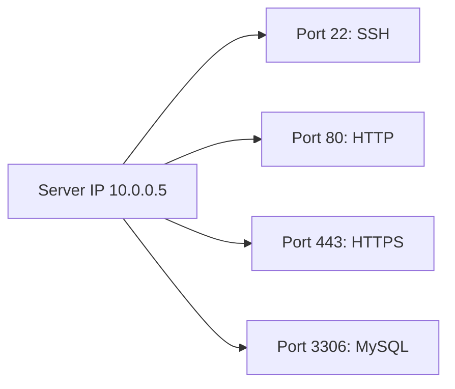

# Ports and Sockets

## 1. What Is This?

A **port** is a numbered endpoint (0–65535) that identifies a specific service on a host. A **socket** is the combination of an IP address + port + protocol that defines one end of a network connection.

## 2. Why Is This Needed?

Multiple services share one IP by using different ports. Knowing ports/sockets lets you tell *which* service a connection belongs to and spot conflicts ("port already in use").

## 3. Simple Layman Explanation

A server is an apartment building (one IP). Each **port** is an apartment number. A **socket** is a specific phone line into a specific apartment. Two services can't both claim apartment 80.

## 4. Technical Explanation

- **Well-known ports** (0–1023): standard services (22 SSH, 80 HTTP, 443 HTTPS). Binding these needs root.
- **Registered ports** (1024–49151): apps/databases (3306 MySQL, 5432 PostgreSQL).
- **Ephemeral ports** (49152–65535): temporary client-side ports.
- A **listening socket** waits for connections; an **established socket** is an active connection.
- A connection is uniquely identified by: `(local IP, local port, remote IP, remote port, protocol)`.

## 5. Real-World Example

Nginx fails to start: "bind() to 0.0.0.0:80 failed (Address already in use)". Another process already holds port 80. You find it with `ss -ltnp`, stop it, and Nginx binds successfully.

## 6. Diagram



## 7. Commands

```bash
ss -ltn                  # listening TCP ports (numeric)
ss -ltnp                 # + the owning process (needs sudo for all)
ss -tan                  # all TCP sockets (listening + established)
ss -lun                  # listening UDP ports
sudo lsof -i :80         # what is using port 80
cat /etc/services        # name<->port mappings
```

## 8. Command Explanation

- `ss -ltnp` → **l**istening, **t**cp, **n**umeric, **p**rocess. The everyday "what's listening and who owns it" command.
- `ss -tan` → all TCP states; useful to see established connections.
- `lsof -i :80` → lists processes using port 80 (alternative to `ss`).
- `/etc/services` → maps service names to default ports.

Expected `ss -ltnp`:

```
State   Local Address:Port   Process
LISTEN  0.0.0.0:22           users:(("sshd",pid=700,fd=3))
LISTEN  0.0.0.0:80           users:(("nginx",pid=900,fd=6))
```

## 9. Practice Tasks

1. `ss -ltnp` and identify SSH (22).
2. Start a quick server: `python3 -m http.server 8000 &`, then `ss -ltnp | grep 8000`.
3. `sudo lsof -i :8000` to confirm the owner.
4. Stop it (`kill`) and re-check that 8000 is free.

## 10. Common Mistakes

- Trying to bind a well-known port (<1024) without root.
- Two services configured on the same port — only one can listen.
- Confusing "listening" sockets with "established" connections.

## 11. Troubleshooting

- **"Address already in use"** → find the holder with `ss -ltnp` / `lsof -i :PORT`, then stop it or change ports.
- **Service running but unreachable** → it may be bound to `127.0.0.1` only (local), not `0.0.0.0`.
- **Port open locally but blocked remotely** → firewall/security group (Module 12 / cloud).

## 12. Best Practices

- Use `ss` (modern) over `netstat`.
- Bind services to the right interface (`127.0.0.1` for local-only).
- Document which service uses which port.

## 13. Quick Recap

- Port = service endpoint; socket = IP+port+protocol.
- `ss -ltnp` shows listeners and owners.
- "Address already in use" = port conflict.

## 14. References

- `man ss`, `man lsof`, `man services`
- iana ports: https://www.iana.org/assignments/service-names-port-numbers/

<!-- NAV-FOOTER -->

---

### 🧭 Navigation

| Previous | Up | Next |
|:---|:---:|---:|
| ⬅️ Prev: [ping, curl, wget](ping-curl-wget.md) | ⬆️ Module: [Module 07 — Networking Basics](README.md) | ➡️ Next: [netstat, ss, and lsof](netstat-ss-lsof.md) |
