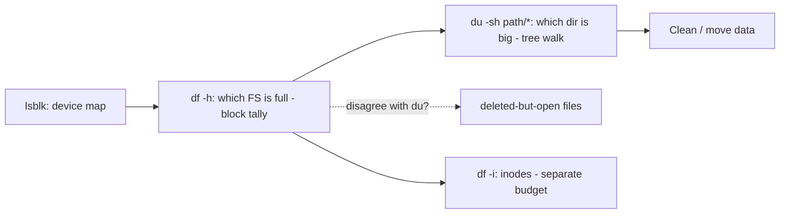

# df, du, and lsblk

## 1. What Is This?

The three measurement tools:
- `df` — free space per **filesystem**.
- `du` — disk usage of **directories/files**.
- `lsblk` — list of **block devices** (disks/partitions) and mount points.

## 2. Why Is This Needed?

When space is tight, you need to know *which* filesystem is full (`df`), then *which* directory is eating it (`du`), and *what* devices exist (`lsblk`). This trio solves nearly every disk problem.

## 3. Simple Layman Explanation

- `df` = how full each shelf (filesystem) is.
- `du` = how much each box (directory) on the shelf weighs.
- `lsblk` = the map of all your shelves.

## 4. Technical Explanation

| Tool | Answers | Scope |
|------|---------|-------|
| `df` | How full is each mounted filesystem? | Per-mount |
| `du` | How big is this directory/file? | Per-path |
| `lsblk` | What disks/partitions exist & where mounted? | Devices |

Also: filesystems can run out of **inodes** (file slots) even with free space — check `df -i`.

## 5. How It Works Under the Hood

`df` and `du` measure the *same* disk in two completely different ways — and knowing the difference explains their most confusing behavior (when their totals disagree):

- **`df` asks the filesystem for its own accounting.** Every filesystem maintains a running tally of used/free **blocks** in its metadata. `df` reads that number instantly — so it's fast regardless of disk size, and it counts *all* used space, including space held by files that no longer have a name (see below).
- **`du` walks the directory tree and adds up file sizes.** It `stat()`s each file under a path and sums their block usage. So `du` is slow on big trees, needs read permission to descend (hence `sudo` and `2>/dev/null`), and — crucially — **only counts files it can still see by name.**
- **Why they disagree (the classic gotcha):** if a process has a file **open** and someone `rm`s it, the *name* is gone (so `du` no longer counts it) but the *blocks* remain allocated until the process closes it (so `df` still counts them, see [Create/Copy/Move/Delete](../03-files-and-directories/create-copy-move-delete.md)). Result: `df` says 100% full, `du` can't find the space. That's not a bug — it's deleted-but-open files, and the fix is restarting the process, not deleting more.
- **Inodes are a separate budget.** A filesystem has a fixed number of **inodes** (one per file) set at format time. Millions of tiny files can exhaust inodes while blocks remain free → writes fail with "No space left on device" even though `df -h` shows space. Only `df -i` reveals it. Two independent limits: **blocks** (size) and **inodes** (file count).

So: `df` = the filesystem's own block tally (fast, counts orphaned blocks); `du` = a name-based walk (slow, misses orphaned blocks); `df -i` = the other budget entirely.

## 6. Diagram



## 7. Real-World Examples

**1. The everyday case.** `df -h` shows `/` at 100%. `du -sh /var/* | sort -h` shows `/var/log` is 30G. You found the offender in two commands and can now clean it (next topics).

**2. The standard drill, on screen:**

```
$ df -h
Filesystem      Size  Used Avail Use% Mounted on
/dev/nvme0n1p1   40G   40G     0  100% /            # ← the full filesystem
$ du -sh /var/* 2>/dev/null | sort -h | tail -3
1.1G    /var/lib
2.4G    /var/cache
30G     /var/log                                     # ← the culprit directory
$ sudo du -ah /var/log | sort -h | tail -2
28G     /var/log/app/debug.log                       # ← the actual file
```

`df` found the *filesystem*, `du` drilled to the *directory*, then the *file* — the exact top-down flow from Section 5.

**3. War story — inodes full with 40% free space.** A build server started failing with "No space left on device," but `df -h` showed `/` only 60% used. Deleting files didn't help. The real limit was **inodes**: a runaway job had created millions of tiny cache files. `df -i` showed `IUse% 100%` — every inode consumed even though blocks were free (Section 5's separate budget). Clearing the millions of small files (`find /tmp/cache -type f -delete`) restored inodes and writes resumed. Lesson: when `df -h` shows space but writes fail, always check `df -i`.

## 8. Worked Walkthrough

Run the full triage, including the two "gotcha" checks:

```
$ lsblk                                   # 0. the device map
NAME        SIZE MOUNTPOINTS
nvme0n1p1    40G /
$ df -h /                                 # 1. how full is the block budget?
Filesystem      Size  Used Avail Use% Mounted on
/dev/nvme0n1p1   40G   40G     0  100% /
$ df -i /                                 # 2. how full is the INODE budget?
Filesystem      Inodes  IUsed IFree IUse% Mounted on
/dev/nvme0n1p1  2.6M    412K  2.2M   16%  /          # inodes fine → it's a size problem
$ sudo du -sh /* 2>/dev/null | sort -h | tail -3    # 3. biggest top-level dirs
2.1G    /usr
5.0G    /home
30G     /var                                          # drill here next
$ sudo lsof +L1 2>/dev/null | head -3     # 4. any deleted-but-open files?
COMMAND   PID  USER  FD  ...  NLINK  NAME
mysqld    810  mysql 12  ...  0      /var/lib/.../ibtmp1 (deleted)   # ← df counts this, du won't
```

Two commands (`df -h`, `df -i`) classify the problem (size vs inodes), `du` localizes it, and `lsof +L1` catches orphaned space — the complete picture from Section 5.

## 9. Commands

```bash
df -h                        # free space, human-readable (block budget)
df -h /var                   # space for the FS holding /var
df -i                        # inode usage (file-count budget)
du -sh /var/log              # total size of /var/log
du -sh /var/* | sort -h      # size of each item under /var, sorted
du -ah /var/log | sort -h | tail   # biggest files under a dir
lsblk                        # device/partition/mount tree
sudo lsof +L1                # files with 0 links (deleted-but-open)
ncdu /var                    # interactive usage browser (install ncdu)
```

Sample output for each (dummy values, for reference):

```text
$ df -h
Filesystem      Size  Used Avail Use% Mounted on
/dev/nvme0n1p1   40G   38G  0.4G  99% /

$ df -i
Filesystem      Inodes IUsed IFree IUse% Mounted on
/dev/nvme0n1p1  2.6M   410K  2.2M   16% /

$ du -sh /var/* 2>/dev/null | sort -h | tail -3
1.1G    /var/lib
2.4G    /var/cache
30G     /var/log

$ lsblk
NAME        SIZE TYPE MOUNTPOINTS
nvme0n1p1    40G part /

$ sudo lsof +L1 | head -2
COMMAND PID  USER  FD  TYPE NLINK NAME
java    711  app   9u  REG  0     /tmp/leaked.log (deleted)
```

## 10. Command Explanation

- `df -h` → human-readable free/used per filesystem (the filesystem's own tally); first command for "disk full."
- `df -i` → inode usage; high here with free blocks means too many small files (Section 5).
- `du -sh PATH` → **s**ummary, **h**uman-readable total for a path (a tree walk).
- `du -sh /var/* | sort -h` → ranks subdirectories so the biggest is at the bottom.
- `lsof +L1` → files with zero links = deleted-but-open, explaining `df` vs `du` disagreements.
- `ncdu` → a friendly interactive explorer (install with `apt install ncdu`).

## 11. In Production (DevOps Context)

- **Disk-full incidents** always run this trio: `df -h` (which mount) → `du` (which dir) → clean (Module 08 troubleshooting).
- **Monitoring** (node_exporter, CloudWatch) alerts on *both* block usage and inode usage — inode exhaustion is a silent killer on servers with many small files (the war story).
- **Containers** hit the same limits: a container filling the host's `/var/lib/docker` shows as node `DiskPressure` in Kubernetes (Module 13); `du` on the overlay dirs finds the offender.
- **`df` vs `du` mismatch** is a routine on-call finding — the fix (restart the holder) comes from recognizing deleted-but-open files (`lsof +L1`).

## 12. Practice Tasks

1. `df -h` — note the `Use%` of `/`.
2. `df -i` — check inode usage (is IUse% high?).
3. `du -sh /var/* 2>/dev/null | sort -h` — find the largest directory under `/var`.
4. Create junk `fallocate -l 100M /tmp/junk`, watch `df -h` change, then `rm /tmp/junk`.
5. Install `ncdu` and explore `ncdu /var`.

## 13. Common Mistakes

- Running `du /` without `-s` and drowning in output. Use `-sh` per directory.
- Forgetting `df -i` when `df -h` shows free space but writes still fail (the war story).
- Misreading `du` (name-based directory size) as `df` (filesystem block tally).
- Ignoring that a `df`/`du` mismatch means deleted-but-open files, not a measuring error.

## 14. Troubleshooting

- **"No space left on device" but `df -h` shows space** → inodes exhausted; check `df -i` and delete many small files.
- **`du` is slow/permission-denied** → add `sudo` and `2>/dev/null` to skip errors.
- **`df` total ≠ `du` total** → deleted-but-open files still consuming space; `lsof +L1`, then restart the holder (Disk Full Troubleshooting).

## 15. Best Practices

- Standard drill: `df -h` → `du -sh /path/* | sort -h` → drill into the biggest.
- Monitor disk usage with alerts before it reaches 90% — and monitor inodes too.
- Check both budgets: space (`df -h`) and inodes (`df -i`).

## 16. Connects To

- **Prev:** [Disks, Partitions, Filesystems & Mounts](disk-partition-mount-concepts.md). **Next:** [mount and umount](mount-and-umount.md).
- **Why df≠du (inodes, deleted-open files):** [Create, Copy, Move, Delete](../03-files-and-directories/create-copy-move-delete.md), [Linux Filesystem Overview](../02-linux-basics/linux-file-system-overview.md).
- **Fixing a full disk:** [Disk Full Troubleshooting](disk-full-troubleshooting.md).
- **Practice:** [Lab 05 — Disk Full Scenario](../14-hands-on-labs/lab-05-disk-full-scenario.md).

## 17. Quick Recap

- `df -h` = filesystem's own block tally (fast); `du -sh dir/*` = name-based tree walk (find offenders); `df -i` = the separate inode budget.
- `df` > `du` means deleted-but-open files (`lsof +L1` → restart the holder).
- `lsblk` = device map. Drill top-down: df → du → clean.

## 18. References

- `man df`, `man du`, `man lsblk`, `man lsof`
- ncdu: https://dev.yorhel.nl/ncdu

<!-- NAV-FOOTER -->

---

### 🧭 Navigation

| Previous | Up | Next |
|:---|:---:|---:|
| ⬅️ Prev: [Disks, Partitions, Filesystems, and Mounts](disk-partition-mount-concepts.md) | ⬆️ Module: [Module 08 — Storage & Disk Management](README.md) | ➡️ Next: [mount and umount](mount-and-umount.md) |
