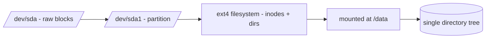

# Disks, Partitions, Filesystems, and Mounts

## 1. What Is This?

The building blocks of Linux storage:
- **Disk** — a physical/virtual storage device (`/dev/sda`, `/dev/nvme0n1`).
- **Partition** — a slice of a disk (`/dev/sda1`).
- **Filesystem** — the format that stores files on a partition (ext4, xfs).
- **Mount** — attaching a filesystem to a directory so you can use it.

## 2. Why Is This Needed?

Linux doesn't use drive letters (C:, D:). Everything is a directory in one tree. Understanding how disks become usable directories is key to managing storage and fixing "disk full".

## 3. Simple Layman Explanation

- A **disk** is a blank notebook.
- **Partitions** divide it into sections.
- A **filesystem** is the ruling/lines that let you write neatly.
- **Mounting** is gluing a section into your binder (the directory tree) at a tab (mount point) so you can read/write it.

## 4. Technical Explanation

- Disks appear under `/dev` (`/dev/sda`, `/dev/vda`, `/dev/nvme0n1`).
- A disk is partitioned (e.g., `/dev/sda1`, `/dev/sda2`).
- Each partition is formatted with a filesystem (ext4 is common, xfs on RHEL).
- A filesystem is **mounted** at a directory (e.g., `/` or `/data`). `/etc/fstab` lists mounts to set up at boot.

## 5. How It Works Under the Hood

Storage becomes usable through **four independent layers**, and every storage problem lives at one of them:

1. **The disk is raw capacity** — the kernel exposes it as a device file in `/dev` (`/dev/sda`, `/dev/nvme0n1`). At this point it's just a numbered sequence of blocks; you can't store a named file on it yet.
2. **A partition table carves the disk into regions** (`/dev/sda1`, `/dev/sda2`). This is just bookkeeping that says "blocks 0–N are partition 1." A brand-new cloud volume often has *no* partition table — which is why it shows in `lsblk` but you can't use it yet.
3. **A filesystem imposes structure on a partition** (`mkfs.ext4`). This writes the on-disk data structures — the **inode** tables and directory maps from [Linux Filesystem Overview](../02-linux-basics/linux-file-system-overview.md) — that turn raw blocks into "files with names, sizes, and permissions." Without this, the partition holds bytes but no *files*.
4. **Mounting grafts that filesystem onto the single tree** at a **mount point** (an existing directory). The kernel's Virtual File System (VFS) layer now routes any path under that directory to this filesystem. This is *the* reason Linux has no drive letters: instead of `D:`, a second disk simply *becomes* `/data`. Reads/writes to `/data/file` are transparently directed to `/dev/sdb`.

Each layer depends on the one below, which is exactly why "a new disk isn't usable" has a precise diagnosis: is it missing a partition (step 2), a filesystem (step 3), or just a mount (step 4)? `lsblk -f` shows all four layers at once, so you can see where the chain stops.

## 6. Diagram



## 7. Real-World Examples

**1. The everyday case.** A cloud VM has a root disk mounted at `/` and an extra data volume `/dev/sdb` formatted ext4 and mounted at `/data`. Apps write to `/data`; if it fills, only `/data` is affected, not the OS on `/`.

**2. Reading all four layers with `lsblk -f`:**

```
$ lsblk -f
NAME    FSTYPE  LABEL  UUID                                 MOUNTPOINT
sda                                                          
├─sda1  ext4           b1f2-...-a9              /            # disk→part→fs→mount: complete
└─sda2  swap           c3d4-...-e5              [SWAP]
sdb                                                          # a disk with NO partition/fs/mount yet
```

`sda1` shows the full chain (ext4, mounted at `/`); `sdb` is bare — present but unusable until partitioned/formatted/mounted (Section 5).

**3. War story — "I attached a 500 GB volume but there's no space."** An engineer attached a new EBS volume to an EC2 instance, saw it in `lsblk` as `nvme1n1`, and expected `/data` to have room — but apps still hit "disk full." The volume had **no filesystem and wasn't mounted** (steps 3–4 never happened): it was raw capacity the OS couldn't use. The fix was the full chain — `mkfs.ext4 /dev/nvme1n1`, `mkdir /data`, `mount`, then an `/etc/fstab` entry. Attaching a disk in the cloud is only step 1; the other three are on you.

## 8. Worked Walkthrough

Map your system's storage layers, then trace one from device to directory:

```
$ lsblk
NAME    SIZE TYPE MOUNTPOINTS
nvme0n1  40G disk
├─nvme0n1p1 39G part /            # root filesystem
└─nvme0n1p2  1G part [SWAP]
nvme1n1 100G disk /data          # a second disk, mounted at /data
$ df -h /data                    # how full is the /data filesystem?
Filesystem      Size  Used Avail Use% Mounted on
/dev/nvme1n1    98G   30G   63G  33% /data
$ findmnt /data                  # exactly which device backs this mount?
TARGET SOURCE       FSTYPE OPTIONS
/data  /dev/nvme1n1 ext4   rw,relatime
$ cat /etc/fstab | grep -v '^#'  # what mounts are set up at boot?
UUID=b1f2-...  /      ext4  defaults        0 1
UUID=9a8b-...  /data  ext4  defaults,nofail 0 2
```

You traced `/data` → `/dev/nvme1n1` (ext4) and confirmed it's pinned in `/etc/fstab` by **UUID** so it re-mounts every boot (Section 5, step 4).

## 9. Commands

```bash
lsblk                    # tree of disks, partitions, mount points
lsblk -f                 # + filesystem type and UUID (all four layers)
sudo fdisk -l            # detailed disk/partition info
df -h                    # mounted filesystems and free space
findmnt /data            # which device backs a given mount point
cat /etc/fstab           # mounts configured at boot
blkid                    # UUIDs and filesystem types
```

Sample output for each (dummy values, for reference):

```text
$ lsblk
NAME    SIZE TYPE MOUNTPOINTS
sda      50G disk
├─sda1   49G part /
└─sda2    1G part [SWAP]

$ lsblk -f
NAME  FSTYPE UUID                MOUNTPOINT
sda1  ext4   b1f2-...-a9         /
sda2  swap   c3d4-...-e5         [SWAP]

$ df -h
Filesystem  Size  Used Avail Use% Mounted on
/dev/sda1    49G   18G   29G  39% /

$ findmnt /
TARGET SOURCE    FSTYPE OPTIONS
/      /dev/sda1 ext4   rw,relatime

$ blkid
/dev/sda1: UUID="b1f2-...-a9" TYPE="ext4"
```

## 10. Command Explanation

- `lsblk` → the clearest view: device → partitions → mount points, as a tree.
- `lsblk -f` → adds filesystem type and UUID — shows all four layers, so you see where the chain stops.
- `fdisk -l` → low-level partition table details (needs sudo).
- `df -h` → which filesystems are mounted and how full.
- `findmnt <dir>` → the exact device + options behind a mount point.
- `/etc/fstab` → defines persistent mounts (device/UUID, mount point, type, options); `blkid` gives the UUIDs to use.

## 11. In Production (DevOps Context)

- **Cloud volumes** (EBS, persistent disks) arrive as raw devices — provisioning must partition/format/mount them (the war story), usually via cloud-init or Ansible with `/etc/fstab` (UUID + `nofail`).
- **Separate `/`, `/var`, `/data` volumes** are a deliberate design so runaway logs/data can't fill the OS disk — the mounting model makes this transparent (ties to [filesystem overview](../02-linux-basics/linux-file-system-overview.md)).
- **Kubernetes PersistentVolumes** are this exact chain one layer up: a volume is formatted and *mounted* into a pod's filesystem; "volume won't mount" events map to steps 3–4 (Module 13).
- **`nofail` in fstab** on cloud data volumes prevents a missing/detached disk from blocking boot — a common ops hardening.

## 12. Practice Tasks

1. `lsblk` and identify your root (`/`) device.
2. `lsblk -f` to see filesystem types and spot any bare (unformatted) device.
3. `df -h` to see free space per mount; `findmnt /` to see the backing device.
4. `cat /etc/fstab` and match each entry to `lsblk` (by UUID via `blkid`).

## 13. Common Mistakes

- Expecting Windows-style drive letters (it's one tree — Section 5).
- Confusing a disk (`/dev/sda`) with a partition (`/dev/sda1`).
- Assuming an attached cloud volume is usable before formatting + mounting (the war story).
- Editing `/etc/fstab` wrong, causing boot failure.

## 14. Troubleshooting

- **A new disk isn't usable** → determine where the chain stops with `lsblk -f`: needs partitioning, a filesystem, and/or a mount.
- **Mount missing after reboot** → it wasn't added to `/etc/fstab` (or the entry is wrong).
- **Wrong/empty `/data`** → the volume may not be mounted; check `lsblk`/`findmnt`/`mount`.
- **"No space" on `/` but a big disk exists** → that disk isn't mounted where you think (`findmnt`).

## 15. Best Practices

- Use **UUIDs** in `/etc/fstab` (stable across reboots), not device names.
- Keep OS (`/`) and data (`/data`) on separate volumes when possible.
- Add `nofail` for non-critical cloud data volumes; always back up `/etc/fstab` before editing.

## 16. Connects To

- **Prev:** [Module 08 — Storage & Disk](README.md). **Next:** [df, du, and lsblk](df-du-lsblk.md).
- **The single tree & mounting:** [Linux Filesystem Overview](../02-linux-basics/linux-file-system-overview.md).
- **Doing the mount:** [mount and umount](mount-and-umount.md); **measuring:** [df/du/lsblk](df-du-lsblk.md).
- **Volumes in containers:** [Linux for Kubernetes](../13-real-world-linux-for-devops/linux-for-kubernetes.md).

## 17. Quick Recap

- Four layers: disk → partition → filesystem → mount point; each depends on the one below.
- No drive letters — a disk *becomes* a directory via mounting onto the single tree.
- `lsblk -f` shows all layers at once; `/etc/fstab` (by UUID) defines boot mounts.

## 18. References

- `man lsblk`, `man fdisk`, `man fstab`, `man findmnt`
- Ubuntu storage: https://ubuntu.com/server/docs

<!-- NAV-FOOTER -->

---

### 🧭 Navigation

| Previous | Up | Next |
|:---|:---:|---:|
| ⬅️ Prev: [Module 08 — Storage & Disk Management](README.md) | ⬆️ Module: [Module 08 — Storage & Disk Management](README.md) | ➡️ Next: [df, du, and lsblk](df-du-lsblk.md) |
