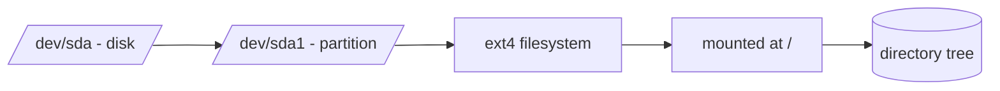

# Disks, Partitions, Filesystems, and Mounts

## 1. What Is This?

The building blocks of Linux storage:
- **Disk** — a physical/virtual storage device (`/dev/sda`, `/dev/nvme0n1`).
- **Partition** — a slice of a disk (`/dev/sda1`).
- **Filesystem** — the format that stores files on a partition (ext4, xfs).
- **Mount** — attaching a filesystem to a directory so you can use it.

## 2. Why Is This Needed?

Linux doesn't use drive letters (C:, D:). Everything is a directory in one tree. Understanding how disks become usable directories is key to managing storage and fixing "disk full".

## 3. Simple Layman Explanation

- A **disk** is a blank notebook.
- **Partitions** divide it into sections.
- A **filesystem** is the ruling/lines that let you write neatly.
- **Mounting** is gluing a section into your binder (the directory tree) at a tab (mount point) so you can read/write it.

## 4. Technical Explanation

- Disks appear under `/dev` (`/dev/sda`, `/dev/vda`, `/dev/nvme0n1`).
- A disk is partitioned (e.g., `/dev/sda1`, `/dev/sda2`).
- Each partition is formatted with a filesystem (ext4 is common, xfs on RHEL).
- A filesystem is **mounted** at a directory (e.g., `/` or `/data`). `/etc/fstab` lists mounts to set up at boot.

## 5. Real-World Example

A cloud VM has a root disk mounted at `/` and an extra data volume `/dev/sdb` formatted ext4 and mounted at `/data`. Apps write to `/data`; if it fills, only `/data` is affected, not the OS on `/`.

## 6. Diagram



## 7. Commands

```bash
lsblk                    # tree of disks, partitions, mount points
lsblk -f                 # + filesystem type and UUID
sudo fdisk -l            # detailed disk/partition info
df -h                    # mounted filesystems and free space
mount | column -t        # what's mounted where
cat /etc/fstab           # mounts configured at boot
blkid                    # UUIDs and filesystem types
```

## 8. Command Explanation

- `lsblk` → the clearest view: device → partitions → mount points, as a tree.
- `lsblk -f` → adds filesystem type and UUID.
- `fdisk -l` → low-level partition table details (needs sudo).
- `df -h` → which filesystems are mounted and how full.
- `/etc/fstab` → defines persistent mounts (device/UUID, mount point, type, options).

Expected `lsblk`:

```
NAME    SIZE TYPE MOUNTPOINT
sda      50G disk
├─sda1   49G part /
└─sda2    1G part [SWAP]
```

## 9. Practice Tasks

1. `lsblk` and identify your root (`/`) device.
2. `lsblk -f` to see filesystem types.
3. `df -h` to see free space per mount.
4. `cat /etc/fstab` and match entries to `lsblk`.

## 10. Common Mistakes

- Expecting Windows-style drive letters.
- Confusing a disk (`/dev/sda`) with a partition (`/dev/sda1`).
- Editing `/etc/fstab` wrong, causing boot failure.

## 11. Troubleshooting

- **A new disk isn't usable** → it needs partitioning, a filesystem, and a mount.
- **Mount missing after reboot** → it wasn't added to `/etc/fstab`.
- **Wrong/empty `/data`** → the volume may not be mounted; check `lsblk`/`mount`.

## 12. Best Practices

- Use **UUIDs** in `/etc/fstab` (stable across reboots), not device names.
- Keep OS (`/`) and data (`/data`) on separate volumes when possible.
- Always back up `/etc/fstab` before editing.

## 13. Quick Recap

- Disk → partition → filesystem → mount point.
- `lsblk` shows the whole picture; `/etc/fstab` defines boot mounts.
- No drive letters — everything is one tree.

## 14. References

- `man lsblk`, `man fdisk`, `man fstab`
- Ubuntu storage: https://ubuntu.com/server/docs
