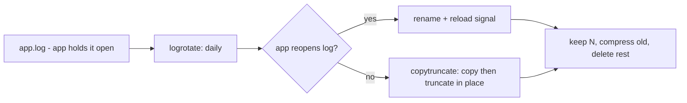

# Log Cleanup Basics

## 1. What Is This?

Safely reducing the space consumed by log files — using **log rotation**, **journald limits**, and careful manual cleanup.

## 2. Why Is This Needed?

Logs grow forever if unmanaged and are the #1 cause of full disks. Clean them the right way to free space without losing important records or breaking the apps that write them.

## 3. Simple Layman Explanation

Logs are like a diary that never stops. Instead of throwing out the whole diary (risky), you archive old pages, keep recent ones, and set a maximum number of pages — automatically.

## 4. Technical Explanation

- **logrotate** rotates, compresses, and deletes old logs on a schedule (config in `/etc/logrotate.conf` and `/etc/logrotate.d/`).
- **systemd journald** stores binary logs; cap them with `--vacuum-size`/`--vacuum-time` or `SystemMaxUse` in `/etc/systemd/journald.conf`.
- For a **growing, in-use** log, use `truncate -s 0` (not `rm`), so the writing process keeps its file handle.

## 5. How It Works Under the Hood

The whole art of log cleanup is handling the fact that **a service holds its log file open and keeps writing to the same file handle** (an inode, see [Create/Copy/Move/Delete](../03-files-and-directories/create-copy-move-delete.md)). That single fact explains every technique and every gotcha:

- **Naïve rotation breaks logging.** The classic logrotate move is: rename `app.log` → `app.log.1`, then create a fresh `app.log`. But the *app still has the old inode open* — so it keeps writing to `app.log.1` (now the "old" file), and the new `app.log` stays empty. Two solutions exist:
  - **`copytruncate`**: logrotate *copies* the file's contents to `app.log.1`, then **truncates the original in place**. The app's file handle stays valid (same inode, now empty) and keeps logging into `app.log`. Simple, but there's a tiny race window where lines written during the copy can be lost.
  - **Signal-based reopen**: logrotate renames the file, then sends the service a signal (`postrotate ... systemctl reload`) telling it to **reopen** its log — creating a fresh handle on the new `app.log`. Cleaner, but requires the app to support log reopening.
- **`truncate -s 0` for emergencies works for the same reason:** it zeroes the file *in place*, so the open handle keeps working and space frees immediately — whereas `rm` would orphan the inode (deleted-but-open, space not freed).
- **journald is different — it's not text files.** systemd stores logs as structured binary journals; you can't logrotate them. Instead you cap them: `--vacuum-size`/`--vacuum-time` prune old journal files now, and `SystemMaxUse=` in `journald.conf` enforces a permanent ceiling.

So: rotation must respect open file handles (via `copytruncate` or reopen-signals), `truncate` is the safe manual reclaim, and journald has its own size-cap mechanism.

## 6. Diagram



## 7. Real-World Examples

**1. The everyday case.** `/var/log/app/app.log` is 20G because the app has no rotation. You truncate it to reclaim space now, then add a logrotate rule so it auto-rotates daily, keeps 7 days, and compresses — the problem never recurs.

**2. Emergency reclaim + permanent fix, on screen:**

```
$ sudo du -ah /var/log | sort -h | tail -2
1.2G    /var/log/journal
20G     /var/log/app/app.log                 # the offender
$ sudo truncate -s 0 /var/log/app/app.log    # instant reclaim; app keeps its handle
$ sudo du -sh /var/log/app/app.log
0       /var/log/app/app.log
$ sudo journalctl --disk-usage
Archived and active journals take up 1.2G in the file system.
$ sudo journalctl --vacuum-time=7d           # keep only a week of journal
Vacuuming done, freed 900M.
```

Space back immediately via `truncate`, and journald trimmed with `vacuum` — the two mechanisms from Section 5.

**3. War story — the app that went silent after rotation.** A team added a logrotate rule for a custom app, and it worked — until they noticed the app had **stopped logging entirely** after the first rotation. The cause: logrotate renamed `app.log`, but the app kept writing to the old (renamed) inode and never touched the new file (Section 5). Because the app couldn't reopen on a signal, the fix was adding **`copytruncate`** to the rule. After that, rotations kept the app's handle valid and logging continued. The lesson: for apps that don't reopen their logs, `copytruncate` is mandatory.

## 8. Worked Walkthrough

Reproduce the open-handle problem, then write and dry-run a rotation rule:

```
# Show WHY rm/rename fails on an open log:
$ ( while true; do echo "line $(date +%s)"; sleep 1; done ) >> /tmp/demo.log &
[1] 9400
$ ls -s /tmp/demo.log ; sleep 3
$ rm /tmp/demo.log                       # remove the NAME (process still writing)
$ ls -s /tmp/demo.log 2>/dev/null || echo "name gone, but..."
name gone, but...
$ sudo lsof -p 9400 | grep demo          # ...the process still holds the deleted inode
bash 9400 alice 1w REG ... /tmp/demo.log (deleted)     # space NOT freed
$ kill 9400                              # only closing the handle frees it

# The RIGHT way for a live log: truncate in place
$ : > /tmp/live.log                      # (shell truncate; equivalent to truncate -s 0)

# A logrotate rule + safe dry run:
$ cat /etc/logrotate.d/myapp
/var/log/app/*.log {
    daily
    rotate 7
    compress
    missingok
    notifempty
    copytruncate
}
$ sudo logrotate -d /etc/logrotate.d/myapp   # -d = DRY RUN, changes nothing
reading config file /etc/logrotate.d/myapp
considering log /var/log/app/app.log
  log needs rotating
```

You watched `rm` orphan an open log (space stuck) versus `truncate`/`copytruncate` doing it safely — and `logrotate -d` previews the rule without touching anything.

## 9. Commands

```bash
sudo du -ah /var/log | sort -h | tail        # biggest logs
sudo truncate -s 0 /var/log/app/app.log      # empty an active log safely
sudo journalctl --disk-usage                 # journal size
sudo journalctl --vacuum-size=200M           # cap journal to 200M
sudo journalctl --vacuum-time=7d             # keep only 7 days
sudo logrotate -d /etc/logrotate.conf        # dry-run (debug) rotation
sudo logrotate -f /etc/logrotate.d/myapp     # force a rotation now
```

Example logrotate rule (`/etc/logrotate.d/myapp`):

```
/var/log/app/*.log {
    daily              # rotate every day
    rotate 7           # keep 7 old versions
    compress           # gzip old logs
    missingok          # don't error if missing
    notifempty         # skip if empty
    copytruncate       # truncate the original (for apps that hold it open)
}
```

Sample output for each (dummy values, for reference):

```text
$ sudo du -ah /var/log | sort -h | tail -2
1.2G    /var/log/journal
20G     /var/log/app/app.log

$ sudo journalctl --disk-usage
Archived and active journals take up 1.2G in the file system.

$ sudo journalctl --vacuum-size=200M
Vacuuming done, freed 1.0G of archived journals.

$ sudo logrotate -d /etc/logrotate.d/myapp
considering log /var/log/app/app.log
  log needs rotating (based on criteria)

$ sudo logrotate -f /etc/logrotate.d/myapp
# (no output = rotation performed)
```

## 10. Command Explanation

- `truncate -s 0 file` → empties a log in place; safe while the app is writing (keeps the handle valid — Section 5).
- `journalctl --vacuum-size/--vacuum-time` → trims systemd's binary journal (which logrotate can't touch).
- `logrotate -d` → **dry run**; shows what *would* happen without changing anything (test before trusting).
- `logrotate -f` → forces rotation immediately (useful for testing your rule).
- `copytruncate` → copies then truncates the live file, so apps that don't reopen on rotation keep logging (the war-story fix).

## 11. In Production (DevOps Context)

- **logrotate is the default answer** to unbounded logs on servers; distro packages ship rules in `/etc/logrotate.d/` and a daily cron/timer runs them.
- **journald `SystemMaxUse=`** in `journald.conf` is the permanent cap for systemd logs — set it on every server so the journal can't fill `/var`.
- **Containers don't logrotate the same way:** apps log to stdout/stderr; Docker/Kubernetes handle rotation via the logging driver (`max-size`/`max-file`) — an unrotated container log is a classic node `DiskPressure` cause (Module 13).
- **Compliance/audit logs** must be shipped off-host (to ELK/CloudWatch/Loki) *before* rotation deletes them — never blindly delete audit trails.

## 12. Practice Tasks

1. `sudo du -ah /var/log | sort -h | tail` — find your biggest logs.
2. `sudo journalctl --disk-usage`, then `sudo journalctl --vacuum-time=7d`.
3. Create a test log, have a loop write to it, `rm` it, and confirm with `lsof` the space isn't freed; then `truncate`/kill and confirm it is.
4. Write a logrotate rule for a test path and run `sudo logrotate -d` on it (dry run).

## 13. Common Mistakes

- `rm`-ing an active log instead of truncating → space not freed until the app restarts (Section 5).
- Forgetting `copytruncate` (or a reopen signal) for apps that don't reopen their log → the app goes silent after rotation (the war story).
- Deleting logs an audit/compliance process needs before they're shipped off-host.
- Trying to logrotate the systemd journal (it's binary — use `vacuum`/`SystemMaxUse` instead).

## 14. Troubleshooting

- **Space not freed after deleting a log** → the app still holds it open; `truncate` instead, or restart the app (`lsof +L1` confirms).
- **App stopped logging after rotation** → it didn't reopen the file; add `copytruncate` or send it a reload signal in `postrotate`.
- **logrotate not running** → check its cron job / systemd timer (`systemctl status logrotate.timer`) and the config path.
- **Journal still huge** → set `SystemMaxUse=` in `/etc/systemd/journald.conf` and restart `systemd-journald`.

## 15. Best Practices

- Automate with **logrotate**; never rely on manual cleanup.
- Cap journald size in `journald.conf` (`SystemMaxUse=`).
- Use `truncate` for active logs; test rotation with `-d` first.
- Ship audit/compliance logs off-host before rotation deletes them.

## 16. Connects To

- **Prev:** [Disk Full Troubleshooting](disk-full-troubleshooting.md). **Next:** [Module 09 — Logs, Monitoring & Troubleshooting](../09-logs-monitoring-troubleshooting/README.md).
- **Why open handles matter:** [Create, Copy, Move, Delete](../03-files-and-directories/create-copy-move-delete.md), [df/du/lsblk](df-du-lsblk.md).
- **The journal:** [journalctl Basics](../09-logs-monitoring-troubleshooting/journalctl-basics.md), [Syslog & /var/log](../09-logs-monitoring-troubleshooting/syslog-and-var-log.md).
- **Automated cleanup scripts:** [Log Cleanup Script Example](../10-shell-scripting/log-cleanup-script-example.md), [Scheduled Backup Example](../11-automation-and-cron/scheduled-backup-example.md).

## 17. Quick Recap

- Logs grow because apps hold them open; rotation must respect that handle (`copytruncate` or reopen-signal).
- `truncate -s 0` safely reclaims an active log; `rm` orphans it (space stuck).
- journald is binary — cap it with `--vacuum-*` and `SystemMaxUse=`. Automate with logrotate; test with `-d`.

## 18. References

- `man logrotate`, `man journalctl`, `man journald.conf`
- [disk-full-troubleshooting.md](./disk-full-troubleshooting.md)

<!-- NAV-FOOTER -->

---

### 🧭 Navigation

| Previous | Up | Next |
|:---|:---:|---:|
| ⬅️ Prev: [Disk Full Troubleshooting](disk-full-troubleshooting.md) | ⬆️ Module: [Module 08 — Storage & Disk Management](README.md) | ➡️ Next: [Module 09 — Logs, Monitoring & Troubleshooting](../09-logs-monitoring-troubleshooting/README.md) |
