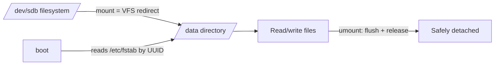

# mount and umount

## 1. What Is This?

**Mounting** attaches a filesystem (a disk, partition, USB, or network share) to a directory so you can access its files. **Unmounting** (`umount`) safely detaches it.

## 2. Why Is This Needed?

New disks, backup drives, and network shares are useless until mounted. Knowing how to mount (temporarily and at boot via `/etc/fstab`) is core storage admin.

## 3. Simple Layman Explanation

A disk is a book; a directory is a slot on your shelf. **Mounting** slides the book into a slot so you can read it. **Unmounting** removes it cleanly so you don't tear pages (corrupt data).

## 4. Technical Explanation

- `mount <device> <dir>` attaches a filesystem at a **mount point** (an existing directory).
- Mounts done with `mount` are **temporary** (lost on reboot).
- To make them **permanent**, add an entry to `/etc/fstab`.
- `umount` detaches; it fails if files are in use (a process has them open).

## 5. How It Works Under the Hood

Mounting is the kernel's **Virtual File System (VFS)** doing a redirect: it records "any path under `/data` is served by the filesystem on `/dev/sdb`." After that, when you open `/data/file`, the VFS routes the request to that device transparently. Three consequences explain the behavior and the dangers:

- **The mount point's original contents are hidden, not deleted.** If `/data` already had files and you mount a disk over it, those files still exist underneath — they just become invisible until you `umount`. Mounting over a non-empty directory is a classic "where did my files go?" surprise.
- **`umount` fails if the filesystem is "busy" because the kernel can't safely detach in-use resources.** If any process has a file open under the mount — *or even just has its working directory there* (`cd /data`) — the kernel refuses, returning "target is busy." This isn't stubbornness: detaching mid-write would corrupt data. You must find and stop the user (`lsof`/`fuser`) or `cd` out first. **Clean unmount = flush buffers + release = no corruption**; yanking a busy/dirty mount is how filesystems get damaged.
- **Temporary vs permanent is about *who* mounts it.** A manual `mount` command exists only in the kernel's current mount table — a reboot wipes it. `/etc/fstab` is the list systemd reads *at boot* to re-establish mounts, keyed ideally by **UUID** (a stable filesystem fingerprint) rather than device names like `/dev/sdb`, which can shift between reboots as disks are added/removed. A wrong fstab line can therefore **block boot** — which is why `mount -a` (mount everything in fstab *now*) is the mandatory test before you ever reboot.

## 6. Diagram



## 7. Real-World Examples

**1. The everyday case.** You attach a new 100G volume to a cloud VM. Steps: format it (`mkfs.ext4 /dev/sdb`), create `/data`, `mount /dev/sdb /data`, then add it to `/etc/fstab` so it survives reboots. Now apps can store data on `/data`.

**2. Mount, verify, and get the UUID for fstab:**

```
$ sudo mkdir -p /data
$ sudo mount /dev/sdb /data
$ findmnt /data
TARGET SOURCE     FSTYPE OPTIONS
/data  /dev/sdb   ext4   rw,relatime          # mounted (temporarily) ✓
$ df -h /data | tail -1
/dev/sdb        98G   24K   93G   1% /data
$ sudo blkid /dev/sdb
/dev/sdb: UUID="9a8b-7c6d-..." TYPE="ext4"      # ← put THIS in /etc/fstab, not /dev/sdb
```

The mount works now, but it's temporary until you add the UUID line to `/etc/fstab` (Section 5).

**3. War story — the fstab typo that bricked boot.** An engineer added a data-volume line to `/etc/fstab` using `/dev/sdb` and a small typo in the options, then rebooted to "make it permanent." The VM never came back — boot halted in emergency mode waiting for the bad mount. Recovery required the cloud console's serial/rescue mode to comment out the line. Two habits would have prevented it: run **`sudo mount -a`** first (it reproduces the boot-time mount and surfaces the error safely, no reboot), and use a **UUID** plus **`nofail`** so a missing/mistyped device can't block boot (Section 5).

## 8. Worked Walkthrough

Practice the mount lifecycle safely with a bind mount (no real disk needed), including the "busy" case:

```
$ sudo mkdir -p /tmp/mp
$ sudo mount --bind /etc /tmp/mp        # graft /etc's contents at /tmp/mp
$ findmnt /tmp/mp
TARGET  SOURCE      FSTYPE OPTIONS
/tmp/mp /dev/...[/etc] ...  rw,relatime
$ ls /tmp/mp | head -3                   # see /etc's files via the mount
hostname
hosts
passwd
$ cd /tmp/mp                             # now MAKE it busy
$ sudo umount /tmp/mp
umount: /tmp/mp: target is busy.         # kernel refuses — we're standing in it (Section 5)
$ cd /                                   # step out
$ sudo umount /tmp/mp                    # now it detaches cleanly
$ findmnt /tmp/mp || echo "unmounted"
unmounted
```

You reproduced "target is busy" (your own shell was inside) and the clean unmount after `cd /` — exactly why you find and clear users before detaching.

## 9. Commands

```bash
lsblk -f                          # see devices & filesystems
sudo mkdir -p /data               # create a mount point
sudo mount /dev/sdb /data         # temporary mount
sudo mount -t ext4 /dev/sdb /data # specify filesystem type
findmnt /data                     # confirm what's mounted there
df -h /data                       # check space on it
sudo umount /data                 # unmount
sudo umount -l /data              # lazy unmount (if busy) — use carefully
blkid /dev/sdb                    # get the UUID for fstab
sudo mount -a                     # mount everything in fstab (TEST before reboot)
```

Permanent mount — add to `/etc/fstab` (use UUID; `nofail` for non-critical volumes):

```
UUID=9a8b-7c6d-...  /data  ext4  defaults,nofail  0  2
```

Sample output for each (dummy values, for reference):

```text
$ sudo mount /dev/sdb /data
# (no output = success)

$ findmnt /data
TARGET SOURCE   FSTYPE OPTIONS
/data  /dev/sdb ext4   rw,relatime

$ sudo umount /data
# (no output = success; "target is busy" if in use)

$ blkid /dev/sdb
/dev/sdb: UUID="9a8b-7c6d-..." TYPE="ext4"

$ sudo mount -a
# (no output = all fstab entries mounted cleanly; errors here = a bad line to fix NOW)
```

## 10. Command Explanation

- `mount <dev> <dir>` → attaches now; not persistent (Section 5).
- `mount -t ext4` → explicitly set filesystem type if auto-detect fails.
- `umount /data` → detaches; **must not be your current directory** and no process may hold files there.
- `umount -l` → lazy unmount; detaches when no longer busy (use carefully — it can hide real problems).
- `mount -a` → mounts all `/etc/fstab` entries — the safe way to test fstab before rebooting.
- `blkid` → gives the UUID to use in fstab (stable across reboots, unlike `/dev/sdX`).

## 11. In Production (DevOps Context)

- **Cloud data volumes** are formatted and added to `/etc/fstab` (UUID + `nofail`) by provisioning so they persist and never block boot (the war story) (Module 13).
- **`mount -a` is a deploy safety gate** — never reboot a server after an fstab change without it.
- **NFS/network shares** mount the same way (`mount -t nfs server:/export /mnt`) and are common for shared config/artifacts; a hung NFS mount is a top cause of processes stuck in `D` state (Module 05).
- **Kubernetes** mounts PersistentVolumes into pods using this same machinery; "volume is already mounted"/"unmount timed out" node errors are the busy-mount problem at scale (Module 13).

## 12. Practice Tasks

1. `lsblk -f` to inspect your devices and filesystems.
2. Safe demo: `sudo mkdir /tmp/mp && sudo mount --bind /etc /tmp/mp`, `ls /tmp/mp`, then `sudo umount /tmp/mp`.
3. Reproduce "target is busy": `cd` into a mount, try to `umount`, then `cd /` and retry.
4. `cat /etc/fstab` and map each line to `lsblk`; run `sudo mount -a` and confirm no errors.

## 13. Common Mistakes

- Editing `/etc/fstab` incorrectly → **system won't boot** (the war story). Always `mount -a` to test first; add `nofail` for data volumes.
- Using device names (`/dev/sdb`) in fstab instead of UUIDs (names can change between reboots).
- Trying to `umount` while you're `cd`'d inside the mount (it's "busy").
- Mounting over a non-empty directory and thinking files were lost (they're just hidden — Section 5).

## 14. Troubleshooting

- **`umount: target is busy`** → find who's using it: `lsof +D /data` or `fuser -vm /data`; `cd` out; stop the process; then unmount.
- **`mount: wrong fs type`** → specify `-t` or format the device first (`mkfs`).
- **Bad fstab line broke boot** → boot to recovery/rescue, comment out the line, fix the UUID, add `nofail`.
- **Files "disappeared"** → a filesystem may be mounted over the directory; `findmnt <dir>` and `umount` to reveal what's underneath.

## 15. Best Practices

- Always test fstab changes with `sudo mount -a` before rebooting.
- Use UUIDs in fstab; add `nofail` for non-critical data volumes.
- Unmount cleanly to avoid corruption; never yank a busy mount — clear its users first.

## 16. Connects To

- **Prev:** [df, du, and lsblk](df-du-lsblk.md). **Next:** [Disk Full Troubleshooting](disk-full-troubleshooting.md).
- **The four storage layers:** [Disks, Partitions, Filesystems & Mounts](disk-partition-mount-concepts.md).
- **Busy mounts / D-state:** [Kill and Signals](../05-processes-and-services/kill-signals.md).
- **Volumes in containers:** [Linux for Kubernetes](../13-real-world-linux-for-devops/linux-for-kubernetes.md).

## 17. Quick Recap

- `mount <dev> <dir>` (temporary) via the VFS; `/etc/fstab` (permanent, by UUID) re-mounts at boot; `umount` detaches.
- "Target is busy" = a process (or your shell) is using the mount — clear it, don't force.
- Always test fstab with `sudo mount -a` before rebooting; use UUID + `nofail`.

## 18. References

- `man mount`, `man umount`, `man fstab`, `man blkid`, `man findmnt`

<!-- NAV-FOOTER -->

---

### 🧭 Navigation

| Previous | Up | Next |
|:---|:---:|---:|
| ⬅️ Prev: [df, du, and lsblk](df-du-lsblk.md) | ⬆️ Module: [Module 08 — Storage & Disk Management](README.md) | ➡️ Next: [Disk Full Troubleshooting](disk-full-troubleshooting.md) |
