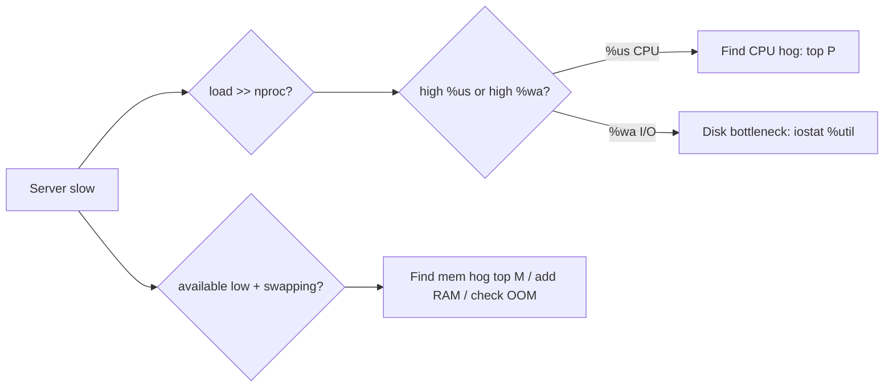

# CPU, Memory, and Disk Checks

## 1. What Is This?

The commands that report a server's **health**: CPU load, memory usage, and disk I/O/space — so you can tell *what* resource is under pressure.

## 2. Why Is This Needed?

"The server is slow" is meaningless until you know which resource is the bottleneck. These checks turn a vague complaint into a specific cause: CPU-bound, memory-bound, or I/O-bound.

## 3. Simple Layman Explanation

Like a doctor checking pulse, temperature, and breathing, you check CPU (busyness), memory (working space), and disk (storage + I/O). One of them is usually the problem.

## 4. Technical Explanation

| Resource | Tools | Key indicator |
|----------|-------|---------------|
| CPU | `top`, `uptime`, `mpstat` | load average vs cores; `%us`/`%sy` |
| Memory | `free -h`, `top` | available memory, swap usage |
| Disk space | `df -h`, `df -i` | `Use%`, inodes |
| Disk I/O | `iostat`, `top` (`wa`) | `%iowait`, await |

**Load average** is the number of processes wanting CPU; compare it to core count (`nproc`).

## 5. How It Works Under the Hood

Two metrics cause 90% of misdiagnoses — **load average** and **"free" memory** — because both mean something different from what beginners assume:

- **Load average counts more than CPU.** It's the average number of processes in the kernel's **run queue** — those *running or runnable* **plus, on Linux, those in uninterruptible I/O wait (`D` state)**. So load isn't "CPU %"; it's "demand for the CPU *and* stuck-on-disk work." Compare it to `nproc`: load ≈ cores = fully busy; load ≫ cores = overloaded. The killer insight: **high load with low CPU% means the extra load is I/O wait**, not computation — the processes are blocked on a slow/failing disk. That's why you check `%wa` (iowait) in `top` before blaming the CPU.
- **Linux deliberately keeps "free" memory near zero.** Unused RAM is wasted RAM, so the kernel fills it with **buff/cache** (cached file data) that it instantly reclaims when apps need it. So a scary-looking low "free" is *normal and good*. The number that actually matters is **`available`** — memory apps can get *without swapping* (it already accounts for reclaimable cache). Real memory pressure shows as **swap activity** (`si`/`so` in `vmstat`) and, at the extreme, the **OOM killer** terminating a process (`dmesg | grep -i oom`).
- **Disk has two independent limits** (from Module 08): **space** (`df -h`) and **inodes** (`df -i`) — plus **I/O throughput**, where `%util` near 100% and rising `await` in `iostat` mean the disk is the bottleneck.

So the diagnostic logic: load vs cores tells you *there's* pressure; `%us` vs `%wa` splits CPU-bound from I/O-bound; `available`+swap (not "free") judges memory; `df`/`iostat` finish the disk picture. Check all three before concluding.

## 6. Diagram



## 7. Real-World Examples

**1. The everyday case.** Slow server: `uptime` shows load 16 on a 4-core box (overloaded). `top` shows high `%wa` (I/O wait). `iostat` shows a disk at 100% utilization. Conclusion: disk I/O is the bottleneck, not CPU.

**2. Reading the vital signs correctly:**

```
$ uptime
 09:20:11 up 42 days,  load average: 15.8, 12.1, 6.0     # high...
$ nproc
4                                                         # ...on only 4 cores → overloaded
$ top -b -n1 | grep '%Cpu'
%Cpu(s):  8.1 us,  2.0 sy,  0.0 ni, 10.2 id, 79.4 wa      # 79% WAIT, only 8% user → it's I/O!
$ free -h
               total   used   free  shared buff/cache available
Mem:            7.7Gi  2.1Gi  0.2Gi  120Mi    5.4Gi      5.1Gi   # "free" tiny, but AVAILABLE 5.1G = fine
```

Load is high, but `%wa` (not `%us`) is the culprit → **disk**, not CPU. And low "free" is harmless because `available` is 5.1G (Section 5).

**3. War story — buying RAM that wasn't needed (twice wrong).** A team saw `free` showing "only 0.2G free" and load of 12, and ordered a bigger instance to "add memory." It didn't help. Two misreadings: (1) `available` was actually 5 GB — memory was *fine* (Linux was just caching); (2) the real problem was **load driven by I/O wait** — `top` showed `%wa` at 80% because a failing disk was slow. `iostat -xz 1` confirmed one disk pinned at 100% `%util`. The fix was storage (and a runaway log write), not RAM. Reading `available` (not "free") and `%wa` (not just load) would have saved the wrong purchase.

## 8. Worked Walkthrough

Run the full health check and interpret each number:

```
$ uptime ; nproc
 09:20 up 3:11,  load average: 0.40, 0.55, 0.60
4                                          # load 0.4 on 4 cores → plenty idle
$ free -h
               total   used   free  shared buff/cache available
Mem:            7.7Gi  2.0Gi  3.1Gi  100Mi    2.6Gi      5.3Gi   # available 5.3G, no pressure
Swap:           2.0Gi     0B  2.0Gi                              # zero swap used = healthy
$ vmstat 1 3
 r  b   swpd   free   buff  cache   si   so   bi   bo  wa
 1  0      0 3200000 210000 2600000   0    0    2    5   0        # si/so=0 (no swap), wa=0 (no I/O wait)
$ df -h / ; df -i /
/dev/nvme0n1p1  40G 18G 22G 46% /
/dev/nvme0n1p1  2.6M 412K 2.2M 16% /       # space AND inodes both fine
$ dmesg | grep -i oom || echo "no OOM events"
no OOM events
```

Every signal is green: load ≪ cores, `available` high, swap zero, `wa` zero, disk space+inodes fine, no OOM. This is the "one-line health summary" you learn to produce at a glance (Section 5).

## 9. Commands

```bash
uptime                       # load average (1/5/15 min)
nproc                        # number of CPU cores (compare to load)
top                          # live CPU/mem per process (P=cpu, M=mem)
free -h                      # memory and swap (watch 'available' + swap)
vmstat 1 5                   # system stats every 1s, 5 times (si/so, wa)
df -h ; df -i                # disk space & inodes
iostat -xz 1 3               # disk I/O %util/await (needs sysstat)
dmesg | grep -i oom          # was a process killed for memory (OOM)?
```

Sample output for each (dummy values, for reference):

```text
$ uptime
 09:20:11 up 42 days,  load average: 0.42, 0.31, 0.20

$ free -h
               total   used   free  shared buff/cache available
Mem:            7.7Gi  2.0Gi  3.1Gi  100Mi    2.6Gi      5.3Gi
Swap:           2.0Gi     0B  2.0Gi

$ vmstat 1 2
 r  b   swpd   free   buff  cache   si   so   bi   bo  us sy id wa
 1  0      0 3.2G   210M  2.6G    0    0    2    5   3  1 96  0

$ df -i /
Filesystem     Inodes IUsed IFree IUse% Mounted on
/dev/nvme0n1p1 2.6M   412K  2.2M   16% /

$ iostat -xz 1 1
Device  r/s  w/s  %util
nvme0n1 12   40   4.2
```

## 10. Command Explanation

- `uptime` → load averages; compare to `nproc`. Load ≈ cores is busy; load ≫ cores is overloaded (and may be I/O, not CPU).
- `free -h` → `available` is the real free memory; heavy `swap` use signals true memory pressure (not low "free").
- `vmstat 1 5` → columns `r` (run queue), `si/so` (swap in/out — nonzero = pressure), `wa` (I/O wait).
- `iostat -xz` → per-disk `%util` and `await`; high values = disk bottleneck (install `sysstat`).
- `dmesg | grep -i oom` → finds Out-Of-Memory killer events (the smoking gun for a service that "just died").

## 11. In Production (DevOps Context)

- **First-response triage** for any "slow/unresponsive" alert is this trio; the load-vs-`%wa` split (Section 5) routes you to CPU, disk, or memory fast.
- **OOM kills** connect here: `dmesg`/`journalctl -k` "Out of memory: Killed process" explains a mysteriously restarting service — and in Kubernetes surfaces as `OOMKilled` (exit 137) against a cgroup limit (Module 13).
- **Monitoring/alerting** (node_exporter, CloudWatch) graphs exactly these — load, available memory, swap, disk %util, inode usage — with the same interpretation rules.
- **Capacity decisions** hinge on reading them correctly (the war story) — right-sizing vs. chasing the wrong resource.

## 12. Practice Tasks

1. `uptime` and `nproc` — is your load high *relative to cores*?
2. `free -h` — read `available` (not "free") and swap; are you actually under pressure?
3. `top`, press `P` (CPU) then `M` (memory); note the `%wa` in the header.
4. `df -h` and `df -i` (space vs inodes).
5. (If installed) `iostat -xz 1 3` and read `%util`; write a one-line health summary of the box.

## 13. Common Mistakes

- Reading load average as a percentage (it's relative to cores, and includes I/O wait — Section 5).
- Thinking low "free" memory is bad — Linux caches with it; watch `available` and swap instead (the war story).
- Ignoring `%iowait`, blaming CPU when the disk is the real bottleneck.
- Overlooking OOM as the cause of a service that "just disappeared."

## 14. Troubleshooting

- **High load, low CPU%** → I/O wait; check disks (`iostat`, `top` `%wa`) (Module 08).
- **Swapping heavily (`si`/`so` nonzero)** → real memory pressure; find the hog in `top` (sort by `%MEM`).
- **A service vanished/restarted** → `dmesg | grep -i oom` / `journalctl -k`; it was likely OOM-killed.
- **Space free but writes fail** → `df -i` (inodes exhausted, Module 08).

## 15. Best Practices

- Check all three (CPU/mem/disk) before concluding — and split load into `%us` vs `%wa`.
- Use `available` memory and swap activity, not raw "free".
- Install `sysstat` for `iostat`/`mpstat` on servers; wire alerts to these metrics.

## 16. Connects To

- **Prev:** [syslog and /var/log](syslog-and-var-log.md). **Next:** [Real-World Troubleshooting Scenarios](real-world-troubleshooting-scenarios.md).
- **Find/act on process hogs:** [ps, top & htop](../05-processes-and-services/ps-top-htop.md), [Kill and Signals](../05-processes-and-services/kill-signals.md).
- **Disk space vs inodes vs I/O:** [df/du/lsblk](../08-storage-and-disk-management/df-du-lsblk.md).
- **OOM in containers:** [Linux for Kubernetes](../13-real-world-linux-for-devops/linux-for-kubernetes.md).

## 17. Quick Recap

- Load average = run-queue demand incl. I/O wait; compare to `nproc`, then split `%us` (CPU) vs `%wa` (disk).
- Watch **`available`** memory + swap, not "free" (Linux caches on purpose); OOM kills show in `dmesg`.
- Disk has two limits (`df -h` space, `df -i` inodes) plus I/O (`iostat %util`). Check all three.

## 18. References

- `man top`, `man free`, `man vmstat`, `man iostat`, `man uptime`

<!-- NAV-FOOTER -->

---

### 🧭 Navigation

| Previous | Up | Next |
|:---|:---:|---:|
| ⬅️ Prev: [syslog and /var/log](syslog-and-var-log.md) | ⬆️ Module: [Module 09 — Logs, Monitoring & Troubleshooting](README.md) | ➡️ Next: [Real-World Troubleshooting Scenarios](real-world-troubleshooting-scenarios.md) |
