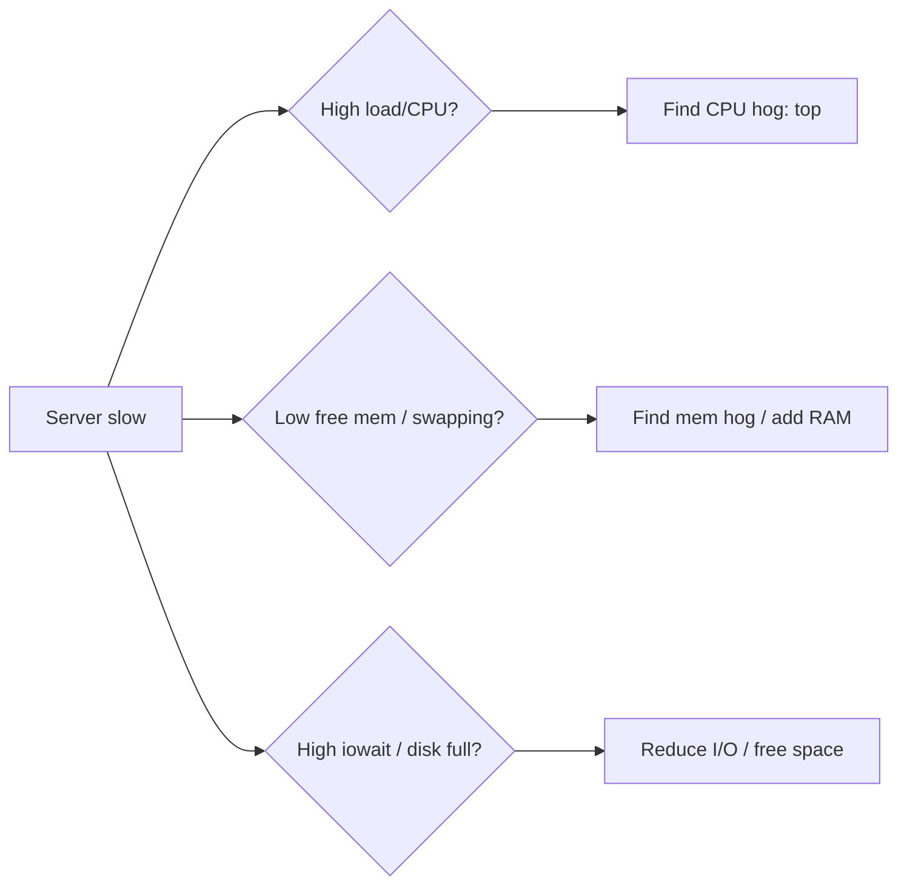

# CPU, Memory, and Disk Checks

## 1. What Is This?

The commands that report a server's **health**: CPU load, memory usage, and disk I/O/space — so you can tell *what* resource is under pressure.

## 2. Why Is This Needed?

"The server is slow" is meaningless until you know which resource is the bottleneck. These checks turn a vague complaint into a specific cause: CPU-bound, memory-bound, or I/O-bound.

## 3. Simple Layman Explanation

Like a doctor checking pulse, temperature, and breathing, you check CPU (busyness), memory (working space), and disk (storage + I/O). One of them is usually the problem.

## 4. Technical Explanation

| Resource | Tools | Key indicator |
|----------|-------|---------------|
| CPU | `top`, `uptime`, `mpstat` | load average vs cores; `%us`/`%sy` |
| Memory | `free -h`, `top` | available memory, swap usage |
| Disk space | `df -h`, `df -i` | `Use%`, inodes |
| Disk I/O | `iostat`, `top` (`wa`) | `%iowait`, await |

**Load average** is the number of processes wanting CPU; compare it to core count (`nproc`).

## 5. Real-World Example

Slow server: `uptime` shows load 16 on a 4-core box (overloaded). `top` shows high `%wa` (I/O wait). `iostat` shows a disk at 100% utilization. Conclusion: disk I/O is the bottleneck, not CPU.

## 6. Diagram



## 7. Commands

```bash
uptime                       # load average (1/5/15 min)
nproc                        # number of CPU cores
top                          # live CPU/mem per process (P=cpu, M=mem)
free -h                      # memory and swap usage
vmstat 1 5                   # system stats every 1s, 5 times
df -h ; df -i                # disk space & inodes
iostat -xz 1 3               # disk I/O (needs sysstat)
dmesg | grep -i oom          # was a process killed for memory (OOM)?
```

## 8. Command Explanation

- `uptime` → load averages; compare to `nproc`. Load ≈ cores is busy; load ≫ cores is overloaded.
- `free -h` → `available` is the real free memory; heavy `swap` use signals memory pressure.
- `vmstat 1 5` → columns `r` (run queue), `si/so` (swap in/out), `wa` (I/O wait).
- `iostat -xz` → per-disk `%util` and `await`; high values = disk bottleneck (install `sysstat`).
- `dmesg | grep -i oom` → finds Out-Of-Memory killer events.

`free -h` example:

```
              total   used   free  shared buff/cache available
Mem:           7.7G   5.1G   0.3G    0.2G       2.3G      2.1G
Swap:          2.0G   1.8G   0.2G
```

## 9. Practice Tasks

1. `uptime` and `nproc` — is your load high relative to cores?
2. `free -h` — note `available` and swap.
3. `top`, press `P` then `M` to sort by CPU then memory.
4. `df -h` and `df -i`.
5. (If installed) `iostat -xz 1 3` and read `%util`.

## 10. Common Mistakes

- Reading load average as a percentage (it's relative to cores).
- Thinking low "free" memory is bad — Linux uses free RAM for cache; watch `available` and swap instead.
- Ignoring `%iowait`, blaming CPU when the disk is the real bottleneck.

## 11. Troubleshooting

- **High load, low CPU%** → I/O wait; check disks (`iostat`, `top` `%wa`).
- **Swapping heavily** → memory pressure; find the hog in `top` (sort by `%MEM`).
- **OOM kills** → `dmesg | grep -i oom`; reduce memory use or add RAM.

## 12. Best Practices

- Check all three (CPU/mem/disk) before concluding.
- Use `available` memory and swap activity, not raw "free".
- Install `sysstat` for `iostat`/`mpstat` on servers.

## 13. Quick Recap

- `uptime`+`nproc` (CPU), `free -h` (memory), `df`+`iostat` (disk).
- Compare load to cores; watch `available` mem and `%iowait`.
- `dmesg | grep oom` for memory kills.

## 14. References

- `man top`, `man free`, `man vmstat`, `man iostat`, `man uptime`
