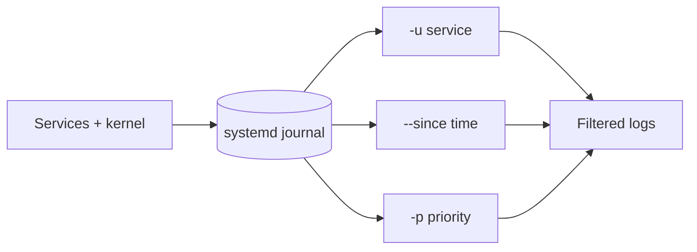

# journalctl Basics

## 1. What Is This?

`journalctl` queries the **systemd journal** — the central, structured log store for the kernel and all systemd-managed services.

## 2. Why Is This Needed?

On modern Linux, most service logs go to the journal. `journalctl` lets you filter them by service, time, priority, and boot — far more powerful than grepping text files.

## 3. Simple Layman Explanation

The journal is one big searchable diary for the whole system. `journalctl` is the search tool: "show me only nginx's entries from the last 10 minutes that are errors."

## 4. Technical Explanation

- The journal is **binary and indexed**, enabling fast filtering by fields (`_SYSTEMD_UNIT`, priority, time).
- Persistence depends on config: if `/var/log/journal` exists, logs survive reboots; otherwise they're in RAM (lost on reboot).
- Priority levels: 0 emerg → 3 err → 4 warning → 6 info → 7 debug.

## 5. Real-World Example

Nginx returns errors. `journalctl -u nginx --since "10 min ago" -p err` shows only Nginx error-level entries in the window — pinpointing the cause without noise.

## 6. Diagram



## 7. Commands

```bash
journalctl -e                         # newest entries (end)
journalctl -f                         # follow live (like tail -f)
journalctl -u nginx                   # logs for the nginx unit
journalctl -u nginx -e                # nginx logs, jump to end
journalctl -u nginx --since "10 min ago"
journalctl --since "2026-06-28 09:00" --until "2026-06-28 10:00"
journalctl -p err                     # only error priority and worse
journalctl -k                         # kernel messages (dmesg)
journalctl -b                         # logs since current boot
journalctl -b -1                      # logs from the previous boot
journalctl --disk-usage               # how much space the journal uses
```

## 8. Command Explanation

- `-u <unit>` → filter to one service (the most-used flag).
- `-e` → jump to the end (newest); `-f` → follow live.
- `--since` / `--until` → time window; accepts "10 min ago", "yesterday", or timestamps.
- `-p err` → priority filter (err and more severe).
- `-k` → kernel-only; `-b` → current boot; `-b -1` → previous boot (great for diagnosing a crash/reboot).

## 9. Practice Tasks

1. `journalctl -u ssh -e`.
2. `journalctl --since "1 hour ago" -p warning`.
3. `journalctl -b | head` and `journalctl -k | tail`.
4. In one terminal `journalctl -f`; in another restart a service and watch entries appear.

## 10. Common Mistakes

- Forgetting `-u`, then scrolling the entire system journal.
- Expecting old logs after reboot when the journal is volatile (RAM-only).
- Misusing time filters (quote multi-word values like `"10 min ago"`).

## 11. Troubleshooting

- **No logs for a unit** → wrong unit name (`systemctl list-units | grep <name>`).
- **Logs gone after reboot** → journal isn't persistent; enable `Storage=persistent` and create `/var/log/journal`.
- **Permission issues** → add your user to the `systemd-journal` group or use `sudo`.

## 12. Best Practices

- Always narrow with `-u` + `--since` + `-p`.
- Use `-b -1` to investigate what happened before a reboot/crash.
- Enable persistent storage on servers you must audit.

## 13. Quick Recap

- `journalctl -u svc -e` is the everyday command.
- Filter by service, time (`--since`), priority (`-p`), boot (`-b`).
- `-f` follows live; `-k` shows kernel.

## 14. References

- `man journalctl`
- systemd journal: https://www.freedesktop.org/software/systemd/man/journalctl.html

<!-- NAV-FOOTER -->

---

### 🧭 Navigation

| Previous | Up | Next |
|:---|:---:|---:|
| ⬅️ Prev: [Linux Logs Overview](linux-logs-overview.md) | ⬆️ Module: [Module 09 — Logs, Monitoring & Troubleshooting](README.md) | ➡️ Next: [syslog and /var/log](syslog-and-var-log.md) |
