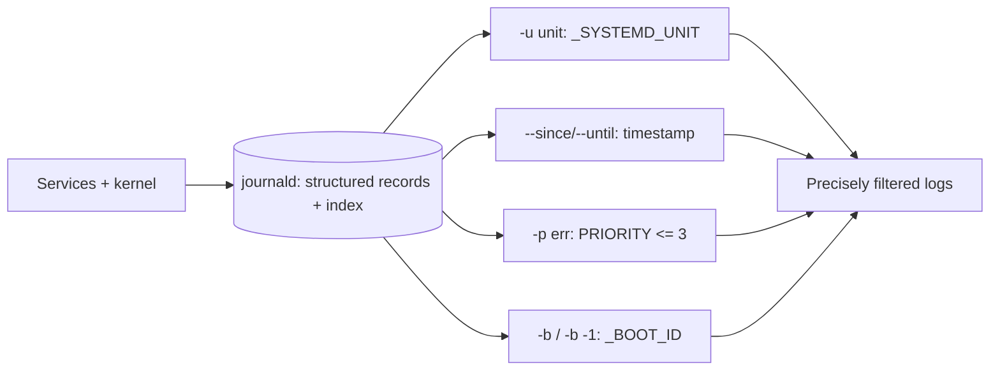

# journalctl Basics

## 1. What Is This?

`journalctl` queries the **systemd journal** — the central, structured log store for the kernel and all systemd-managed services.

## 2. Why Is This Needed?

On modern Linux, most service logs go to the journal. `journalctl` lets you filter them by service, time, priority, and boot — far more powerful than grepping text files.

## 3. Simple Layman Explanation

The journal is one big searchable diary for the whole system. `journalctl` is the search tool: "show me only nginx's entries from the last 10 minutes that are errors."

## 4. Technical Explanation

- The journal is **binary and indexed**, enabling fast filtering by fields (`_SYSTEMD_UNIT`, priority, time).
- Persistence depends on config: if `/var/log/journal` exists, logs survive reboots; otherwise they're in RAM (lost on reboot).
- Priority levels: 0 emerg → 3 err → 4 warning → 6 info → 7 debug.

## 5. How It Works Under the Hood

The reason `journalctl` filtering is instant (where grepping a text log is a linear scan) is that **every journal entry is a structured record with indexed fields, not a line of text**:

- When a service writes `Failed to bind port 80`, journald stores it *with metadata*: `_SYSTEMD_UNIT=nginx.service`, `PRIORITY=3`, `_PID=900`, `_BOOT_ID=...`, a precise timestamp, and more. So `journalctl -u nginx -p err` isn't searching text — it's selecting records where those *fields* match, using an index. That's why you can slice by service **and** priority **and** time window cheaply.
- **`-p` maps to numeric syslog priorities** (0 emerg … 3 err … 6 info … 7 debug), and `-p err` means "err *and worse*" (≤3). This is a severity filter, not a keyword — so it catches errors even when the message doesn't contain the word "error."
- **`-b` uses the boot ID field.** Each boot gets a unique `_BOOT_ID`; `-b` = current boot, `-b -1` = previous boot. That's how you cleanly separate "what happened since this reboot" from "what happened before the crash" — invaluable for diagnosing an unexpected restart (assuming a persistent journal, see [Logs Overview](linux-logs-overview.md)).
- **The trade-off:** because it's an indexed binary format, you *can't* `cat`/`grep` the raw files — you must go through `journalctl` (which is also why it can output JSON via `-o json` for tooling).

So the mental model: journald is a small structured database of log records; `journalctl` is its query language, and `-u`/`-p`/`--since`/`-b` are `WHERE` clauses on indexed fields.

## 6. Diagram



## 7. Real-World Examples

**1. The everyday case.** Nginx returns errors. `journalctl -u nginx --since "10 min ago" -p err` shows only Nginx error-level entries in the window — pinpointing the cause without noise.

**2. Narrowing from noise to signal:**

```
$ journalctl -u myapp --no-pager | wc -l
14203                                        # everything the app ever logged — too much
$ journalctl -u myapp --since "10 min ago" -p err --no-pager
Jul 02 09:14:02 web01 myapp[8123]: ERROR db connection refused (10.0.4.20:5432)
Jul 02 09:14:07 web01 myapp[8123]: ERROR retry limit reached, exiting
```

Three filters (unit + time + priority) cut 14k lines to the two that matter — Section 5's indexed fields in action.

**3. War story — the reboot mystery solved by `-b -1`.** A server rebooted on its own overnight; the app team suspected their deploy. On a box with a persistent journal, the on-call ran `journalctl -b -1 -p err` (previous boot, errors only) and found, seconds before shutdown: `kernel: Out of memory: Killed process 8123 (java)` followed by a watchdog reboot. It wasn't the deploy — it was an **OOM** event. `-b -1` cleanly separated the doomed boot from the current one, and the priority filter surfaced the cause immediately. Without the boot-ID field, that needle would've been lost in noise.

## 8. Worked Walkthrough

Practice the filters that matter, then follow logs live:

```
$ journalctl -u ssh -e --no-pager | tail -2      # one unit, newest entries
Jul 02 09:15:22 web01 sshd[8123]: Accepted publickey for deploy from 198.51.100.7
$ journalctl --since "1 hour ago" -p warning --no-pager | head -3   # time + severity
Jul 02 08:40:11 web01 systemd[1]: Failed to start Some Unit.
$ journalctl -k --no-pager | tail -2             # kernel messages only (like dmesg)
Jul 02 06:00:03 web01 kernel: EXT4-fs (nvme0n1p1): mounted filesystem
$ journalctl -b -1 -p err --no-pager | head -2   # previous boot, errors (crash forensics)
Jul 01 22:14:50 web01 kernel: Out of memory: Killed process 8123 (java)
# Live follow (run in one terminal; restart a service in another to watch entries appear):
$ journalctl -u cron -f
```

Each command is a different `WHERE` clause — unit, time, severity, kernel, boot — over the same indexed store (Section 5).

## 9. Commands

```bash
journalctl -e                         # newest entries (end)
journalctl -f                         # follow live (like tail -f)
journalctl -u nginx                   # logs for the nginx unit
journalctl -u nginx --since "10 min ago" -p err   # unit + time + severity
journalctl --since "2026-07-02 09:00" --until "2026-07-02 10:00"
journalctl -p err                     # only error priority and worse (<=3)
journalctl -k                         # kernel messages (dmesg)
journalctl -b                         # logs since current boot
journalctl -b -1                      # logs from the previous boot
journalctl --disk-usage               # how much space the journal uses
```

Sample output for each (dummy values, for reference):

```text
$ journalctl -u nginx -e --no-pager | tail -1
Jul 02 09:16:01 web01 nginx[900]: 203.0.113.9 "GET /health" 200

$ journalctl -p err --since "1 hour ago" --no-pager | head -1
Jul 02 09:14:02 web01 myapp[8123]: ERROR db connection refused

$ journalctl -k --no-pager | tail -1
Jul 02 06:00:03 web01 kernel: EXT4-fs (nvme0n1p1): mounted filesystem

$ journalctl -b -1 --no-pager | head -1
Jul 01 22:14:55 web01 systemd[1]: Shutting down.

$ journalctl --disk-usage
Archived and active journals take up 512.0M in the file system.
```

## 10. Command Explanation

- `-u <unit>` → filter to one service by its `_SYSTEMD_UNIT` field (the most-used flag).
- `-e` → jump to the end (newest); `-f` → follow live.
- `--since` / `--until` → time window; accepts "10 min ago", "yesterday", or timestamps (quote multi-word values).
- `-p err` → priority filter (err=3 and more severe); severity, not keyword.
- `-k` → kernel-only; `-b` → current boot; `-b -1` → previous boot (crash forensics — the war story).
- `--disk-usage` → journal size (pair with `--vacuum-*`, Module 08).

## 11. In Production (DevOps Context)

- **Service debugging** is almost always `journalctl -u <svc> -e` then narrowed by time/priority — the core of Module 05's service troubleshooting.
- **Crash/reboot forensics** rely on `-b -1` and persistent journals (the war story) — a standard SRE move.
- **`-o json`** feeds structured logs into shippers (Fluent Bit, Vector) for centralized platforms; the field structure (Section 5) is what makes journald integrate cleanly.
- **`kubectl logs`/`journalctl -u kubelet`** are the container/node equivalents; node problems start with `journalctl -u kubelet` (Module 13).

## 12. Practice Tasks

1. `journalctl -u ssh -e`.
2. `journalctl --since "1 hour ago" -p warning`.
3. `journalctl -b | head` and `journalctl -k | tail`; if persistent, try `journalctl -b -1`.
4. In one terminal `journalctl -u cron -f`; in another `sudo systemctl restart cron` and watch entries appear.

## 13. Common Mistakes

- Forgetting `-u`, then scrolling the entire system journal.
- Treating `-p` as a keyword filter — it's a severity level (`-p err` = ≤3).
- Expecting old logs after reboot when the journal is volatile (RAM-only — see [Logs Overview](linux-logs-overview.md)).
- Not quoting multi-word time values (`--since "10 min ago"`).

## 14. Troubleshooting

- **No logs for a unit** → wrong unit name; confirm with `systemctl list-units | grep <name>`.
- **Logs gone after reboot** → journal isn't persistent; enable `Storage=persistent` and create `/var/log/journal`.
- **`-b -1` invalid** → no persistent journal for the previous boot.
- **Permission issues** → add your user to the `systemd-journal` group or use `sudo`.

## 15. Best Practices

- Always narrow with `-u` + `--since` + `-p` — three fields turn thousands of lines into a handful.
- Use `-b -1` to investigate what happened before a reboot/crash.
- Enable persistent storage on servers you must audit; cap size with `--vacuum-*`/`SystemMaxUse=` (Module 08).

## 16. Connects To

- **Prev:** [Linux Logs Overview](linux-logs-overview.md). **Next:** [syslog and /var/log](syslog-and-var-log.md).
- **Service debugging with journalctl:** [Service Troubleshooting](../05-processes-and-services/service-troubleshooting.md), [systemd Services](../05-processes-and-services/systemd-services.md).
- **OOM / crash context:** [CPU/Memory/Disk Checks](cpu-memory-disk-checks.md).
- **Journal size limits:** [Log Cleanup Basics](../08-storage-and-disk-management/log-cleanup-basics.md).

## 17. Quick Recap

- The journal stores **structured, indexed records** (fields + timestamp + boot ID); `journalctl` queries them.
- `journalctl -u svc --since "10 min ago" -p err` is the everyday precise filter; `-b -1` = previous boot (crash forensics).
- Volatile unless `/var/log/journal/` exists; `-f` follows live, `-k` shows the kernel.

## 18. References

- `man journalctl`
- systemd journal: https://www.freedesktop.org/software/systemd/man/journalctl.html

<!-- NAV-FOOTER -->

---

### 🧭 Navigation

| Previous | Up | Next |
|:---|:---:|---:|
| ⬅️ Prev: [Linux Logs Overview](linux-logs-overview.md) | ⬆️ Module: [Module 09 — Logs, Monitoring & Troubleshooting](README.md) | ➡️ Next: [syslog and /var/log](syslog-and-var-log.md) |
