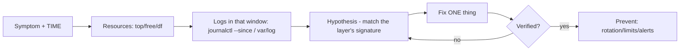

# Real-World Troubleshooting Scenarios

## 1. What Is This?

End-to-end walkthroughs that combine logs + resource checks + service tools to solve realistic incidents.

## 2. Why Is This Needed?

Individual commands are easy; **combining** them under pressure is the real skill. These scenarios build that workflow.

## 3. Simple Layman Explanation

It's the difference between knowing how to use a stethoscope and actually diagnosing a patient. Here you practice full diagnoses from symptom to fix.

## 4. Technical Explanation

General method (the "incident loop"):
1. Reproduce / note the **symptom** and **time**.
2. Check **resources** (`top`, `free`, `df`).
3. Check **logs** around that time (`journalctl --since`, `/var/log`).
4. Form a hypothesis → test it → fix → verify → prevent.

## 5. How It Works Under the Hood

Why does one loop — symptom → resources → logs → fix → verify → prevent — solve almost any incident? Because it's built on two principles that hold across every subsystem you've learned:

- **Correlate by timestamp; symptoms and causes share a clock.** An incident has a *time*. The skill is filtering *everything* — metrics, `journalctl --since`, `/var/log` — to that window, so cause and effect line up. A CPU spike at 09:14, an OOM kill at 09:14, and a service restart at 09:14 aren't three problems; they're one causal chain you can only see by aligning clocks. This is why "note the time first" is step one.
- **Symptoms point to a layer, and each layer has a signature** (the whole repo's payoff). "Slow" → resources (CPU vs I/O-wait vs memory, Module 09). "Service down" → exit code + `journalctl -u` (Module 05). "Can't connect" → the DNS→reachability→port→app ladder (Module 07). "No space" → blocks vs inodes vs deleted-open (Module 08). The loop is generic; the *evidence you gather* is dictated by which signature the symptom matches.
- **Two disciplines keep the loop honest:** change **one thing at a time** (so you know what actually fixed it — otherwise you've "fixed" it without learning why), and always end with **prevent** (rotation, limits, alerts, `Restart=on-failure`) so the same page doesn't fire next week. An incident without a prevention step is a scheduled repeat.

So the loop isn't a script to memorize — it's *apply the right module's signature to the symptom, aligned to the incident's timestamp, changing one variable at a time, and close with prevention.* That's what turns scattered commands into diagnosis.

## 6. Diagram



## 7. Real-World Examples

**1. The everyday case.** "Site slow at 09:14." You filter to that minute: `top` shows `%wa` 80%, `journalctl --since "09:13"` shows disk errors, `iostat` shows a disk at 100%. One timestamped chain → I/O bottleneck → fix storage → add an alert.

**2. Correlating metrics and logs by time:**

```
$ date                                          # anchor the incident window
Wed Jul  2 09:15:10 UTC 2026
$ uptime
 09:15:10 up 42 days, load average: 14.2, 9.1, 4.0     # spiking
$ journalctl --since "09:13" --until "09:16" -p err --no-pager
Jul 02 09:14:02 web01 kernel: Out of memory: Killed process 8123 (java)
Jul 02 09:14:03 web01 systemd[1]: myapp.service: Main process exited, status=137
$ dmesg | grep -i oom | tail -1
[924102.3] Out of memory: Killed process 8123 (java)
```

Load spike + OOM kill + service exit **137**, all at 09:14 — one causal chain, visible only because everything was filtered to the window (Section 5).

**3. War story — the "random" nightly restarts.** An app restarted around 3 AM most nights; three engineers had "fixed" it three ways with no result (all changing multiple things at once). Applying the loop properly: they noted the *time* (03:00), pulled `journalctl -b --since "02:55" --until "03:05"` across several nights, and every time saw a cron-triggered backup spike memory → **OOM killer** → restart. Root cause was the backup job (Module 11) loading everything into RAM, not the app. Fix: stream the backup + set a memory limit; **prevent**: alert on swap usage. One variable changed, verified over the next nights. Timestamp correlation cracked what random fixes couldn't.

## 8. Worked Walkthrough

Run the loop on a self-induced incident (safe to try):

```
$ date                                    # 1. anchor the time
Wed Jul  2 10:00:00 UTC 2026
$ yes > /dev/null &                       # induce a CPU "incident"
[1] 9500
$ uptime                                  # 2. resources: is load climbing?
 10:00:20 up 3:11, load average: 1.30, 0.40, 0.20
$ top -b -n1 | head -8 | tail -2          #    who? (sorted view)
   PID USER  %CPU %MEM COMMAND
  9500 alice 99.0  0.0 yes                 #    found the hog + its PID
$ journalctl --since "10:00" -p warning --no-pager | tail -3   # 3. logs in the window
# (nothing alarming — consistent with a benign CPU spike)
$ kill 9500                               # 4. fix ONE thing
[1]+  Terminated              yes
$ uptime                                  # 5. verify recovery
 10:01:05 up 3:12, load average: 0.55, 0.45, 0.22            # load falling → resolved
# 6. prevent: if this were real, add a cgroup/systemd limit + a load alert
```

You executed the full loop — anchor time, check resources, correlate logs, fix one thing, verify, note prevention — exactly the discipline from Section 5.

## 9. Commands

```bash
date                                         # anchor the incident time
uptime; top; free -h                         # resources
df -h; df -i; du -sh /path/*                 # disk
systemctl status <svc>                       # service state + exit code
journalctl -u <svc> --since "X min ago" -e   # service logs in the window
journalctl --since "HH:MM" --until "HH:MM" -p err   # everything in the window, errors
dmesg | grep -i oom                          # memory kills
```

Sample output for each (dummy values, for reference):

```text
$ uptime
 09:15:10 up 42 days, load average: 14.2, 9.1, 4.0

$ free -h | grep Mem
Mem: 7.7Gi 7.2Gi 0.1Gi 120Mi 0.4Gi 0.2Gi     # available only 0.2G → real pressure

$ systemctl status myapp | sed -n '3p'
     Active: failed (Result: oom-kill) since Wed 2026-07-02 09:14:03 UTC

$ journalctl -u myapp --since "09:13" -e --no-pager | tail -1
Jul 02 09:14:03 web01 systemd[1]: myapp.service: Main process exited, status=137

$ dmesg | grep -i oom | tail -1
[924102.3] Out of memory: Killed process 8123 (java)
```

## 10. Command Explanation

These are covered in their topic files; here they form the diagnostic loop. The skill is (a) anchoring the **time** with `date`, (b) choosing the right check based on the symptom's **layer signature**, and (c) correlating everything to the incident window with `--since`/`--until`. Exit `137` = OOM (128+9), tying `systemctl status`/`journalctl` back to Module 05 signals.

## 11. In Production (DevOps Context)

- **On-call/incident response** *is* this loop under time pressure; runbooks encode the per-symptom signatures so anyone can execute it.
- **Observability platforms** (Grafana + Loki/Prometheus, Datadog) exist to make timestamp correlation instant across a fleet — the Section 5 principle, industrialized.
- **Blameless postmortems** formalize the "prevent" step: every incident yields an action item (an alert, a limit, rotation) so it can't silently recur (the war story).
- **SLOs/alerts** are tuned on the same metrics (load, available memory, disk %, error rate) you gather manually here.

## 12. Practice Tasks

1. Induce load: `yes > /dev/null &`, run the loop (`uptime`→`top`→`kill`), verify recovery.
2. Inspect a real service in a window: `journalctl -u ssh --since "1 hour ago"`.
3. Run the resource trio (`uptime`, `free -h`, `df -h`) and write a one-line health summary.
4. Walk Scenario D (below) using a temp junk file (`fallocate -l 200M /tmp/junk`).

## 13. Common Mistakes

- Jumping to a fix before identifying the bottleneck / matching the layer signature.
- Ignoring timestamps — not correlating logs with the incident window (Section 5).
- Changing several things at once, so you never learn what actually fixed it.
- Looking only at the app or only at resources, not both — and skipping the prevention step.

## 14. Troubleshooting

**Scenario A — Server is slow**
- **Symptoms:** web/SSH lag. **Check:** `uptime` vs `nproc`; `top` (`%us` vs `%wa`); `free -h`; `iostat -xz 1 3`.
- **Fix:** CPU hog → investigate/`kill` (Module 05); swapping → find `%MEM` hog/add RAM; high `%wa` → disk (Module 08). **Prevent:** monitoring + capacity planning.

**Scenario B — A service keeps crashing**
- **Symptoms:** `systemctl status app` shows repeated restarts. **Check:** `systemctl status app`; `journalctl -u app --since "30 min ago" -e`; `dmesg | grep -i oom`; `df -h`.
- **Fix:** read the exact error; OOM → memory (Scenario A); config error → fix+validate+restart (Module 05); disk full → free space (Module 08). **Prevent:** `Restart=on-failure`, memory limits, alerts.

**Scenario C — High CPU from one process**
- **Symptoms:** `top` shows one process ~100%. **Check:** `top` (note PID); `ps -p <pid> -o pid,ppid,cmd,%cpu,%mem`; `journalctl -u <svc> -e`.
- **Fix:** legit spike vs runaway; `kill` gracefully or restart its service; investigate root cause in logs. **Prevent:** cgroup/systemd limits, code fixes, alerts.

**Scenario D — Out of disk space**
- **Symptoms:** `No space left on device`. **Check:** `df -h; df -i`; `du -sh /var/* | sort -h`; `sudo lsof +L1`.
- **Fix:** see [Disk Full Troubleshooting](../08-storage-and-disk-management/disk-full-troubleshooting.md) — locate FS → drill with `du` → clean safely → restart processes holding deleted files. **Prevent:** log rotation, journald limits, disk alerts.

## 15. Best Practices

- Note the incident time first; filter everything to that window.
- Match the symptom to the right layer's signature (resources / service / network / disk).
- Change one thing at a time and re-test.
- Always add a prevention step (the "post-incident" habit).

## 16. Connects To

- **Prev:** [CPU, Memory & Disk Checks](cpu-memory-disk-checks.md). **Next:** [Module 10 — Shell Scripting](../10-shell-scripting/README.md).
- **The signatures this loop applies:** [Service Troubleshooting](../05-processes-and-services/service-troubleshooting.md), [Network Troubleshooting](../07-networking-basics/network-troubleshooting.md), [Disk Full Troubleshooting](../08-storage-and-disk-management/disk-full-troubleshooting.md).
- **Logs in the window:** [journalctl Basics](journalctl-basics.md).
- **Build a runbook:** [Project 05 — Troubleshooting Playbook](../15-mini-projects/project-05-troubleshooting-playbook.md); **quick lookup:** [Troubleshooting Cheatsheet](../16-cheatsheets/troubleshooting-cheatsheet.md).

## 17. Quick Recap

- Incident loop: symptom + **time** → resources → logs (in that window) → hypothesis → fix one thing → verify → **prevent**.
- Correlate metrics and logs by timestamp; match the symptom to a layer's signature.
- Change one variable at a time; always close with a prevention action.

## 18. References

- [Module 05](../05-processes-and-services/), [Module 07](../07-networking-basics/), [Module 08](../08-storage-and-disk-management/)
- [Module 15 Project 05: troubleshooting playbook](../15-mini-projects/project-05-troubleshooting-playbook.md)

<!-- NAV-FOOTER -->

---

### 🧭 Navigation

| Previous | Up | Next |
|:---|:---:|---:|
| ⬅️ Prev: [CPU, Memory, and Disk Checks](cpu-memory-disk-checks.md) | ⬆️ Module: [Module 09 — Logs, Monitoring & Troubleshooting](README.md) | ➡️ Next: [Module 10 — Shell Scripting](../10-shell-scripting/README.md) |
