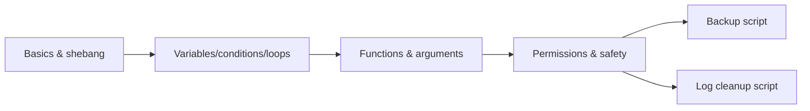

# Module 10 — Shell Scripting

## What You Will Learn

- Writing and running bash scripts.
- Variables, conditions, and loops.
- Functions and command-line arguments.
- Making scripts executable and safe.
- Two real scripts: a backup and a log-cleanup helper.

## Why This Module Matters

Scripting turns repetitive manual work into one reliable command. It's the foundation of automation, CI/CD, and "infrastructure as code." This is where you stop typing and start automating.

## Real-World Use Case

You'll automate backups, log cleanup, health checks, and deployments — replacing error-prone manual steps with tested scripts that run the same way every time.

## Topics Covered

| File | What It Covers |
|------|----------------|
| [shell-script-basics.md](./shell-script-basics.md) | Shebang, running, structure |
| [variables-conditions-loops.md](./variables-conditions-loops.md) | Core logic |
| [functions-and-arguments.md](./functions-and-arguments.md) | Reusable, parameterized code |
| [script-permissions.md](./script-permissions.md) | chmod +x and safety |
| [backup-script-example.md](./backup-script-example.md) | A real backup script |
| [log-cleanup-script-example.md](./log-cleanup-script-example.md) | A real cleanup script |

## Learning Flow

## Hands-On Practice

Write a "hello" script, add variables and a loop, turn it into a function with arguments, then build the backup script.

## Common Mistakes

- Forgetting the shebang or execute bit.
- Unquoted variables breaking on spaces.
- No error handling — scripts that fail silently.

## Troubleshooting

- "Permission denied" → `chmod +x` or run with `bash script.sh`.
- Debug with `bash -x script.sh` to trace each line.

## Best Practices

- Start scripts with `set -euo pipefail`.
- Quote variables (`"$var"`); comment important lines.
- Never put destructive commands without confirmation.

## Quick Revision

- `#!/bin/bash` + `chmod +x` + `./script.sh`.
- Variables, `if`, `for`/`while`, functions, `$1 $2 "$@"`.
- Safe headers and quoting prevent disasters.

## Next Module

➡️ [11 — Automation & Cron](../11-automation-and-cron/).
