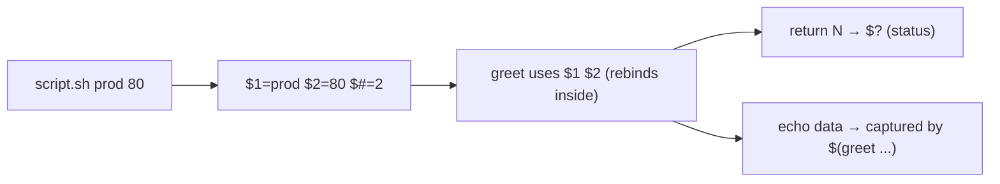

# Functions and Arguments

## 1. What Is This?

**Functions** group commands into reusable named blocks. **Arguments** are inputs passed to a script or function so it can act on different values.

## 2. Why Is This Needed?

Functions stop you repeating code and make scripts readable. Arguments make scripts flexible — one backup script can back up any directory you pass it.

## 3. Simple Layman Explanation

A function is a **named recipe step** you can reuse ("make_coffee"). Arguments are the **ingredients** you hand it ("make_coffee large oat-milk").

## 4. Technical Explanation

- Define: `name() { commands; }`. Call: `name arg1 arg2`.
- Inside, positional parameters: `$1`, `$2`, ... `$@` (all args), `$#` (count), `$0` (script name).
- `return N` sets a function's exit status; `echo` returns text output.
- Script-level args work the same: `./script.sh foo` → `$1` is `foo`.

## 5. How It Works Under the Hood

Two design facts explain the whole model — and its sharp edges:

- **Arguments are positional, not named — the same `$1..$9`, `$@`, `$#` mechanism at script *and* function level.** When you run `./script.sh prod 80`, bash sets `$1=prod`, `$2=80`, `$#=2`. When you *call a function* `greet Alice 3`, bash **temporarily rebinds** `$1=Alice`, `$2=3`, `$#=2` for the duration of that function, then restores the previous values on return. So a function "receives arguments" by the caller's words shadowing the positional parameters — there are no named parameters. That's why you copy them into readable names (`local who="$1"`) at the top of a function.
- **Functions don't "return values" like other languages — they return an exit *status* (0–255) and communicate data via output.** `return N` only sets `$?` (a status, for success/failure logic), *not* a value you can assign. To get *data* out, the function `echo`s it and the caller captures it with command substitution: `result=$(sum 3 4)`. Confusing the two (`x=$(myfunc)` when the function used `return`) is a classic bug.
- **`"$@"` vs `$*` matters for correctness.** `"$@"` expands to each argument as a *separate quoted word* (so `"arg with spaces"` stays one word) — this is what you almost always want when passing args through. `$*` joins everything into one string, losing boundaries. Combined with `set -u` (from [basics](shell-script-basics.md)), referencing `$1` when no arg was passed *errors out* — hence guarding with `${1:-}` or checking `$#` first.
- **`local` scopes a variable to the function.** Without it, assigning `who=...` inside a function overwrites a `who` in the caller (all bash variables are global by default) — a subtle source of "why did my outer variable change?" bugs.

## 6. Diagram



## 7. Real-World Examples

**1. The everyday case.** A deploy script defines `log()`, `check_disk()`, and `deploy(env)` functions. You call `./deploy.sh staging` and `$1` ("staging") flows through — clean, reusable, testable.

**2. Status vs output, demonstrated:**

```
$ cat funcs.sh
#!/bin/bash
set -euo pipefail
sum() { echo $(( $1 + $2 )); }          # DATA via echo → capture with $(...)
is_even() { (( $1 % 2 == 0 )); }        # STATUS via exit code → use in if
$ source funcs.sh
$ total=$(sum 3 4); echo "total=$total"
total=7
$ if is_even 10; then echo "even"; else echo "odd"; fi
even
```

`sum` returns *data* (captured), `is_even` returns *status* (used in `if`) — the two-channel model from Section 5.

**3. War story — `set -u` broke the script on a missing argument.** A script called `deploy()` with `local env="$1"`, but one CI job invoked it with no argument. Because `set -u` was on, referencing `$1` when unset aborted the script with `$1: unbound variable` — and since it happened *inside* a function, the error message pointed at a confusing line. The fix was defensive defaults and validation: `local env="${1:-}"; [ -n "$env" ] || { echo "Usage: deploy <env>" >&2; return 1; }`. With `set -u`, every positional you read must be guarded (`${1:-}`) or pre-checked via `$#` (Section 5).

## 8. Worked Walkthrough

Write a script that validates args and passes them into a function:

```
$ cat > funcs.sh <<'EOF'
#!/bin/bash
set -euo pipefail
log() { echo "[$(date +%T)] $*"; }            # $* = all args as one message
greet() {
    local who="$1"                            # copy positional → readable name
    local times="${2:-1}"                     # default 1 if $2 unset (set -u safe)
    for ((i=0; i<times; i++)); do log "Hello, $who"; done
}
if [ "$#" -lt 1 ]; then                        # validate BEFORE using $1
    echo "Usage: $0 <name> [times]" >&2
    exit 1
fi
greet "$1" "${2:-2}"
log "Done. Args received: $#"
EOF
$ chmod +x funcs.sh
$ ./funcs.sh Alice 3
[10:00:01] Hello, Alice
[10:00:01] Hello, Alice
[10:00:01] Hello, Alice
[10:00:01] Done. Args received: 1
$ ./funcs.sh
Usage: ./funcs.sh <name> [times]        # $# check caught the missing arg
$ echo $?
1
```

The `$#` guard prevents the `set -u` crash from the war story, and `${2:-1}` supplies a default — the defensive pattern every argument-taking script needs (Section 5).

## 9. Commands

```bash
# Save as funcs.sh (key constructs):
name() { commands; }                  # define a function
local var="$1"                        # scope a variable to the function
"$1" "$2" "$@" "$#"                    # positional args / all / count
"${2:-default}"                        # default value if unset (set -u safe)
result=$(myfunc arg)                  # capture a function's echoed DATA
if myfunc; then ...; fi               # branch on a function's exit STATUS
if [ "$#" -lt 1 ]; then echo "Usage: $0 ..." >&2; exit 1; fi   # validate args
```

Sample output (dummy values, for reference):

```text
$ ./funcs.sh Alice 2
[10:00:01] Hello, Alice
[10:00:01] Hello, Alice
[10:00:01] Done. Args received: 1

$ ./funcs.sh
Usage: ./funcs.sh <name> [times]

$ total=$(bash -c 'sum(){ echo $(( $1 + $2 )); }; sum 5 6'); echo "$total"
11
```

## 10. Command Explanation

- `name() { ...; }` → defines a function; call it like a command.
- `local var=...` → scopes a variable to the function (prevents clobbering caller globals — Section 5).
- `"$1"`, `"$2"` → first/second argument; `"$@"` all args (each preserved), `$#` count, `$0` script name.
- `"${2:-1}"` → **default value**: use `$2`, or `1` if unset (essential under `set -u`).
- `if [ "$#" -lt 1 ]` → argument validation; `exit 1` signals an error (`return 1` inside a function).
- `result=$(func)` captures echoed **data**; `if func; then` branches on exit **status**.

## 11. In Production (DevOps Context)

- **Reusable ops libraries:** teams keep a `lib.sh` of functions (`log`, `retry`, `require_cmd`) that many scripts `source` — DRY, testable automation.
- **Parameterized deploys:** `./deploy.sh <env>` with validated `$1` is the standard pattern; CI passes the environment as an argument (Module 13).
- **`set -u` + defaults** is a reliability practice: guarding every positional prevents the unbound-variable crashes that break pipelines (the war story).
- **Exit-status functions** (`is_healthy && proceed`) drive conditional automation and health gates (Module 15).

## 12. Practice Tasks

1. Run `funcs.sh` with and without arguments; observe the usage message + exit 1.
2. Add `sum() { echo $(( $1 + $2 )); }` and capture it: `total=$(sum 3 4)`.
3. Write a function using `"$@"` that prints each argument on its own line.
4. Make a positional safe under `set -u` with `${1:-default}`, then call it with no args.

## 13. Common Mistakes

- Forgetting `local`, so function variables overwrite caller globals (Section 5).
- Reading `$1` under `set -u` without a guard → "unbound variable" crash (the war story).
- Expecting `return` to hand back *data* — it only sets `$?`; use `echo` + `$(...)` for values.
- Confusing `$*` (joined) with `"$@"` (each arg preserved) — prefer `"$@"`.

## 14. Troubleshooting

- **"$1: unbound variable"** (with `set -u`) → guard with `${1:-}` or check `$#` first.
- **Function not running** → ensure it's **defined before** it's called (scripts run top-down).
- **Captured "value" is empty** → the function used `return N` (status), not `echo` (data).
- **Wrong values** → trace with `bash -x script.sh`.

## 15. Best Practices

- Validate arguments early; print a `Usage:` line to stderr (`>&2`).
- Use `local` for function variables; provide defaults with `${var:-default}`.
- Prefer `"$@"` for passing arguments through; separate **status** (`return`) from **data** (`echo`).

## 16. Connects To

- **Prev:** [Variables, Conditions & Loops](variables-conditions-loops.md). **Next:** [Script Permissions & Safety](script-permissions.md).
- **`set -u` & exit codes:** [Shell Script Basics](shell-script-basics.md), [Terminal Basics](../01-linux-setup/terminal-basics.md).
- **Applied in:** [Backup Script Example](backup-script-example.md), [User Management Project](../15-mini-projects/project-03-user-management-script.md).

## 17. Quick Recap

- Arguments are positional (`$1 $2 "$@" $#`), rebound inside functions; there are no named params.
- Functions return a **status** (`return`/`$?`) and emit **data** via `echo` (captured with `$(...)`).
- `local` scopes variables; `${2:-default}` gives `set -u`-safe defaults; validate `$#` and show usage.

## 18. References

- Bash functions: https://www.gnu.org/software/bash/manual/
- `man bash` (Shell Functions, Positional Parameters)

<!-- NAV-FOOTER -->

---

### 🧭 Navigation

| Previous | Up | Next |
|:---|:---:|---:|
| ⬅️ Prev: [Variables, Conditions, and Loops](variables-conditions-loops.md) | ⬆️ Module: [Module 10 — Shell Scripting](README.md) | ➡️ Next: [Script Permissions & Safety](script-permissions.md) |
