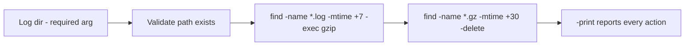

# Log Cleanup Script Example

## 1. What Is This?

A safe **log-cleanup script** that compresses or deletes log files older than a chosen number of days in a specific directory.

## 2. Why Is This Needed?

Logs fill disks (Module 08). A scheduled cleanup script keeps `/var/log` (or an app's log dir) under control automatically — without risking the wrong files.

## 3. Simple Layman Explanation

It's a **tidy-up robot** for one drawer of logs: it zips up papers older than a week and shreds anything older than a month — and it only ever touches the drawer you point it at.

## 4. Technical Explanation

The script:
1. Requires an explicit log directory (no default → can't run on the wrong place).
2. Validates the directory exists.
3. Compresses `.log` files older than `COMPRESS_DAYS`.
4. Deletes `.gz` files older than `DELETE_DAYS`.
5. Uses `find ... -print` so you can see exactly what it touched.

## 5. How It Works Under the Hood

The engine here is **`find`** (from [Searching Files](../03-files-and-directories/search-files.md)), and understanding how it selects and acts is what makes this script safe:

- **`find` builds a filtered set, then acts on each match.** `find "$LOG_DIR" -type f -name '*.log' -mtime +7` walks the tree and keeps only files (`-type f`) named `*.log` whose modification time is **more than** 7 days ago (`-mtime +7`). The scoping (`-type`, `-name`) is the safety: it *cannot* match directories or non-log files.
- **`-mtime +N` vs `-N` is a classic trap.** `+7` = *more than* 7×24 hours old; `-7` = *less than* 7 days old (recent); `7` = exactly the 7th day. Getting the sign wrong deletes the *newest* logs instead of the oldest — the difference between cleanup and disaster.
- **`-exec ... {} \;` vs `-delete`.** `-exec gzip {} \;` runs `gzip` once per match (`{}` = the filename, `\;` ends the command). `-delete` is find's built-in removal. The safety practice: **swap `-delete` for `-print` first** — same selection, but it only *lists* what it *would* remove. That's a built-in dry run, so you verify the target set before anything is destroyed.
- **Why require the directory with no default.** `LOG_DIR="${1:-}"` + validation means the script refuses to run pointed at nothing. Combined with `set -euo pipefail`, an empty argument can't silently expand a `find` into `/` (the same class of catastrophe as the `rm -rf` in [script-permissions](script-permissions.md)).
- **Compress vs delete = a two-tier retention policy.** Recent-ish logs are *compressed* (kept, but small); truly old *archives* (`.gz`) are *deleted*. This mirrors logrotate's model (Module 08) but for directories logrotate doesn't manage. Note: `find`+`gzip` on an **active** log a process holds open hits the deleted-but-open trap — those need `truncate`/logrotate `copytruncate` instead (Module 08).

## 6. Diagram



## 7. Real-World Examples

**1. The everyday case.** Cron runs `cleanup-logs.sh /var/log/myapp 7 30` daily: logs older than 7 days get gzipped, archives older than 30 days get removed. The app's disk usage stops growing without manual effort.

**2. Test on a temp dir first (the safe habit):**

```
$ mkdir -p /tmp/logtest
$ touch -d '10 days ago' /tmp/logtest/old.log
$ touch -d '2 days ago'  /tmp/logtest/recent.log
$ ./cleanup-logs.sh /tmp/logtest 7 30
Cleaning logs in: /tmp/logtest
Compress .log older than 7d, delete .gz older than 30d
/tmp/logtest/old.log                       # -print shows what was compressed
Log cleanup complete.
$ ls /tmp/logtest
old.log.gz  recent.log                      # old.log gzipped; recent.log untouched
```

`-mtime +7` correctly selected only the 10-day-old file, leaving the 2-day-old one — the sign convention from Section 5 working as intended.

**3. War story — the `-mtime -30` that deleted everything new.** An engineer wrote a cleanup with `find /var/log/app -name '*.gz' -mtime -30 -delete`, intending "delete archives older than 30 days." The `-30` (minus) means *younger than* 30 days — so it deleted every **recent** archive and kept the ancient ones: the exact opposite of the goal, and it silently discarded the logs they most needed. Had they run it with `-print` first (Section 5's dry run), the wrong file list would have been obvious before anything was lost. Two fixes: `+30` (not `-30`), and always dry-run with `-print`.

## 8. Worked Walkthrough

Dry-run, verify, then act — the disciplined cleanup flow:

```
$ mkdir -p /tmp/lt && touch -d '40 days ago' /tmp/lt/ancient.log.gz && touch -d '3 days ago' /tmp/lt/new.log.gz
$ # 1. DRY RUN: replace -delete with -print to preview the target set
$ find /tmp/lt -type f -name '*.gz' -mtime +30 -print
/tmp/lt/ancient.log.gz                      # only the 40-day-old one — correct
$ # (new.log.gz is NOT listed → safe to proceed)
$ # 2. ACT: now run the real deletion
$ find /tmp/lt -type f -name '*.gz' -mtime +30 -print -delete
/tmp/lt/ancient.log.gz
$ ls /tmp/lt
new.log.gz                                  # recent archive preserved
```

The dry-run confirmed *exactly* which file would be deleted before committing — the single habit that would have prevented the war story (Section 5).

## 9. Commands (the script)

Save as `cleanup-logs.sh`:

```bash
#!/bin/bash
# cleanup-logs.sh - compress old logs and delete very old archives in ONE directory
set -euo pipefail

LOG_DIR="${1:-}"                  # directory to clean (required, no default)
COMPRESS_DAYS="${2:-7}"           # gzip .log files older than this
DELETE_DAYS="${3:-30}"            # delete .gz files older than this

# --- Safety: require and validate the directory ---
if [ -z "$LOG_DIR" ]; then
    echo "Usage: $0 <log-dir> [compress_days] [delete_days]" >&2
    exit 1
fi
if [ ! -d "$LOG_DIR" ]; then
    echo "Error: '$LOG_DIR' is not a directory" >&2
    exit 1
fi

echo "Cleaning logs in: $LOG_DIR"
echo "Compress .log older than ${COMPRESS_DAYS}d, delete .gz older than ${DELETE_DAYS}d"

# --- Compress old, uncompressed logs ---
# -type f: files only | -name '*.log': only logs | -mtime +N: modified > N days ago
find "$LOG_DIR" -type f -name '*.log' -mtime +"$COMPRESS_DAYS" -print -exec gzip {} \;

# --- Delete archives older than DELETE_DAYS ---
find "$LOG_DIR" -type f -name '*.gz' -mtime +"$DELETE_DAYS" -print -delete

echo "Log cleanup complete."
```

Run (test safely first):

```bash
chmod +x cleanup-logs.sh
mkdir -p /tmp/logtest && touch -d '10 days ago' /tmp/logtest/old.log
./cleanup-logs.sh /tmp/logtest 7 30
ls -l /tmp/logtest          # old.log should now be old.log.gz
```

Sample output (dummy values, for reference):

```text
$ ./cleanup-logs.sh /tmp/logtest 7 30
Cleaning logs in: /tmp/logtest
Compress .log older than 7d, delete .gz older than 30d
/tmp/logtest/old.log
Log cleanup complete.

$ ls -l /tmp/logtest
-rw-r--r-- 1 alice alice 20 Jun 22 09:00 old.log.gz
```

## 10. Command Explanation (key parts)

- `LOG_DIR="${1:-}"` with validation → the script **cannot** run without a valid directory (prevents accidents — Section 5).
- `find ... -name '*.log' -mtime +7` → matches `.log` files modified **more than** 7 days ago (mind the `+` sign).
- `-exec gzip {} \;` → compresses each match; `{}` is the filename, `\;` ends the command.
- `-name '*.gz' -mtime +30 -delete` → deletes only old gzip archives (scoped, so nothing else is at risk).
- `-print` → echoes every file acted on — and, swapped in for `-delete`, gives a built-in dry run.

## 11. In Production (DevOps Context)

- **Prefer logrotate for system logs** (Module 08); use this script for app directories logrotate doesn't manage, or ad-hoc cleanup.
- **Always dry-run in automation:** cron jobs that delete should be reviewed with `-print` first; a wrong `-mtime` sign silently deletes the wrong set (the war story).
- **Active logs need truncate, not gzip:** a running service holding its `.log` open won't free space when gzipped/deleted — use `truncate`/`copytruncate` (Module 08).
- **Scoped + validated cleanup** is the safe pattern for CI runners and app hosts that accumulate build/log artifacts (Module 13).

## 12. Practice Tasks

1. Create test logs with `touch -d 'N days ago'` and run the script.
2. Change `COMPRESS_DAYS`/`DELETE_DAYS` and observe the effect.
3. **Dry run first:** replace `-delete` with `-print` and confirm the target set before deleting.
4. Deliberately try `-mtime -30` vs `+30` on test files and observe the opposite selections.
5. Schedule it daily (Module 11) once you trust it.

## 13. Common Mistakes

- Running on `/var/log` directly without testing on a temp dir first.
- Getting the `-mtime` sign wrong (`-30` = *recent*, `+30` = *old*) → deleting the wrong files (the war story).
- Forgetting quotes around `"$LOG_DIR"` (breaks on spaces).
- Deleting/gzipping active logs a process holds open (use truncate for those — Module 08).

## 14. Troubleshooting

- **Nothing happened** → no files matched the age/name; verify with `-print` and check `mtime`/the `+`/`-` sign.
- **Deleted the wrong files** → wrong `-mtime` sign; restore from backup and always dry-run (`-print`) next time.
- **Permission denied** → the log dir needs higher privileges; run with appropriate rights.
- **Deleted too much** → you pointed it at the wrong dir; always test on `/tmp` first.

## 15. Best Practices

- Prefer **logrotate** for system logs; use this script for app dirs logrotate doesn't manage.
- Always dry-run (`-print` instead of `-delete`) before trusting it.
- Scope tightly by directory and file pattern; mind the `-mtime` sign.
- Don't delete logs an audit/compliance process needs.

## 16. Connects To

- **Prev:** [Backup Script Example](backup-script-example.md). **Next:** [Module 11 — Automation & Cron](../11-automation-and-cron/README.md).
- **The `find` engine:** [Searching Files](../03-files-and-directories/search-files.md); **safety:** [Script Permissions & Safety](script-permissions.md).
- **Active logs / rotation:** [Log Cleanup Basics](../08-storage-and-disk-management/log-cleanup-basics.md), [Disk Full Troubleshooting](../08-storage-and-disk-management/disk-full-troubleshooting.md).
- **Schedule it:** [crontab Basics](../11-automation-and-cron/crontab-basics.md).

## 17. Quick Recap

- Validate the dir (required) → `find -name '*.log' -mtime +N -exec gzip` → `find -name '*.gz' -mtime +M -delete` → report.
- `-mtime +N` = older than N days (sign matters!); swap `-delete` for `-print` as a built-in dry run.
- For system logs use logrotate; for active open logs use truncate — not gzip/delete.

## 18. References

- `man find`, `man gzip`, `man touch`
- [Module 08 log cleanup](../08-storage-and-disk-management/log-cleanup-basics.md)

<!-- NAV-FOOTER -->

---

### 🧭 Navigation

| Previous | Up | Next |
|:---|:---:|---:|
| ⬅️ Prev: [Backup Script Example](backup-script-example.md) | ⬆️ Module: [Module 10 — Shell Scripting](README.md) | ➡️ Next: [Module 11 — Automation & Cron](../11-automation-and-cron/README.md) |
