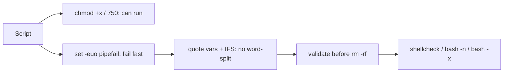

# Script Permissions & Safety

## 1. What Is This?

Making scripts **runnable** (`chmod +x`) and **safe** (error handling, quoting, no destructive surprises).

## 2. Why Is This Needed?

A script that can't run is useless; a script that runs *unsafely* is dangerous. Both permissions and safety practices matter before you trust a script — especially one that's scheduled or run as root.

## 3. Simple Layman Explanation

Permissions are the **key** that lets a script run. Safety practices are the **seatbelt and brakes** that stop it crashing or causing damage when something unexpected happens.

## 4. Technical Explanation

- Execute bit: `chmod +x script.sh` (or `750` for owner+group).
- Run with `./script.sh` (needs `+x`) or `bash script.sh` (doesn't).
- Safety header: `set -euo pipefail` (exit on error, unset vars, pipeline failures).
- Quote variables; validate inputs; avoid `rm -rf` on variables without checks.

## 5. How It Works Under the Hood

"Safety" in bash is really about defusing the ways a script silently does the wrong thing — and each practice targets a specific failure mechanism you've already met:

- **The execute bit and interpreter** (Module 04, [basics](shell-script-basics.md)): `./script.sh` requires `+x` because the kernel checks the execute permission before reading the shebang; `bash script.sh` bypasses both. `750` (owner+group execute, others none) is the usual server choice — runnable by its team, invisible to everyone else.
- **`set -euo pipefail` flips the failure model** from "continue past errors" to "fail fast" — the single biggest safety lever (detailed in [Shell Script Basics](shell-script-basics.md) §5).
- **`IFS=$'\n\t'` tames word splitting.** `IFS` (Internal Field Separator) is *how* bash splits unquoted expansions into words — by default on spaces, tabs, and newlines. Setting it to just newline+tab means filenames with spaces don't shatter mid-loop. It's a belt-and-suspenders complement to quoting (from [variables topic](variables-conditions-loops.md) §5).
- **The `rm -rf "$VAR"/` catastrophe** is the reason all this matters. If `$VAR` is *empty* or *unset*, `rm -rf "$VAR"/` becomes `rm -rf /` — recursively deleting the system. `set -u` catches the *unset* case (aborts before running); validating (`[ -d "$VAR" ]`) catches the *empty/wrong* case. This is not hypothetical — it's shipped in real installers. Defense: never run a destructive command on a variable you haven't proven is non-empty and correct.
- **Static analysis catches what testing misses.** `shellcheck` parses your script and flags unquoted variables, `[ ]` misuse, useless `cat`, and dozens of subtle bugs *without running it* — the cheapest safety win available. `bash -n` checks syntax; `bash -x` traces execution to see exactly what expanded to what.

## 6. Diagram



## 7. Real-World Examples

**1. The everyday case.** A cron-scheduled cleanup script with `set -euo pipefail` aborts immediately if a variable is empty — preventing a catastrophic `rm -rf "$DIR"/` where `$DIR` was accidentally blank.

**2. shellcheck catching a real bug before it ships:**

```
$ cat risky.sh
#!/bin/bash
DIR=$1
rm -rf $DIR/tmp/*
$ shellcheck risky.sh
In risky.sh line 2:
DIR=$1
    ^-- SC2086: Double quote to prevent globbing and word splitting.
In risky.sh line 3:
rm -rf $DIR/tmp/*
       ^-- SC2086: Double quote to prevent globbing and word splitting.
$ # ...and there's no `set -u` or validation → if $1 is empty, rm -rf /tmp/* on the WRONG scope
```

shellcheck flagged the unquoted variables *statically* — the exact pattern behind the `rm -rf` disaster (Section 5), caught before a single run.

**3. War story — the installer that deleted /usr.** A well-known game launcher once shipped `rm -rf "$STEAMROOT/"*` where `$STEAMROOT` could end up empty after a failed `cd` — expanding to `rm -rf /*` and wiping users' home directories. The root causes were exactly Section 5's list: no `set -u` (empty variable used), no validation (`[ -n "$STEAMROOT" ]`), and an unguarded `cd`. The fixes are one-liners: `set -euo pipefail`, validate the variable is a non-empty existing directory, and guard the `cd`. A destructive command on an unvalidated variable is one of the most damaging bugs you can write — and one of the easiest to prevent.

## 8. Worked Walkthrough

Make a script runnable and safe, then lint and trace it:

```
$ cat > safe.sh <<'EOF'
#!/bin/bash
set -euo pipefail                     # fail fast
IFS=$'\n\t'                           # safer word splitting
TARGET="${1:-}"                       # required arg, empty default (set -u safe)
[ -n "$TARGET" ]   || { echo "Usage: $0 <dir>" >&2; exit 1; }   # non-empty?
[ -d "$TARGET" ]   || { echo "Error: '$TARGET' is not a directory" >&2; exit 1; }  # exists?
echo "Operating safely on: $TARGET"
EOF
$ chmod 750 safe.sh                   # owner+group can run; others cannot
$ ls -l safe.sh
-rwxr-x--- 1 alice devs 260 Jul 2 10:00 safe.sh
$ ./safe.sh                           # no arg → validated, refuses safely
Usage: ./safe.sh <dir>
$ ./safe.sh /nope                     # bad dir → refuses
Error: '/nope' is not a directory
$ ./safe.sh /tmp                      # valid → proceeds
Operating safely on: /tmp
$ shellcheck safe.sh && echo "clean"  # static analysis
clean
$ bash -x safe.sh /tmp 2>&1 | head -3 # trace what actually runs
+ set -euo pipefail
+ TARGET=/tmp
+ '[' -n /tmp ']'
```

Both empty and wrong inputs were refused *before* any action, and `shellcheck` confirmed no quoting bugs — the layered defense from Section 5.

## 9. Commands

```bash
chmod +x script.sh        # make executable (all classes)
chmod 750 script.sh       # owner rwx, group r-x, others none (server default)
ls -l script.sh           # verify the x bit
bash -n script.sh         # syntax check without running
bash -x script.sh         # run with a trace (debug)
shellcheck script.sh      # static analysis (install shellcheck)
```

Safety template:

```bash
#!/bin/bash
set -euo pipefail          # fail fast
IFS=$'\n\t'                # safer word splitting
TARGET="${1:-}"            # required arg, default empty
[ -n "$TARGET" ] || { echo "Usage: $0 <target-dir>" >&2; exit 1; }
[ -d "$TARGET" ] || { echo "Error: $TARGET is not a directory" >&2; exit 1; }
echo "Operating safely on: $TARGET"
```

Sample output (dummy values, for reference):

```text
$ chmod 750 script.sh ; ls -l script.sh
-rwxr-x--- 1 alice devs 412 Jul  2 10:00 script.sh

$ bash -n script.sh
# (no output = syntax OK)

$ shellcheck script.sh
In script.sh line 7:
rm -rf $DIR
       ^-- SC2086: Double quote to prevent globbing and word splitting.

$ ./script.sh
Usage: ./script.sh <target-dir>
```

## 10. Command Explanation

- `chmod +x` / `chmod 750` → grant execution (`750` is good for shared server scripts).
- `bash -n` → checks syntax only; catches typos before running.
- `bash -x` → prints each command as it runs (with expansions) — the main debugging tool.
- `shellcheck` → flags quoting bugs, unsafe patterns, and common mistakes statically (highly recommended).
- The template validates the argument is **non-empty and a real directory** *before* doing anything (Section 5).

## 11. In Production (DevOps Context)

- **shellcheck in CI:** many teams gate merges on `shellcheck` passing, catching unquoted-variable and `rm -rf` risks before they reach servers (the war story).
- **Least privilege:** scheduled/root scripts run with the minimum rights needed; `750` + a dedicated service user limits blast radius (Module 12).
- **Idempotent, validated scripts** are the backbone of safe automation (Ansible, deploy hooks) — validate inputs, then act.
- **`set -euo pipefail` everywhere:** it's a de-facto standard header for production and CI scripts so failures surface instead of silently corrupting state (Module 13).

## 12. Practice Tasks

1. Create a script, run it without `+x` (fails), then `chmod +x` (or `750`) and run.
2. Run `bash -n` on a script with a deliberate syntax error.
3. Install `shellcheck` and run it on a script with an unquoted `$VAR`; fix the warnings.
4. Add the safety template's validation and confirm it refuses empty and non-directory inputs.

## 13. Common Mistakes

- No `set -euo pipefail` → errors pass silently (Module 10 basics).
- Unquoted `$VAR` in destructive commands → disaster if empty/has spaces (the war story).
- Running untrusted scripts as root without reading them.
- Skipping validation before `rm`/`mv`/`cp` on a variable path.

## 14. Troubleshooting

- **"Permission denied"** → `chmod +x` (or `bash script.sh`).
- **Script does nothing/odd** → `bash -x script.sh` to trace expansions.
- **Subtle bugs** → run `shellcheck`; it catches most quoting/logic issues.
- **Destructive command misfired** → you skipped validation; add non-empty + `-d`/`-f` checks and `set -u`.

## 15. Best Practices

- Always: `set -euo pipefail`, quote variables, validate inputs.
- Never run `rm -rf` on an unvalidated variable (non-empty + correct path first).
- Lint with `shellcheck`; test with `bash -n`/`bash -x`.
- Use least privilege (`750`, non-root where possible); don't require root unless necessary.

## 16. Connects To

- **Prev:** [Functions and Arguments](functions-and-arguments.md). **Next:** [Backup Script Example](backup-script-example.md).
- **Fail-fast & quoting mechanics:** [Shell Script Basics](shell-script-basics.md), [Variables, Conditions & Loops](variables-conditions-loops.md).
- **Permissions & least privilege:** [chmod/chown/chgrp](../04-users-groups-permissions/chmod-chown-chgrp.md), [Least Privilege](../12-linux-security-basics/least-privilege.md).
- **Applied safely in:** [Backup Script](backup-script-example.md), [Log Cleanup Script](log-cleanup-script-example.md).

## 17. Quick Recap

- `chmod +x`/`750` to run; `set -euo pipefail` + `IFS=$'\n\t'` to fail safely.
- Quote variables and **validate** (non-empty + correct type) before any destructive command — the `rm -rf` catastrophe is preventable.
- Debug with `bash -x`, syntax-check with `bash -n`, lint with `shellcheck`.

## 18. References

- ShellCheck: https://www.shellcheck.net/
- `man bash`, `man chmod`

<!-- NAV-FOOTER -->

---

### 🧭 Navigation

| Previous | Up | Next |
|:---|:---:|---:|
| ⬅️ Prev: [Functions and Arguments](functions-and-arguments.md) | ⬆️ Module: [Module 10 — Shell Scripting](README.md) | ➡️ Next: [Backup Script Example](backup-script-example.md) |
