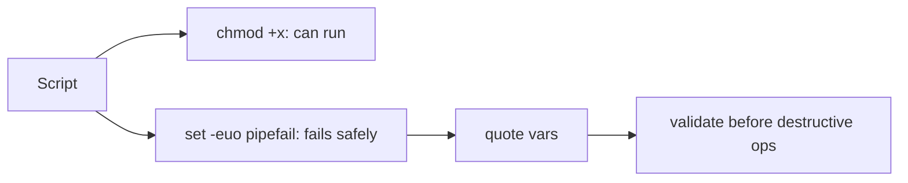

# Script Permissions & Safety

## 1. What Is This?

Making scripts **runnable** (`chmod +x`) and **safe** (error handling, quoting, no destructive surprises).

## 2. Why Is This Needed?

A script that can't run is useless; a script that runs *unsafely* is dangerous. Both permissions and safety practices matter before you trust a script — especially one that's scheduled or run as root.

## 3. Simple Layman Explanation

Permissions are the **key** that lets a script run. Safety practices are the **seatbelt and brakes** that stop it crashing or causing damage when something unexpected happens.

## 4. Technical Explanation

- Execute bit: `chmod +x script.sh` (or `750` for owner+group).
- Run with `./script.sh` (needs `+x`) or `bash script.sh` (doesn't).
- Safety header: `set -euo pipefail` (exit on error, unset vars, pipeline failures).
- Quote variables; validate inputs; avoid `rm -rf` on variables without checks.

## 5. Real-World Example

A cron-scheduled cleanup script with `set -euo pipefail` aborts immediately if a variable is empty — preventing a catastrophic `rm -rf "$DIR"/` where `$DIR` was accidentally blank.

## 6. Diagram



## 7. Commands

```bash
chmod +x script.sh        # make executable (all classes)
chmod 750 script.sh       # owner rwx, group r-x, others none
ls -l script.sh           # verify the x bit
bash -n script.sh         # syntax check without running
bash -x script.sh         # run with a trace (debug)
shellcheck script.sh      # static analysis (install shellcheck)
```

Safety template:

```bash
#!/bin/bash
set -euo pipefail          # safe mode
IFS=$'\n\t'                # safer word splitting

TARGET="${1:-}"            # required arg, default empty
if [ -z "$TARGET" ]; then
    echo "Usage: $0 <target-dir>" >&2
    exit 1
fi
if [ ! -d "$TARGET" ]; then
    echo "Error: $TARGET is not a directory" >&2
    exit 1
fi

echo "Operating safely on: $TARGET"
```

## 8. Command Explanation

- `chmod +x` / `chmod 750` → grant execution (750 is good for shared scripts).
- `bash -n` → checks syntax only; catches typos before running.
- `bash -x` → prints each command as it runs — the main debugging tool.
- `shellcheck` → flags quoting bugs, unsafe patterns, and common mistakes (highly recommended).
- The template validates the argument **before** doing anything, guarding against empty/wrong input.

## 9. Practice Tasks

1. Create a script, run it without `+x` (fails), then `chmod +x` and run.
2. Run `bash -n` on a script with a deliberate syntax error.
3. Install `shellcheck` and run it on one of your scripts.
4. Add the safety template's argument validation to a script.

## 10. Common Mistakes

- No `set -euo pipefail` → errors pass silently.
- Unquoted `$VAR` in destructive commands → disaster if empty/has spaces.
- Running untrusted scripts as root without reading them.

## 11. Troubleshooting

- **"Permission denied"** → `chmod +x` or `bash script.sh`.
- **Script does nothing/odd** → `bash -x script.sh` to trace.
- **Subtle bugs** → run `shellcheck`; it catches most quoting/logic issues.

## 12. Best Practices

- Always: `set -euo pipefail`, quote variables, validate inputs.
- Never run `rm -rf` on an unvalidated variable.
- Lint with `shellcheck`; test with `bash -n`/`bash -x`.
- Use least privilege; don't require root unless necessary.

## 13. Quick Recap

- `chmod +x` to run; `set -euo pipefail` to fail safely.
- Quote variables; validate inputs before destructive actions.
- Debug with `bash -x`; lint with `shellcheck`.

## 14. References

- ShellCheck: https://www.shellcheck.net/
- `man bash`, `man chmod`
