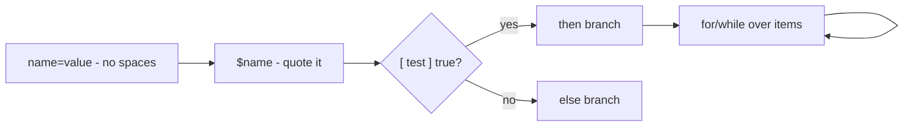

# Variables, Conditions, and Loops

## 1. What Is This?

The core logic of scripting: **variables** (store values), **conditions** (`if`/`else`, make decisions), and **loops** (`for`/`while`, repeat actions).

## 2. Why Is This Needed?

Real scripts must react to situations (is the disk full? does the file exist?) and repeat work (process each file). Variables, conditions, and loops make that possible.

## 3. Simple Layman Explanation

- **Variable** = a labeled box holding a value.
- **Condition** = "if it's raining, take an umbrella."
- **Loop** = "for each plate, wash it."

## 4. Technical Explanation

- Assign with `name=value` (**no spaces** around `=`). Use with `"$name"`.
- Conditions use `if [ ... ]; then ... fi`; tests like `-f` (file exists), `-d` (dir), `-z` (empty string), `-eq`/`-gt` (numbers).
- Loops: `for x in list; do ...; done` and `while [ cond ]; do ...; done`.

## 5. How It Works Under the Hood

Bash's quirks all trace back to one fact: **bash is fundamentally a string/word processor, not a programming language with typed variables.** Everything is text, split into words, until a context forces a number.

- **Why `name = value` fails but `name=value` works.** Bash splits a line into words on spaces. `name=value` (no spaces) is recognized as an *assignment*. `name = value` is parsed as *three words* — the command `name` with arguments `=` and `value` → "command not found." The no-spaces rule isn't style; it's how the parser distinguishes assignment from a command.
- **Why you must quote `"$var"`.** Before running a command, bash performs **word splitting** on unquoted variables: `file=/tmp/my file` then `[ -f $file ]` expands to `[ -f /tmp/my file ]` — *two* arguments where one was expected → "too many arguments" or worse. Quoting (`"$file"`) keeps it as one word. This is also why an *empty* unquoted variable in `[ -f $x ]` becomes `[ -f ]` → the cryptic "unary operator expected."
- **Why `-gt` is for numbers and `=` for strings.** `[ ]` (the `test` builtin) has *separate operators* for each type because bash has no types: `-eq/-gt/-lt` force **numeric** interpretation; `=`/`!=` do **string** comparison. Use `-gt` on non-numbers and it errors; use `=` on numbers and `"08" = "8"` is *false* (different strings) even though 8 = 8.
- **`$(( ))` is the one numeric context.** Arithmetic expansion evaluates its contents as integers — that's how `count=$((count + 1))` works, converting the string "5" to a number, adding, and storing "6" back as a string.

So: no spaces (parser), quote everything (word splitting), pick the right operator (no types), and use `$(( ))` when you actually mean math.

## 6. Diagram



## 7. Real-World Examples

**1. The everyday case.** A health-check script stores a threshold in a variable, loops over each mounted disk, and uses a condition to warn if usage exceeds the threshold — all three concepts together.

**2. Conditions and loops in action:**

```
$ cat logic.sh
#!/bin/bash
set -euo pipefail
threshold=80
usage=85
if [ "$usage" -gt "$threshold" ]; then      # numeric compare
    echo "WARNING: usage ${usage}% over ${threshold}%"
fi
for svc in ssh cron nginx; do                # loop over a list
    echo "checking $svc"
done
$ ./logic.sh
WARNING: usage 85% over 80%
checking ssh
checking cron
checking nginx
```

`-gt` did a numeric test; the `for` iterated the list — the two building blocks of every real script (Section 5).

**3. War story — the unquoted variable that skipped a safety check.** A cleanup script had `TARGET=$1` and `if [ -d $TARGET ]; then rm -rf $TARGET/tmp/*; fi`. It worked until someone passed a path with a space (`/data/old logs`). Unquoted, `[ -d /data/old logs ]` became a malformed test that bash evaluated oddly, the guard misfired, and `rm -rf` ran against the wrong expansion. Quoting everywhere (`[ -d "$TARGET" ]`, `rm -rf "$TARGET"/tmp/*`) fixed it. Word splitting (Section 5) turns unquoted variables into landmines — especially before destructive commands.

## 8. Worked Walkthrough

Build up logic and hit (then fix) the classic errors:

```
$ name="Linux"                       # assignment (no spaces)
$ echo "Hello, $name"
Hello, Linux
$ name = "Linux"                     # WRONG: spaces → treated as a command
name: command not found
$ file="/etc/hostname"
$ if [ -f "$file" ]; then echo "exists"; else echo "missing"; fi
exists
$ empty=""
$ [ -f $empty ] && echo hi           # unquoted empty var → error (Section 5)
bash: [: -f: unary operator expected
$ [ -f "$empty" ] || echo "safely handled"
safely handled
$ count=1
$ while [ "$count" -le 3 ]; do echo "count $count"; count=$((count+1)); done
count 1
count 2
count 3
```

You reproduced the "command not found" (spaces) and "unary operator expected" (unquoted empty) errors, and saw quoting fix them — exactly the mechanics from Section 5.

## 9. Commands

```bash
# Save as logic.sh:
#!/bin/bash
set -euo pipefail
name="Linux"; threshold=80          # assignment: no spaces around =
echo "Hello, $name"
file="/etc/hostname"
if [ -f "$file" ]; then echo "$file exists"; else echo "missing"; fi
usage=85
if [ "$usage" -gt "$threshold" ]; then echo "WARN ${usage}% > ${threshold}%"; fi
for fruit in apple banana cherry; do echo "Fruit: $fruit"; done
count=1
while [ "$count" -le 3 ]; do echo "Count: $count"; count=$((count + 1)); done
```

Sample output (dummy values, for reference):

```text
$ ./logic.sh
Hello, Linux
/etc/hostname exists
WARN 85% > 80%
Fruit: apple
Fruit: banana
Fruit: cherry
Count: 1
Count: 2
Count: 3

$ for i in $(seq 1 3); do echo "n=$i"; done
n=1
n=2
n=3
```

## 10. Command Explanation

- `name="Linux"` → assignment; quote when using: `"$name"` (word-splitting safety).
- `[ -f "$file" ]` → test if a regular file exists. `-d` dir, `-e` exists, `-z` empty string, `-n` non-empty.
- `[ "$usage" -gt "$threshold" ]` → **numeric** comparison: `-gt`, `-lt`, `-ge`, `-le`, `-eq`, `-ne` (use `=`/`!=` for strings).
- `for x in list; do ... done` → iterate over a list; `while [ cond ]; do ... done` → repeat while true.
- `$((count + 1))` → arithmetic expansion (the one numeric context).

## 11. In Production (DevOps Context)

- **Health checks & guards:** production scripts constantly test `[ -f config ]`, `[ "$usage" -gt 90 ]`, and loop over services/mounts — the health-check script (Module 15) is exactly this.
- **Quoting bugs are real outages:** unquoted variables in destructive commands (the war story) have caused data loss; `shellcheck` (next topic) flags them.
- **CI/CD conditionals** branch on exit codes and env vars (`if [ "$BRANCH" = "main" ]`) to decide deploy steps (Module 13).
- **Loops process fleets/files:** `for host in $SERVERS; do ssh ...; done` is a daily automation pattern.

## 12. Practice Tasks

1. Run `logic.sh` and read each section's output.
2. Add a condition checking if `/tmp` is a directory (`-d`).
3. Loop over 1–5 with `for i in $(seq 1 5)`.
4. Reproduce the errors: try `name = "x"` (spaces) and `[ -f $empty ]` (unquoted empty), then fix both with proper syntax/quoting.

## 13. Common Mistakes

- Spaces around `=` (`name = "x"` fails — Section 5). Use `name="x"`.
- Missing spaces inside `[ ]` (`[ -f"$x" ]` fails; need `[ -f "$x" ]`).
- Unquoted variables breaking on spaces/empties (the war story) — always `"$var"`.
- Using `-gt` on strings or `=` on numbers (wrong operator for the type).

## 14. Troubleshooting

- **"unary operator expected"** → a variable was empty/unquoted; use `[ "$x" = "y" ]`.
- **"command not found" right after `=`** → you put spaces around `=`.
- **"too many arguments" in `[ ]`** → an unquoted variable word-split; quote it.
- **Trace the logic** with `bash -x logic.sh` to see every expansion.

## 15. Best Practices

- Always quote variables: `"$var"`.
- Prefer `[[ ... ]]` in bash for safer tests (handles empties/word-splitting better).
- Use the right operator for the type (`-gt` numbers, `=` strings); comment non-obvious tests.

## 16. Connects To

- **Prev:** [Shell Script Basics](shell-script-basics.md). **Next:** [Functions and Arguments](functions-and-arguments.md).
- **Safety (quoting, shellcheck):** [Script Permissions & Safety](script-permissions.md).
- **Applied in:** [Backup Script Example](backup-script-example.md), [Log Cleanup Script Example](log-cleanup-script-example.md), [Health-Check Project](../15-mini-projects/project-01-linux-health-check-script.md).

## 17. Quick Recap

- Bash is word/string-based: `name=value` (no spaces), always use `"$name"` (word splitting).
- `if [ test ]; then ... fi`; `-f -d -z` (files/strings), `-gt -eq` (numbers), `=`/`!=` (strings).
- `for`/`while` loops; `$(( ))` is the only numeric context.

## 18. References

- Bash conditional expressions: https://www.gnu.org/software/bash/manual/
- `man test`, `man bash`

<!-- NAV-FOOTER -->

---

### 🧭 Navigation

| Previous | Up | Next |
|:---|:---:|---:|
| ⬅️ Prev: [Shell Script Basics](shell-script-basics.md) | ⬆️ Module: [Module 10 — Shell Scripting](README.md) | ➡️ Next: [Functions and Arguments](functions-and-arguments.md) |
