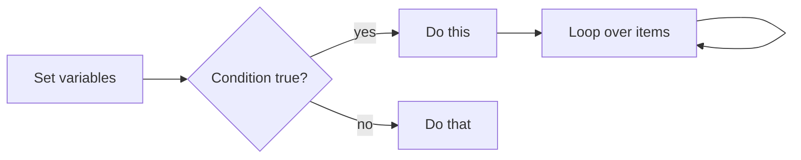

# Variables, Conditions, and Loops

## 1. What Is This?

The core logic of scripting: **variables** (store values), **conditions** (`if`/`else`, make decisions), and **loops** (`for`/`while`, repeat actions).

## 2. Why Is This Needed?

Real scripts must react to situations (is the disk full? does the file exist?) and repeat work (process each file). Variables, conditions, and loops make that possible.

## 3. Simple Layman Explanation

- **Variable** = a labeled box holding a value.
- **Condition** = "if it's raining, take an umbrella."
- **Loop** = "for each plate, wash it."

## 4. Technical Explanation

- Assign with `name=value` (**no spaces** around `=`). Use with `"$name"`.
- Conditions use `if [ ... ]; then ... fi`; tests like `-f` (file exists), `-d` (dir), `-z` (empty string), `-eq`/`-gt` (numbers).
- Loops: `for x in list; do ...; done` and `while [ cond ]; do ...; done`.

## 5. Real-World Example

A health-check script stores a threshold in a variable, loops over each mounted disk, and uses a condition to warn if usage exceeds the threshold — all three concepts working together.

## 6. Diagram



## 7. Commands

Save as `logic.sh`:

```bash
#!/bin/bash
set -euo pipefail

# --- Variables ---
name="Linux"                 # no spaces around =
threshold=80
greeting="Hello, $name"      # use the variable
echo "$greeting"

# --- Condition: does a file exist? ---
file="/etc/hostname"
if [ -f "$file" ]; then
    echo "$file exists"
else
    echo "$file is missing"
fi

# --- Condition: numeric compare ---
usage=85
if [ "$usage" -gt "$threshold" ]; then
    echo "WARNING: usage ${usage}% over ${threshold}%"
fi

# --- for loop ---
for fruit in apple banana cherry; do
    echo "Fruit: $fruit"
done

# --- while loop (count 1..3) ---
count=1
while [ "$count" -le 3 ]; do
    echo "Count: $count"
    count=$((count + 1))     # arithmetic
done
```

## 8. Command Explanation

- `name="Linux"` → assignment; quote when using: `"$name"`.
- `[ -f "$file" ]` → test if a regular file exists. `-d` dir, `-e` exists, `-z` empty string, `-n` non-empty.
- `[ "$usage" -gt "$threshold" ]` → numeric comparison: `-gt`, `-lt`, `-ge`, `-le`, `-eq`, `-ne`.
- `for x in list; do ... done` → iterate over a list.
- `while [ cond ]; do ... done` → repeat while condition holds.
- `$((count + 1))` → arithmetic expansion.

## 9. Practice Tasks

1. Run `logic.sh` and read each section's output.
2. Add a condition checking if `/tmp` is a directory (`-d`).
3. Loop over the numbers 1–5 with a `for` loop and `seq`: `for i in $(seq 1 5)`.
4. Change `usage` to 50 and confirm the warning disappears.

## 10. Common Mistakes

- Spaces around `=` (`name = "x"` fails). Use `name="x"`.
- Missing spaces inside `[ ]` (`[ -f"$x" ]` fails; need `[ -f "$x" ]`).
- Unquoted variables breaking when values contain spaces.
- Using `-gt` on strings (it's for numbers; use `=`/`!=` for strings).

## 11. Troubleshooting

- **"unary operator expected"** → a variable was empty; quote it: `[ "$x" = "y" ]`.
- **"command not found"** after `=` → you put spaces around `=`.
- Trace logic with `bash -x logic.sh`.

## 12. Best Practices

- Always quote variables: `"$var"`.
- Prefer `[[ ... ]]` in bash for safer tests (e.g., `[[ -f "$file" ]]`).
- Keep conditions readable; comment non-obvious tests.

## 13. Quick Recap

- `name=value` (no spaces), use `"$name"`.
- `if [ test ]; then ... fi`; tests `-f -d -z -gt`...
- `for`/`while` loops; `$(( ))` for math.

## 14. References

- Bash conditional expressions: https://www.gnu.org/software/bash/manual/
- `man test`, `man bash`
