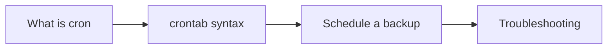

# Module 11 — Automation & Cron

## What You Will Learn

- What cron is and how scheduled jobs work.
- Reading and writing crontab entries.
- Scheduling a real backup job.
- Troubleshooting jobs that don't run.

## Why This Module Matters

Automation is what separates manual operators from engineers. Cron lets your scripts (Module 10) run on a schedule — backups at 2 AM, cleanups nightly, health checks every 5 minutes — with no human involved.

## Real-World Use Case

You'll schedule the backup and log-cleanup scripts from Module 10 so they run automatically, then debug a cron job that "isn't running" — a classic real-world puzzle.

## Topics Covered

| File | What It Covers |
|------|----------------|
| [what-is-cron.md](./what-is-cron.md) | The cron concept & daemon |
| [crontab-basics.md](./crontab-basics.md) | The 5-field schedule syntax |
| [scheduled-backup-example.md](./scheduled-backup-example.md) | Automating the backup script |
| [cron-troubleshooting.md](./cron-troubleshooting.md) | Why jobs fail to run |

## Learning Flow

## Hands-On Practice

Write a cron job that appends a timestamp to a file every minute, confirm it runs, then schedule a real script.

## Common Mistakes

- Assuming cron uses your interactive shell's PATH/environment (it doesn't).
- Using relative paths in cron jobs.

## Troubleshooting

- Job not running → check syntax, absolute paths, environment, and the cron log.

## Best Practices

- Use absolute paths everywhere.
- Redirect output to a log so you can see failures.

## Quick Revision

- Cron = time-based job scheduler; `crontab -e` edits jobs.
- 5 fields: minute hour day-of-month month day-of-week.
- Always use absolute paths and capture output.

## Next Module

➡️ [12 — Linux Security Basics](../12-linux-security-basics/).
