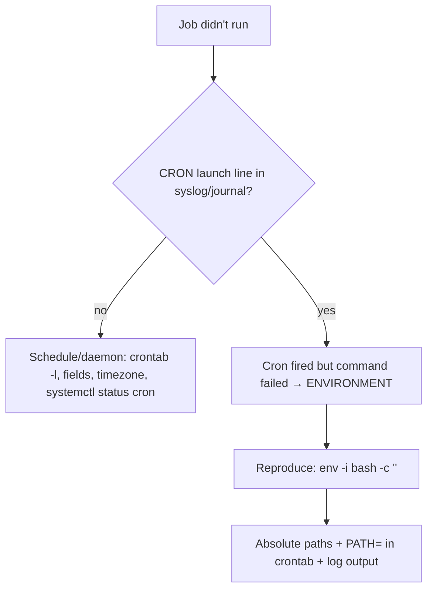

# Cron Troubleshooting

## 1. What Is This?

Diagnosing the classic problem: **"My cron job isn't running"** (even though the script works when you run it by hand).

## 2. Why Is This Needed?

Cron failures are silent and confusing because cron runs in a different environment than your interactive shell. Knowing the usual causes saves hours.

## 3. Simple Layman Explanation

Your script works when *you* run it, but the cron robot runs it in a bare room with different tools and no map. Most "it won't run" issues are about that difference: wrong paths, missing environment, or no record of what happened.

## 4. Technical Explanation

The four usual suspects:
1. **Environment/PATH** — cron has a minimal PATH; your script may rely on commands it can't find.
2. **Relative paths** — cron's working directory isn't where you think.
3. **No output captured** — failures are invisible without `>> log 2>&1`.
4. **Permissions / daemon** — the cron daemon is off, or the user can't access the files.

## 5. How It Works Under the Hood

Nearly every "cron won't run it" splits into two fundamentally different questions, and step one is telling them apart:

- **Did cron even *fire* the job?** cron logs each launch. On Debian/Ubuntu, `grep CRON /var/log/syslog` (or `journalctl -u cron`) shows a line every time it *started* a job. If there's **no** `CRON ... CMD (...)` line at the expected minute, the problem is the *schedule or daemon*: wrong five fields, wrong timezone, the daemon isn't running, or the job isn't installed (`crontab -l`).
- **Did the job fire but *fail*?** If the `CRON` line **is** there but nothing happened, cron did its part and the *command* failed — almost always the **environment difference** from [what-is-cron](what-is-cron.md) §5. cron runs with a minimal `PATH`, no `.bashrc`, and an unexpected working directory, so a script that used bare command names (`python3`, `aws`) or relative paths can't find them.

**The killer diagnostic is `env -i bash -c '<your command>'`.** `env -i` wipes the environment to (almost) nothing, then runs your command — *mimicking cron's bare room*. If it fails there with your exact command line, it will fail in cron, and the error message tells you which command/path is missing. This turns "works for me, mysteriously not in cron" from guesswork into a reproducible test you can run interactively.

The fixes all target the environment: **absolute paths** for the script and every binary it calls, a `PATH=` (and often `SHELL=`) line at the top of the crontab, and `>> log 2>&1` so there's *evidence* next time. And because schedules follow the **server timezone**, a job that "runs at the wrong time" is often a `timedatectl` (TZ) issue, not a syntax one.

## 6. Diagram



## 7. Real-World Examples

**1. The everyday case.** A job "doesn't run." `grep CRON /var/log/syslog` shows it *did* launch — so cron is fine; the script failed on a missing `PATH`. Absolute paths + a `PATH=` line fix it.

**2. Reproducing cron's environment interactively:**

```
$ /opt/scripts/report.sh          # works by hand (rich environment)
Report generated: /tmp/report.csv
$ env -i /bin/bash -c '/opt/scripts/report.sh'    # simulate cron's bare env
/opt/scripts/report.sh: line 8: aws: command not found      # ← reproduced the failure!
$ grep CRON /var/log/syslog | tail -1
Jul  2 02:00:01 web01 CRON[9001]: (alice) CMD (/opt/scripts/report.sh)   # cron DID fire it
```

`env -i` reproduced the exact failure without waiting for 2 AM — the environment difference laid bare (Section 5). Fix: call `/usr/local/bin/aws` (absolute) or add `PATH=`.

**3. War story — the "broken" job that ran three hours early.** A team swore their `0 22 * * *` job (10 PM) was broken because it "ran at the wrong time." `grep CRON` showed it firing reliably — at 22:00 **UTC**, which was 7 PM their local time. The server's timezone was UTC (`timedatectl` confirmed), and their five fields were interpreted in *server* time. Nothing was broken; the schedule simply wasn't in the timezone they assumed. They either adjusted the fields to UTC or set the server/user timezone. "Wrong time" is often a timezone mismatch, not a cron bug (Section 5).

## 8. Worked Walkthrough

Run the two-question diagnosis on a failing job:

```
# Q1: did cron FIRE it? (look for a launch line at the expected minute)
$ grep CRON /var/log/syslog | tail -2
Jul  2 10:05:01 web01 CRON[9100]: (alice) CMD (/home/alice/job.sh)
#   → YES, cron fired it. So the SCRIPT failed. Go to Q2.

# Q2: reproduce the failure in a cron-like bare environment
$ env -i /bin/bash -c '/home/alice/job.sh'
/home/alice/job.sh: line 3: jq: command not found        # missing binary in minimal PATH

# Fix A: use an absolute path in the script (/usr/bin/jq), OR
# Fix B: add PATH to the crontab and re-test:
$ crontab -e
# PATH=/usr/local/sbin:/usr/local/bin:/usr/sbin:/usr/bin:/sbin:/bin
# 10 * * * * /home/alice/job.sh >> /tmp/job.log 2>&1
$ command -v jq          # confirm where jq actually lives
/usr/bin/jq
$ env -i /bin/bash -c 'PATH=/usr/bin:/bin /home/alice/job.sh && echo OK'
OK                        # now succeeds under a minimal PATH → will work in cron
```

`grep CRON` answered "cron fired it," `env -i` reproduced *why* it failed, and adding `PATH=` fixed it — the exact loop from Section 5, no waiting for the next scheduled minute.

## 9. Commands

```bash
systemctl status cron            # daemon running? (crond on RHEL)
crontab -l                       # is the job actually installed?
grep CRON /var/log/syslog        # did cron LAUNCH it? (Debian/Ubuntu)
journalctl -u cron --since "1 hour ago"   # cron activity (systemd)
env -i /bin/bash -c '/path/job.sh'   # reproduce cron's clean environment
timedatectl                      # server timezone (schedules use it)
```

Sample output (dummy values, for reference):

```text
$ systemctl status cron | sed -n '3p'
     Active: active (running) since Tue 2026-07-02 06:00:11 UTC; 4h ago

$ grep CRON /var/log/syslog | tail -1
Jul  2 10:05:01 web01 CRON[9100]: (alice) CMD (/home/alice/job.sh >> /tmp/job.log 2>&1)

$ env -i /bin/bash -c '/home/alice/job.sh'
/home/alice/job.sh: line 3: aws: command not found

$ timedatectl | grep "Time zone"
                Time zone: Etc/UTC (UTC, +0000)
```

## 10. Command Explanation

- `systemctl status cron` / `crontab -l` → answer "is the daemon up and the job installed?" (the schedule side).
- `grep CRON /var/log/syslog` → shows each time cron *launched* a job — proves it fired vs. the job itself failing (the key first question, Section 5).
- `journalctl -u cron` → systemd's view of cron activity.
- `env -i bash -c '...'` → runs your command with an **empty environment**, mimicking cron — the best way to reproduce "works for me but not in cron."
- `timedatectl` → schedules follow the system timezone; a surprising run time is often a TZ mismatch (the war story).

## 11. In Production (DevOps Context)

- **This diagnosis is a standard on-call skill:** "the nightly job silently stopped" is common, and the fire-vs-fail split (Section 5) routes it fast.
- **Structured logging + alerting:** production jobs append to logs *and* emit a success heartbeat (dead-man's-switch) so a *missed* run pages someone — solving cron's silent-failure problem.
- **Timezones on fleets:** standardizing servers to UTC (and being explicit in schedules) avoids the "ran at the wrong time" class of incidents (the war story).
- **systemd timers** improve on cron here: `journalctl -u mytimer.service` gives per-run logs and status, and `Persistent=true` catches up missed runs (Module 05).

## 12. Practice Tasks

1. Schedule `* * * * * env >> /tmp/cronenv.log 2>&1`; after a minute, compare `/tmp/cronenv.log` to your interactive `env` — note the PATH difference.
2. Reproduce a failure with `env -i bash -c '/path/script.sh'`.
3. Find your job's launch in `grep CRON /var/log/syslog`.
4. Add a `PATH=` line to your crontab and re-test a job that previously failed; check `timedatectl` for the server TZ.

## 13. Common Mistakes

- Blaming the schedule when cron *fired* the job and the script failed on PATH/environment (check `grep CRON` first — Section 5).
- No `>> log 2>&1`, so there's nothing to diagnose.
- Relative paths and assuming the home directory as the working dir.
- Forgetting the timezone affects when jobs run (the war story).

## 14. Troubleshooting

**Scenario — Cron job not running**
- **Symptoms:** expected files/log entries never appear; the script works when run manually.
- **Possible Causes:** minimal PATH, relative paths, missing output redirection, syntax error, daemon down, wrong user, timezone.
- **Commands to Check:**
  ```bash
  systemctl status cron                     # daemon up?
  crontab -l                                # job installed?
  grep CRON /var/log/syslog                 # did it FIRE?
  journalctl -u cron --since "1 hour ago"
  timedatectl                               # timezone
  ```
- **Step-by-Step Fix:** ① Confirm the daemon (`systemctl status cron`). ② Confirm the job exists (`crontab -l`). ③ Add output capture (`>> /tmp/job.log 2>&1`). ④ Use **absolute paths** for the script and every command it calls. ⑤ Set env in the crontab:
  ```cron
  SHELL=/bin/bash
  PATH=/usr/local/sbin:/usr/local/bin:/usr/sbin:/usr/bin:/sbin:/bin
  0 2 * * * /opt/scripts/backup.sh /etc /backups >> /var/log/backup.log 2>&1
  ```
  ⑥ Check `grep CRON /var/log/syslog` to confirm it fired. ⑦ Verify the running user can read inputs/write outputs. ⑧ Reproduce failures with `env -i bash -c '<cmd>'`.
- **Prevention:** absolute paths, output logging, manual test, documented schedule, standardized timezone.

## 15. Best Practices

- Absolute paths everywhere; set `PATH=`/`SHELL=` in the crontab.
- Always capture output to a log; add a success heartbeat for critical jobs.
- Test under a clean environment (`env -i bash -c '...'`) before scheduling.
- Keep crontabs and scripts in version control; standardize server timezones.

## 16. Connects To

- **Prev:** [Scheduled Backup Example](scheduled-backup-example.md). **Next:** [Module 12 — Linux Security Basics](../12-linux-security-basics/README.md).
- **Cron's minimal environment:** [What Is Cron?](what-is-cron.md); **syntax/`%`/timezone:** [Crontab Basics](crontab-basics.md).
- **Reading cron logs:** [journalctl Basics](../09-logs-monitoring-troubleshooting/journalctl-basics.md), [Syslog & /var/log](../09-logs-monitoring-troubleshooting/syslog-and-var-log.md).
- **Better logging via timers:** [systemd Services](../05-processes-and-services/systemd-services.md). **Quick lookup:** [Troubleshooting Cheatsheet](../16-cheatsheets/troubleshooting-cheatsheet.md).

## 17. Quick Recap

- First question: did cron **fire** it? `grep CRON /var/log/syslog`. No → schedule/daemon/timezone. Yes → the script failed (environment).
- Reproduce failures with `env -i bash -c '<cmd>'`; fix with **absolute paths** + `PATH=`/`SHELL=` in the crontab.
- Always `>> log 2>&1`; check `timedatectl` when the *time* is wrong.

## 18. References

- `man cron`, `man crontab`, `man 5 crontab`
- [crontab-basics.md](./crontab-basics.md)

<!-- NAV-FOOTER -->

---

### 🧭 Navigation

| Previous | Up | Next |
|:---|:---:|---:|
| ⬅️ Prev: [Scheduled Backup Example](scheduled-backup-example.md) | ⬆️ Module: [Module 11 — Automation & Cron](README.md) | ➡️ Next: [Module 12 — Linux Security Basics](../12-linux-security-basics/README.md) |
