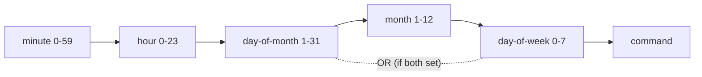

# Crontab Basics

## 1. What Is This?

The **crontab syntax**: five time fields plus a command, defining *when* and *what* cron runs.

## 2. Why Is This Needed?

To schedule anything you must write the schedule correctly. Misreading the five fields is the most common cron mistake.

## 3. Simple Layman Explanation

A crontab line is a sentence: "**At this minute, this hour, this day, this month, this weekday — run this command.**" Get the five time words right and cron does the rest.

## 4. Technical Explanation

```
* * * * *  command_to_run
| | | | |
| | | | +-- day of week (0-7, 0 and 7 = Sunday)
| | | +---- month (1-12)
| | +------ day of month (1-31)
| +-------- hour (0-23)
+---------- minute (0-59)
```

Special operators:
- `*` = every value
- `*/5` = every 5 (e.g., every 5 minutes)
- `1,15` = at 1 and 15
- `9-17` = range 9 through 17

Shortcuts: `@reboot`, `@hourly`, `@daily`, `@weekly`, `@monthly`.

## 5. How It Works Under the Hood

The matching rule is simple but has two edges that cause most bugs:

- **cron ANDs the fields — except day-of-month and day-of-week, which it ORs.** Every minute, cron checks: does the current minute, hour, month *all* match **and** does the day match? For the *day*, there's a special rule: if **both** day-of-month (field 3) and day-of-week (field 5) are restricted (not `*`), cron runs the job when **either** matches, not both. So `0 0 13 * 5` = "midnight on the 13th **OR** any Friday," not "Friday the 13th." This surprises everyone; if you need an exact date+weekday, guard it inside the script.
- **The command runs via `/bin/sh -c`, and `%` is special.** cron feeds your command to a shell, but first it treats an **unescaped `%`** as a *newline*, turning everything after the first `%` into stdin for the command. That's why `date +%F` in a crontab silently breaks — you must write `date +\%F`. This bites anyone scheduling `date`-formatted filenames.
- **Fields are position-based, and minute is FIRST.** The order is minute → hour → day-of-month → month → day-of-week. The classic error is reading `0 2 ...` as "2 o'clock-something" but putting the hour first — `2 0 * * *` means 00:02, not 02:00. Position, not value, determines meaning.
- **Redirect or lose it.** From [what-is-cron](what-is-cron.md), jobs run detached with no terminal. Without `>> log 2>&1`, cron tries to *email* the output to the user (usually undelivered) — so failures vanish. Redirection isn't optional; it's how you get any evidence at all.

Because the syntax is fiddly, validating with a tool like crontab.guru before trusting a schedule is standard practice.

## 6. Diagram



## 7. Real-World Examples

**1. The everyday case.** Common schedules mapped to meaning:

| Schedule | Meaning |
|----------|---------|
| `0 2 * * *` | Every day at 02:00 (nightly backup) |
| `*/5 * * * *` | Every 5 minutes (health check) |
| `0 9 * * 1` | Every Monday at 09:00 (weekly report) |
| `30 0 1 * *` | 00:30 on the 1st of each month |
| `@reboot` | Once at every boot |

**2. Reading and installing a crontab:**

```
$ crontab -l
# m h  dom mon dow  command
0 2 * * * /opt/scripts/backup.sh /etc /backups >> /var/log/backup.log 2>&1
*/5 * * * * /opt/scripts/healthcheck.sh >> /var/log/health.log 2>&1
$ crontab -e     # add: * * * * * date >> /tmp/cron-test.log 2>&1
$ sleep 65; cat /tmp/cron-test.log
Wed Jul  2 10:01:00 UTC 2026        # fired at the top of the minute
```

The one-minute-granularity heartbeat (from [what-is-cron](what-is-cron.md)) is visible: the line appears at `:00`.

**3. War story — "Friday the 13th" that fired every Friday.** A team wanted a special job only on Friday the 13th and wrote `0 9 13 * 5`. It ran every Friday *and* every 13th — flooding them with runs. The cause is Section 5's OR rule: with *both* day fields restricted, cron matches **either**. They fixed it by scheduling `0 9 13 * *` (any 13th) and adding a `[ "$(date +%u)" = 5 ] || exit 0` guard *inside* the script to require Friday. The five-field syntax can't express "AND across the two day fields" — you enforce that in the script.

## 8. Worked Walkthrough

Build a schedule, test its cadence, and hit the `%` trap:

```
$ crontab -e     # add a test line running every minute:
# * * * * * echo "run at $(date +\%H:\%M)" >> /tmp/ct.log 2>&1
$ sleep 130; cat /tmp/ct.log
run at 10:01
run at 10:02                          # fires each minute; note %H/%M were ESCAPED as \%
# What happens WITHOUT escaping % (do NOT keep this):
# * * * * * echo "bad $(date +%H)" >> /tmp/bad.log 2>&1
#   → everything after the first % becomes stdin; the filename/format breaks
$ crontab -l | tail -1
* * * * * echo "run at $(date +\%H:\%M)" >> /tmp/ct.log 2>&1
```

The escaped `\%` made `date +%H:%M` work; an unescaped `%` would have silently mangled the command (Section 5). Remove the test line with `crontab -e` afterward.

## 9. Commands

```bash
crontab -e        # edit your crontab
crontab -l        # list current jobs
```

Example crontab content:

```cron
# Run a backup every day at 2 AM (use absolute paths!)
0 2 * * * /home/alice/scripts/backup.sh /etc /backups >> /home/alice/logs/backup.log 2>&1

# Health check every 5 minutes
*/5 * * * * /home/alice/scripts/healthcheck.sh >> /home/alice/logs/health.log 2>&1

# Weekly cleanup, Sundays at 3:30 AM
30 3 * * 0 /home/alice/scripts/cleanup-logs.sh /var/log/myapp 7 30 >> /home/alice/logs/cleanup.log 2>&1
```

Sample output (dummy values, for reference):

```text
$ crontab -l
0 2 * * * /home/alice/scripts/backup.sh /etc /backups >> ...backup.log 2>&1
*/5 * * * * /home/alice/scripts/healthcheck.sh >> ...health.log 2>&1

$ crontab -e
crontab: installing new crontab

$ tail -1 /tmp/cron-test.log
Wed Jul  2 10:05:00 UTC 2026
```

## 10. Command Explanation

- The five fields set the schedule (minute first!); the rest is the exact command.
- `>> file 2>&1` → append both **stdout** and **stderr** to a log. **Always do this** — otherwise cron emails output (often lost) and failures are invisible (Section 5).
- Use **absolute paths** for scripts and binaries (cron's PATH is minimal — [what-is-cron](what-is-cron.md)).
- Escape `%` as `\%` in commands (e.g., `date +\%F`); lines starting with `#` are comments.

## 11. In Production (DevOps Context)

- **crontab.guru and validation** are standard before shipping a schedule — the syntax is error-prone (Section 5).
- **Kubernetes CronJobs** use the *same* five-field syntax (`schedule: "0 2 * * *"`), so this knowledge transfers directly to orchestrated scheduled tasks (Module 13).
- **Timezones bite:** a schedule fires in the *server's* timezone; UTC servers running "2 AM" jobs surprise teams expecting local time (`timedatectl`).
- **Output logging** is how scheduled jobs integrate with monitoring — alerting reads the log the job appends to.

## 12. Practice Tasks

1. Add `* * * * * date >> /tmp/cron-test.log 2>&1`, wait 2 minutes, check the file grows.
2. Change it to `*/2 * * * *` (every 2 minutes) and verify the cadence.
3. Write the cron line for "every weekday at 6 PM" (answer: `0 18 * * 1-5`).
4. Use `date +\%F` in a job and confirm the escaping works; remove the test line after.

## 13. Common Mistakes

- Confusing field order (minute is **first**, not hour) — `2 0 * * *` = 00:02, not 02:00.
- Forgetting `>> log 2>&1`, so failures are invisible (Section 5).
- Using `%` literally in a command (it's special in crontab — escape as `\%`).
- Setting both day-of-month and day-of-week and expecting AND (it's OR — the war story).

## 14. Troubleshooting

- **Job runs at the wrong time** → re-read the five fields (minute first); check the server timezone (`timedatectl`).
- **`date`/`%` command mangled** → escape `%` as `\%`.
- **No output** → add `>> /tmp/job.log 2>&1` and inspect it.
- **Deeper "won't run" issues** → environment/PATH (see [Cron Troubleshooting](cron-troubleshooting.md)); validate the schedule with crontab.guru.

## 15. Best Practices

- Always redirect output to a log.
- Use absolute paths; set `PATH=`/`SHELL=` at the top of the crontab if needed.
- Comment every job with its purpose; validate the expression before trusting it.
- Test the script manually first, then schedule it.

## 16. Connects To

- **Prev:** [What Is Cron?](what-is-cron.md). **Next:** [Scheduled Backup Example](scheduled-backup-example.md).
- **Environment/PATH gotchas:** [Cron Troubleshooting](cron-troubleshooting.md).
- **Scripts to schedule:** [Backup Script](../10-shell-scripting/backup-script-example.md), [Log Cleanup Script](../10-shell-scripting/log-cleanup-script-example.md).
- **Same syntax in K8s:** [Linux for Kubernetes](../13-real-world-linux-for-devops/linux-for-kubernetes.md).

## 17. Quick Recap

- Five fields: minute (first!) hour day-of-month month day-of-week, then the command.
- `*/5` every five; `0 2 * * *` daily at 2 AM; the two day fields are **OR**ed when both are set.
- Escape `%` as `\%`; always `>> log 2>&1`; use absolute paths; validate with crontab.guru.

## 18. References

- `man 5 crontab`
- crontab.guru (expression helper): https://crontab.guru/

<!-- NAV-FOOTER -->

---

### 🧭 Navigation

| Previous | Up | Next |
|:---|:---:|---:|
| ⬅️ Prev: [What Is Cron?](what-is-cron.md) | ⬆️ Module: [Module 11 — Automation & Cron](README.md) | ➡️ Next: [Scheduled Backup Example](scheduled-backup-example.md) |
