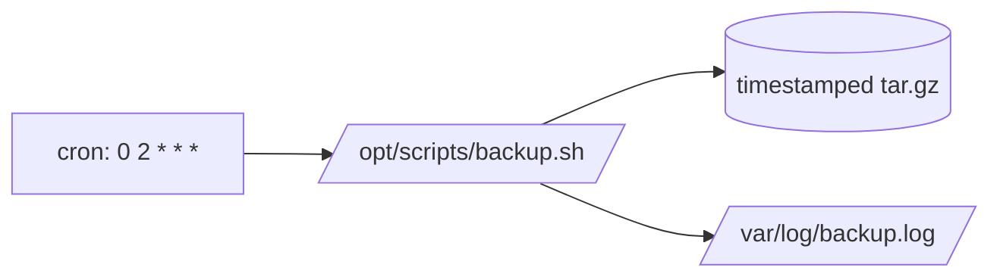

# Scheduled Backup Example

## 1. What Is This?

Putting it together: scheduling the **backup script** from Module 10 to run automatically every night with cron.

## 2. Why Is This Needed?

A backup script you must remember to run isn't reliable. Scheduling it removes the human, guaranteeing consistent backups.

## 3. Simple Layman Explanation

You already built the photocopier (backup script). Now you plug it into a **timer** so it runs itself every night — no one has to press the button.

## 4. Technical Explanation

Steps:
1. Place the script at an absolute path and make it executable.
2. Test it manually.
3. Add a cron entry with absolute paths and output logging.
4. Verify it ran by checking the backup files and the log.

## 5. Real-World Example

`/opt/scripts/backup.sh` archives `/var/www/site` to `/backups` nightly at 2 AM, keeping 7 copies, logging to `/var/log/backup.log`. Each morning you confirm success by tailing the log — fully automated.

## 6. Diagram



## 7. Commands

```bash
# 1) Install the script (from Module 10) at an absolute path
sudo mkdir -p /opt/scripts
sudo cp backup.sh /opt/scripts/backup.sh
sudo chmod +x /opt/scripts/backup.sh

# 2) Test it manually FIRST
/opt/scripts/backup.sh /etc /backups 7

# 3) Prepare a log location
sudo mkdir -p /var/log && sudo touch /var/log/backup.log

# 4) Schedule it: crontab -e, then add:
```

Crontab entry:

```cron
# Nightly backup of /var/www/site at 02:00, keep 7, log everything
0 2 * * * /opt/scripts/backup.sh /var/www/site /backups 7 >> /var/log/backup.log 2>&1
```

Verify next day:

```bash
ls -lh /backups            # see timestamped archives
tail -n 20 /var/log/backup.log
```

## 8. Command Explanation

- Absolute paths (`/opt/scripts/backup.sh`, `/backups`) → cron has a minimal PATH and unknown working directory.
- `>> /var/log/backup.log 2>&1` → captures both normal output and errors for later inspection.
- Testing manually first → confirms the script works before trusting the schedule.
- `0 2 * * *` → every day at 02:00.

## 9. Practice Tasks

1. Install and chmod the script at an absolute path.
2. Run it manually and confirm an archive appears.
3. Schedule it for 2–3 minutes from now (temporarily) and confirm it fires.
4. Change it back to nightly and check the log the next day.

## 10. Common Mistakes

- Scheduling before testing the script manually.
- Relative paths in the cron line.
- No log redirection — you can't tell if it ran or failed.
- Backing up to the same disk as the source (no protection from disk failure).

## 11. Troubleshooting

- **No backups appeared** → check `/var/log/backup.log`; verify the cron line and absolute paths.
- **Script works manually, not via cron** → environment/PATH; use absolute paths and set `PATH=` in crontab if needed (see cron-troubleshooting).
- **Permission denied** → cron runs as your user; ensure that user can read the source and write the destination.

## 12. Best Practices

- Back up to a **different disk/host**.
- Alert on failure (email or a monitoring check on the log).
- Keep the cron entry and script in version control.
- Periodically test restoring from a backup.

## 13. Quick Recap

- Install script at absolute path → test manually → schedule with `0 2 * * *` → log output → verify.
- Absolute paths + output logging are non-negotiable.

## 14. References

- [Module 10 backup script](../10-shell-scripting/backup-script-example.md)
- [crontab-basics.md](./crontab-basics.md), [cron-troubleshooting.md](./cron-troubleshooting.md)
