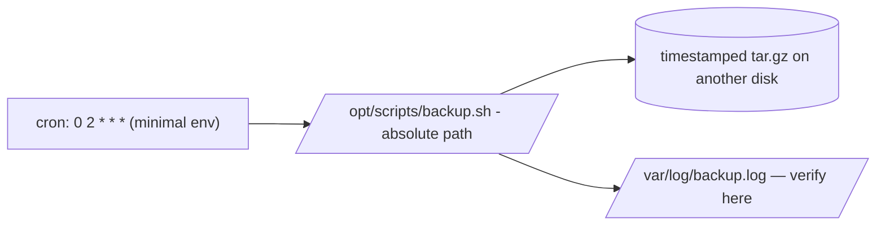

# Scheduled Backup Example

## 1. What Is This?

Putting it together: scheduling the **backup script** from Module 10 to run automatically every night with cron.

## 2. Why Is This Needed?

A backup script you must remember to run isn't reliable. Scheduling it removes the human, guaranteeing consistent backups.

## 3. Simple Layman Explanation

You already built the photocopier (backup script). Now you plug it into a **timer** so it runs itself every night — no one has to press the button.

## 4. Technical Explanation

Steps:
1. Place the script at an absolute path and make it executable.
2. Test it manually.
3. Add a cron entry with absolute paths and output logging.
4. Verify it ran by checking the backup files and the log.

## 5. How It Works Under the Hood

This topic is where the two previous modules collide, and the "gotchas" are exactly their intersection:

- **A working script + a scheduler is not automatically a working scheduled job**, because cron runs it in a *different world* (from [what-is-cron](what-is-cron.md) §5): minimal `PATH`, no `.bashrc`, unknown working directory, no terminal. A script that used bare command names or relative paths works when *you* run it (rich environment) and silently fails at 2 AM. That's why the recipe is: **absolute path to the script**, **absolute paths to its data**, and (if it calls tools) a `PATH=` line in the crontab.
- **`>> /var/log/backup.log 2>&1` is the difference between "automated" and "hope."** With no terminal, cron would email output (usually undelivered), so a failed backup leaves *no trace*. Redirecting both stdout and stderr to a dated log turns the job into something you can *verify* — and the backup script's own `[ -s ]` verification (Module 10 §5) writes its success/failure line there.
- **The user matters.** `crontab -e` installs the job under *your* user, so it runs with *your* permissions. If the backup reads `/var/www` (root-owned) or writes `/backups`, that user must have the rights — otherwise "permission denied," even though the schedule and script are perfect. System backups often live in root's crontab or `/etc/cron.d/` for this reason.
- **Test-by-hand-first is a safety gate, not a formality:** run the script manually with the *exact* arguments the cron line will use. If it fails there, it'll fail in cron; if it works there, the only remaining variable is the environment (which absolute paths + `PATH=` neutralize).

So scheduling a backup is really "port a script into cron's stripped environment safely" — absolute paths, output logging, right user, tested first.

## 6. Diagram



## 7. Real-World Examples

**1. The everyday case.** `/opt/scripts/backup.sh` archives `/var/www/site` to `/backups` nightly at 2 AM, keeping 7 copies, logging to `/var/log/backup.log`. Each morning you confirm success by tailing the log — fully automated.

**2. Verifying the automated run the next morning:**

```
$ ls -lh /backups | tail -2
-rw-r--r-- 1 root root 214M Jul  1 02:00 site-2026-07-01_0200.tar.gz
-rw-r--r-- 1 root root 215M Jul  2 02:00 site-2026-07-02_0200.tar.gz
$ tail -n 3 /var/log/backup.log
Creating backup: /backups/site-2026-07-02_0200.tar.gz
Backup OK: 215M
Backup complete.
$ grep CRON /var/log/syslog | grep backup | tail -1
Jul  2 02:00:01 web01 CRON[9001]: (root) CMD (/opt/scripts/backup.sh /var/www/site /backups 7 ...)
```

The archive exists, the log confirms success (the script's `[ -s ]` verification), and `syslog` proves cron *fired* it — three independent confirmations.

**3. War story — the backup cron that never wrote a byte.** A team scheduled their tested backup script, but weeks later found `/backups` empty. No error anywhere — because the cron line had **no output redirection**. Debugging with `>> /var/log/backup.log 2>&1` revealed the truth instantly: `tar: command not found`-style failures from a wrapper calling `aws s3 cp` by bare name in cron's minimal `PATH` (Section 5). Adding a `PATH=` line and absolute binary paths fixed it. The lesson: an unlogged scheduled backup can fail invisibly for weeks — always redirect output and verify.

## 8. Worked Walkthrough

Install, test-by-hand, schedule, and confirm firing:

```
$ sudo mkdir -p /opt/scripts && sudo cp backup.sh /opt/scripts/ && sudo chmod +x /opt/scripts/backup.sh
$ /opt/scripts/backup.sh /etc /backups 7          # 1. TEST with the EXACT cron args
Creating backup: /backups/etc-2026-07-02_1010.tar.gz
Backup OK: 2.1M
Backup complete.                                   #    works by hand → good
$ crontab -e     # 2. schedule it a couple minutes out to verify quickly:
# PATH=/usr/local/sbin:/usr/local/bin:/usr/sbin:/usr/bin:/sbin:/bin
# 12 10 * * * /opt/scripts/backup.sh /etc /backups 7 >> /var/log/backup.log 2>&1
$ sleep 130 ; ls -1t /backups | head -1            # 3. did the scheduled run produce a file?
etc-2026-07-02_1012.tar.gz
$ tail -n 2 /var/log/backup.log                    # 4. and did the log confirm it?
Backup OK: 2.1M
Backup complete.
$ crontab -e     # 5. change back to nightly: 0 2 * * *
```

Testing with the *exact* arguments, then scheduling with absolute paths + `PATH=` + redirection, then verifying both the file *and* the log — the full safe-scheduling flow (Section 5).

## 9. Commands

```bash
# 1) Install the script (from Module 10) at an absolute path
sudo mkdir -p /opt/scripts
sudo cp backup.sh /opt/scripts/backup.sh
sudo chmod +x /opt/scripts/backup.sh

# 2) Test it manually FIRST, with the exact args cron will use
/opt/scripts/backup.sh /etc /backups 7

# 3) Prepare a log location
sudo mkdir -p /var/log && sudo touch /var/log/backup.log

# 4) Schedule it: crontab -e, then add the entry below
```

Crontab entry:

```cron
PATH=/usr/local/sbin:/usr/local/bin:/usr/sbin:/usr/bin:/sbin:/bin
# Nightly backup of /var/www/site at 02:00, keep 7, log everything
0 2 * * * /opt/scripts/backup.sh /var/www/site /backups 7 >> /var/log/backup.log 2>&1
```

Verify next day:

```bash
ls -lh /backups            # see timestamped archives
tail -n 20 /var/log/backup.log
grep CRON /var/log/syslog | grep backup   # confirm cron fired it
```

Sample output (dummy values, for reference):

```text
$ /opt/scripts/backup.sh /etc /backups 7
Creating backup: /backups/etc-2026-07-02_0200.tar.gz
Backup OK: 2.1M
Backup complete.

$ tail -n 2 /var/log/backup.log
Backup OK: 215M
Backup complete.

$ grep CRON /var/log/syslog | tail -1
Jul  2 02:00:01 web01 CRON[9001]: (root) CMD (/opt/scripts/backup.sh /var/www/site /backups 7 ...)
```

## 10. Command Explanation

- Absolute paths (`/opt/scripts/backup.sh`, `/backups`) → cron has a minimal PATH and unknown working directory (Section 5).
- `PATH=` line → ensures any tools the script calls by name are found in cron's stripped environment.
- `>> /var/log/backup.log 2>&1` → captures both normal output and errors so you can *verify* and so failures aren't invisible.
- Testing manually first → confirms the script works before trusting the schedule.
- `0 2 * * *` → every day at 02:00 (server timezone).

## 11. In Production (DevOps Context)

- **This is the canonical scheduled job:** nightly backups with rotation, logged and verified — plus offsite copy (S3/object storage) per the 3-2-1 rule (Module 10).
- **Alert on failure:** monitoring watches the log (or the job pushes a heartbeat to a dead-man's-switch); a *silent* backup failure (the war story) is a classic post-incident finding.
- **Kubernetes CronJob** is the orchestrated equivalent — same schedule syntax, with logs in `kubectl logs` and built-in failure tracking (Module 13).
- **Right user / least privilege:** backups run as a user with exactly the read/write rights needed, not blanket root where avoidable (Module 12).

## 12. Practice Tasks

1. Install and `chmod +x` the script at an absolute path.
2. Run it manually with the exact args and confirm an archive appears.
3. Schedule it for 2–3 minutes from now (temporarily), verify the file *and* the log entry.
4. Add a `PATH=` line, change back to nightly, and check the log the next day.

## 13. Common Mistakes

- Scheduling before testing the script manually with the exact arguments.
- Relative paths in the cron line (cron's CWD/PATH differ — Section 5).
- No log redirection — you can't tell if it ran or failed (the war story).
- Backing up to the same disk as the source (no protection from disk failure).

## 14. Troubleshooting

- **No backups appeared** → check `/var/log/backup.log`; verify the cron line, absolute paths, and that cron fired (`grep CRON /var/log/syslog`).
- **Script works manually, not via cron** → environment/PATH; use absolute paths and a `PATH=` line ([Cron Troubleshooting](cron-troubleshooting.md)).
- **Permission denied** → the cron user can't read the source or write the destination; adjust ownership or run from root's crontab.
- **Ran but archive is empty/broken** → disk full (Module 08); the script's `[ -s ]` check logs this.

## 15. Best Practices

- Back up to a **different disk/host** (and offsite); follow 3-2-1.
- Alert on failure (email or a monitoring check on the log/heartbeat).
- Keep the cron entry and script in version control.
- Periodically test restoring from a backup — an untested backup isn't a backup.

## 16. Connects To

- **Prev:** [Crontab Basics](crontab-basics.md). **Next:** [Cron Troubleshooting](cron-troubleshooting.md).
- **The script itself:** [Backup Script Example](../10-shell-scripting/backup-script-example.md).
- **Cron's minimal env:** [What Is Cron?](what-is-cron.md); **debugging:** [Cron Troubleshooting](cron-troubleshooting.md).
- **Disk-full failures:** [Disk Full Troubleshooting](../08-storage-and-disk-management/disk-full-troubleshooting.md).

## 17. Quick Recap

- Install script at an absolute path → **test by hand with the exact args** → schedule with absolute paths + `PATH=` + `>> log 2>&1` → verify file *and* log.
- Cron's minimal environment is the enemy; absolute paths and output logging are non-negotiable.
- Run as a user with the right permissions; back up off-host and test restores.

## 18. References

- [Module 10 backup script](../10-shell-scripting/backup-script-example.md)
- [crontab-basics.md](./crontab-basics.md), [cron-troubleshooting.md](./cron-troubleshooting.md)

<!-- NAV-FOOTER -->

---

### 🧭 Navigation

| Previous | Up | Next |
|:---|:---:|---:|
| ⬅️ Prev: [Crontab Basics](crontab-basics.md) | ⬆️ Module: [Module 11 — Automation & Cron](README.md) | ➡️ Next: [Cron Troubleshooting](cron-troubleshooting.md) |
