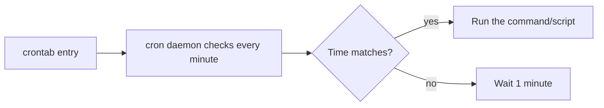

# What Is Cron?

## 1. What Is This?

**cron** is the Linux **time-based job scheduler**. The `cron` daemon runs in the background and executes commands/scripts at the times you define in a **crontab** ("cron table").

## 2. Why Is This Needed?

Many tasks must run on a schedule without a human: backups, log cleanup, certificate renewals, health checks, report generation. Cron automates all of them reliably.

## 3. Simple Layman Explanation

cron is an **alarm clock for commands**. You set the time ("every day at 2 AM") and the action ("run the backup"), and cron makes sure it happens — even while you sleep.

## 4. Technical Explanation

- The `cron` (or `crond`) daemon wakes every minute and runs any jobs whose schedule matches.
- **User crontabs**: per-user, edited with `crontab -e`.
- **System crontab**: `/etc/crontab` and `/etc/cron.d/`, plus convenience dirs `/etc/cron.{hourly,daily,weekly,monthly}`.
- Cron runs jobs in a **minimal environment** (limited PATH, no interactive profile) — a common gotcha.
- Modern systems also offer **systemd timers** as an alternative.

## 5. Real-World Example

A company's database server runs `pg_dump` every night at 1 AM via cron, uploads it to storage, and emails on failure — all unattended. Without cron, someone would have to do it manually each night.

## 6. Diagram



## 7. Commands

```bash
crontab -l                 # list your cron jobs
crontab -e                 # edit your cron jobs
crontab -r                 # remove all your cron jobs (careful)
systemctl status cron      # is the cron daemon running? (Debian/Ubuntu)
systemctl status crond     # RHEL/CentOS name
ls /etc/cron.d/ /etc/cron.daily/   # system-wide jobs
```

## 8. Command Explanation

- `crontab -l` → shows the current user's scheduled jobs.
- `crontab -e` → opens your crontab in an editor; saving installs it.
- `crontab -r` → deletes **all** your jobs (no confirmation — be careful).
- `systemctl status cron`/`crond` → confirms the scheduler itself is running.
- `/etc/cron.daily/` etc. → drop a script here to run it on that cadence.

## 9. Practice Tasks

1. `systemctl status cron` (or `crond`) — confirm it's active.
2. `crontab -l` to see existing jobs (may be empty).
3. List `/etc/cron.daily/` and read one of the scripts there.
4. Explain in your own words how cron decides to run a job.

## 10. Common Mistakes

- Assuming cron has your normal shell environment/PATH — it doesn't.
- Forgetting the cron daemon must be running for jobs to fire.
- Using `crontab -r` and wiping all jobs by accident.

## 11. Troubleshooting

- **No jobs run** → check the daemon is active (`systemctl status cron`).
- **Job runs manually but not via cron** → environment/PATH difference (next topics).
- **Lost all jobs** → likely `crontab -r`; restore from backup/version control.

## 12. Best Practices

- Keep important crontabs in version control (export with `crontab -l > cron.bak`).
- Use absolute paths and explicit environment in jobs.
- Consider systemd timers for complex scheduling with logging.

## 13. Quick Recap

- cron runs scheduled jobs via the cron daemon, checking every minute.
- `crontab -e/-l/-r` manage your jobs.
- Cron's environment is minimal — plan for it.

## 14. References

- `man cron`, `man crontab`, `man 5 crontab`
- Ubuntu cron: https://help.ubuntu.com/community/CronHowto
