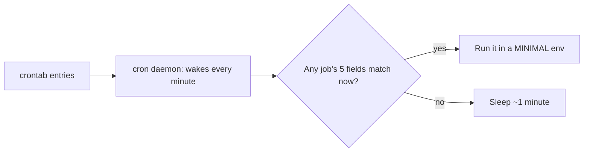

# What Is Cron?

## 1. What Is This?

**cron** is the Linux **time-based job scheduler**. The `cron` daemon runs in the background and executes commands/scripts at the times you define in a **crontab** ("cron table").

## 2. Why Is This Needed?

Many tasks must run on a schedule without a human: backups, log cleanup, certificate renewals, health checks, report generation. Cron automates all of them reliably.

## 3. Simple Layman Explanation

cron is an **alarm clock for commands**. You set the time ("every day at 2 AM") and the action ("run the backup"), and cron makes sure it happens — even while you sleep.

## 4. Technical Explanation

- The `cron` (or `crond`) daemon wakes every minute and runs any jobs whose schedule matches.
- **User crontabs**: per-user, edited with `crontab -e`.
- **System crontab**: `/etc/crontab` and `/etc/cron.d/`, plus convenience dirs `/etc/cron.{hourly,daily,weekly,monthly}`.
- Cron runs jobs in a **minimal environment** (limited PATH, no interactive profile) — a common gotcha.
- Modern systems also offer **systemd timers** as an alternative.

## 5. How It Works Under the Hood

cron is a **daemon** — a background service (managed by systemd, Module 05) that does one simple thing on a loop: **once per minute it wakes, reads all installed crontabs, and runs every job whose five time-fields match the current minute.** Two consequences flow from this design:

- **Granularity is one minute.** cron can't run something "every 30 seconds" — its heartbeat is 60 seconds. If a schedule matches, the job fires; if the machine was *asleep/off* at that minute, classic cron simply **misses** the run (it doesn't catch up later — a key difference from systemd timers' `Persistent=true`).
- **Each job runs in a fresh, minimal environment — not your shell.** This is *the* thing that surprises everyone. When cron launches a job, it does **not** source your `.bashrc`/`.profile`, so there's no rich `PATH`, no `cd` to your home project, no environment variables you set interactively. cron gives the job a bare `PATH` (often just `/usr/bin:/bin`), `HOME`, and little else. That's precisely why "it works when I run it, but not in cron" happens: your interactive shell had a fat environment; cron's job doesn't. The fixes — **absolute paths** and setting `PATH=`/`SHELL=` in the crontab — all address this one fact.

There are two crontab worlds: **user crontabs** (`crontab -e`, run as that user) and **system crontabs** (`/etc/crontab`, `/etc/cron.d/`, and the `cron.{hourly,daily,…}` drop-in dirs, which include a *user* field and run as root by default). Modern distros also ship **systemd timers**, which add logging (journald), catch-up (`Persistent`), and dependencies — but the mental model (a scheduler firing jobs in a controlled environment) is the same.

## 6. Diagram



## 7. Real-World Examples

**1. The everyday case.** A company's database server runs `pg_dump` every night at 1 AM via cron, uploads it to storage, and emails on failure — all unattended. Without cron, someone would have to do it manually each night.

**2. Confirming the scheduler and its jobs:**

```
$ systemctl status cron            # (crond on RHEL)
● cron.service - Regular background program processing daemon
     Active: active (running) since Tue 2026-07-02 06:00:11 UTC; 3h ago
$ crontab -l
0 2 * * * /opt/scripts/backup.sh /etc /backups >> /var/log/backup.log 2>&1
$ ls /etc/cron.daily/
apt-compat  logrotate  man-db          # system jobs that run daily
```

The daemon is active, the user has one job, and `/etc/cron.daily/` holds system jobs (like `logrotate` from Module 08) — the two crontab worlds from Section 5.

**3. War story — the job that ran fine by hand but never fired.** An engineer's report-generation script worked perfectly interactively, but the nightly cron run produced nothing — and no error, because there was no output capture. The cause was pure Section 5: the script called `python3` and `aws` via bare names, relying on a `PATH` set in `.bashrc` that **cron doesn't load**. In cron's minimal environment those commands were "not found." Adding absolute paths (`/usr/bin/python3`) and a `PATH=` line to the crontab — plus `>> /var/log/report.log 2>&1` so failures were visible — fixed it. "Works by hand, not in cron" is almost always the environment difference.

## 8. Worked Walkthrough

Prove cron's minimal-environment behavior for yourself:

```
$ crontab -e        # add this line, save, then wait ~2 minutes:
# * * * * * env > /tmp/cronenv.log 2>&1
$ cat /tmp/cronenv.log        # what cron gave the job
HOME=/home/alice
PATH=/usr/bin:/bin            # ← minimal! compare to yours:
SHELL=/bin/sh
$ echo "$PATH"                # your interactive PATH — much richer
/usr/local/sbin:/usr/local/bin:/usr/sbin:/usr/bin:/sbin:/bin:/home/alice/.local/bin
$ crontab -l                  # confirm your jobs
* * * * * env > /tmp/cronenv.log 2>&1
$ systemctl status cron | sed -n '3p'
     Active: active (running) since ...
```

Side by side, cron's `PATH` (`/usr/bin:/bin`) is far thinner than your interactive one — the exact reason bare command names fail under cron (Section 5). Remove the test line with `crontab -e` when done.

## 9. Commands

```bash
crontab -l                 # list your cron jobs
crontab -e                 # edit your cron jobs
crontab -r                 # remove ALL your cron jobs (careful!)
systemctl status cron      # is the cron daemon running? (Debian/Ubuntu)
systemctl status crond     # RHEL/CentOS name
ls /etc/cron.d/ /etc/cron.daily/   # system-wide jobs
```

Sample output (dummy values, for reference):

```text
$ crontab -l
0 2 * * * /opt/scripts/backup.sh /etc /backups >> /var/log/backup.log 2>&1

$ systemctl status cron | head -3
● cron.service - Regular background program processing daemon
     Loaded: loaded (/lib/systemd/system/cron.service; enabled)
     Active: active (running) since Tue 2026-07-02 06:00:11 UTC; 3h ago

$ ls /etc/cron.daily/
apt-compat  dpkg  logrotate  man-db
```

## 10. Command Explanation

- `crontab -l` → shows the current user's scheduled jobs.
- `crontab -e` → opens your crontab in an editor; saving installs it.
- `crontab -r` → deletes **all** your jobs (no confirmation — be careful).
- `systemctl status cron`/`crond` → confirms the scheduler daemon itself is running (Module 05).
- `/etc/cron.daily/` etc. → drop a script here to run it on that cadence (system crontab world).

## 11. In Production (DevOps Context)

- **Cron runs the unglamorous backbone:** backups, log rotation (`/etc/cron.daily/logrotate`, Module 08), cert renewals (certbot), metric pushes, cleanup.
- **systemd timers** are increasingly preferred in production for their **journald logging**, `Persistent=` catch-up after downtime, and dependency ordering — but the scheduling concept is identical.
- **Containers usually don't use cron inside them** (one process per container); scheduled work runs as **Kubernetes CronJobs** — the same five-field syntax, orchestrated (Module 13).
- **The minimal-environment gotcha** (Section 5) is a top cause of "the scheduled job silently stopped working" incidents — absolute paths + output logging are standard hygiene.

## 12. Practice Tasks

1. `systemctl status cron` (or `crond`) — confirm it's active.
2. `crontab -l` to see existing jobs (may be empty).
3. Add `* * * * * env > /tmp/cronenv.log 2>&1`, wait, and compare its `PATH` to your interactive `echo $PATH`.
4. List `/etc/cron.daily/` and read one of the scripts there.

## 13. Common Mistakes

- Assuming cron has your normal shell environment/PATH — it doesn't (Section 5, the war story).
- Forgetting the cron daemon must be running for jobs to fire.
- Expecting classic cron to "catch up" a run missed while the machine was off (it won't; use a systemd timer with `Persistent=`).
- Using `crontab -r` and wiping all jobs by accident.

## 14. Troubleshooting

- **No jobs run** → check the daemon is active (`systemctl status cron`).
- **Job runs manually but not via cron** → environment/PATH difference (the war story); use absolute paths, set `PATH=` (see [cron-troubleshooting](cron-troubleshooting.md)).
- **Missed run after downtime** → classic cron doesn't catch up; consider a systemd timer.
- **Lost all jobs** → likely `crontab -r`; restore from backup/version control.

## 15. Best Practices

- Keep important crontabs in version control (`crontab -l > cron.bak`).
- Use absolute paths and set explicit environment (`PATH=`/`SHELL=`) in jobs.
- Always capture output (`>> log 2>&1`); test the script by hand first.
- Consider systemd timers for logging, catch-up, and complex scheduling.

## 16. Connects To

- **Prev:** [Module 11 — Automation & Cron](README.md). **Next:** [Crontab Basics](crontab-basics.md).
- **The syntax:** [Crontab Basics](crontab-basics.md); **debugging the env gotcha:** [Cron Troubleshooting](cron-troubleshooting.md).
- **The daemon model:** [systemd Services](../05-processes-and-services/systemd-services.md).
- **What you'll schedule:** [Backup Script](../10-shell-scripting/backup-script-example.md), [Log Cleanup Script](../10-shell-scripting/log-cleanup-script-example.md).

## 17. Quick Recap

- cron is a daemon that wakes every minute and runs jobs whose five time-fields match — one-minute granularity, no catch-up.
- Jobs run in a **minimal environment** (thin PATH, no `.bashrc`) — the root of "works by hand, not in cron."
- `crontab -e/-l/-r` manage user jobs; `/etc/cron.*` are system jobs; systemd timers are the modern alternative.

## 18. References

- `man cron`, `man crontab`, `man 5 crontab`
- Ubuntu cron: https://help.ubuntu.com/community/CronHowto

<!-- NAV-FOOTER -->

---

### 🧭 Navigation

| Previous | Up | Next |
|:---|:---:|---:|
| ⬅️ Prev: [Module 11 — Automation & Cron](README.md) | ⬆️ Module: [Module 11 — Automation & Cron](README.md) | ➡️ Next: [Crontab Basics](crontab-basics.md) |
