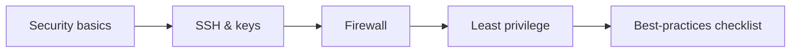

# Module 12 — Linux Security Basics

## What You Will Learn

- Core security principles for Linux servers.
- SSH: secure remote access and key-based auth.
- Firewalls with ufw (Ubuntu) and firewalld (RHEL).
- The principle of least privilege.
- A practical security best-practices checklist.

## Why This Module Matters

Internet-facing servers are attacked constantly. Basic security hygiene — SSH keys, firewalls, least privilege, updates — prevents the vast majority of breaches. This is non-negotiable for production.

## Real-World Use Case

You'll harden a cloud server: disable password SSH in favor of keys, open only needed ports with a firewall, and apply least-privilege access for users and services.

## Topics Covered

| File | What It Covers |
|------|----------------|
| [security-basics.md](./security-basics.md) | Threat model & principles |
| [ssh-basics.md](./ssh-basics.md) | Secure remote login & keys |
| [firewall-basics-ufw-firewalld.md](./firewall-basics-ufw-firewalld.md) | Controlling ports |
| [least-privilege.md](./least-privilege.md) | Minimal access |
| [security-best-practices.md](./security-best-practices.md) | A hardening checklist |

## Learning Flow

## Hands-On Practice

Generate an SSH key pair, configure key-based login, enable a firewall allowing only SSH/HTTP/HTTPS, and audit who has sudo.

## Common Mistakes

- Leaving password SSH and root login enabled.
- Opening all ports or running everything as root.

## Troubleshooting

- Locked out after firewall change → always keep SSH open and test in a second session.
- SSH refused → check the service, port, firewall, and key permissions.

## Best Practices

- Keys over passwords, firewall by default-deny, least privilege, patch regularly.

## Quick Revision

- SSH keys + no root login + firewall + least privilege + updates.
- Test security changes without closing your existing session.

## Next Module

➡️ [13 — Real-World Linux for DevOps](../13-real-world-linux-for-devops/).

<!-- NAV-FOOTER -->

---

### 🧭 Navigation

| Previous | Up | Next |
|:---|:---:|---:|
| ⬅️ Prev: [Cron Troubleshooting](../11-automation-and-cron/cron-troubleshooting.md) | ⬆️ Home: [Learning Linux](../README.md) | ➡️ Next: [Security Basics](security-basics.md) |
