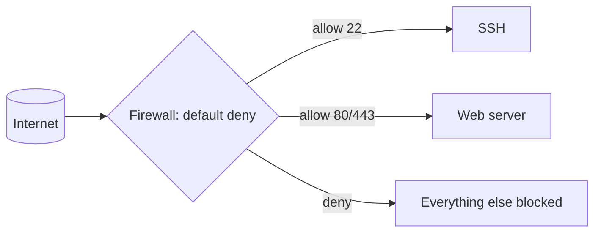

# Firewall Basics (ufw / firewalld)

## 1. What Is This?

A **firewall** controls which network ports/connections are allowed in or out. **ufw** (Uncomplicated Firewall) is Ubuntu/Debian's easy front end; **firewalld** is the RHEL/CentOS/Fedora equivalent.

## 2. Why Is This Needed?

Every open port is a potential way in. A firewall enforces "deny by default, allow only what's needed" — drastically shrinking your attack surface.

## 3. Simple Layman Explanation

A firewall is a **doorman** for your server. By default he turns everyone away, and only opens specific doors (SSH, web) for expected visitors. Everything else stays locked.

## 4. Technical Explanation

- Both tools manage the kernel's netfilter rules with a friendlier interface.
- Policy: default **deny incoming**, **allow outgoing**, then explicitly allow needed ports (22 SSH, 80 HTTP, 443 HTTPS).
- firewalld uses **zones** (e.g., `public`); ufw uses simple allow/deny rules.
- Cloud servers also have a provider firewall (AWS **security groups**) — both must allow the traffic.

## 5. Real-World Example

A new web server should accept SSH and web traffic only. With ufw: allow 22, 80, 443; enable; done. Database port 3306 stays closed to the internet, reachable only internally.

## 6. Diagram



## 7. Commands

ufw (Ubuntu/Debian):

```bash
sudo ufw status verbose            # current rules
sudo ufw default deny incoming     # deny all inbound by default
sudo ufw default allow outgoing    # allow outbound
sudo ufw allow 22/tcp              # allow SSH (do this BEFORE enabling!)
sudo ufw allow 80,443/tcp          # allow web
sudo ufw allow from 203.0.113.5 to any port 22   # SSH from one IP only
sudo ufw enable                    # turn the firewall on
sudo ufw delete allow 80/tcp       # remove a rule
```

firewalld (RHEL/Fedora):

```bash
sudo firewall-cmd --state
sudo firewall-cmd --permanent --add-service=ssh
sudo firewall-cmd --permanent --add-service=http --add-service=https
sudo firewall-cmd --reload
sudo firewall-cmd --list-all
```

## 8. Command Explanation

- `ufw default deny incoming` → the crucial default-deny baseline.
- `ufw allow 22/tcp` → **always allow SSH before enabling**, or you'll lock yourself out.
- `ufw allow from <IP> to any port 22` → restrict SSH to a trusted IP.
- `ufw enable` → activates the rules.
- firewalld: changes need `--permanent` + `--reload` to persist; services are named (ssh/http/https).

## 9. Practice Tasks

1. `sudo ufw status` (or `firewall-cmd --list-all`).
2. Allow SSH, then HTTP/HTTPS.
3. Enable the firewall (ensure SSH is allowed first!).
4. Add a rule restricting SSH to a single IP, then remove it.

## 10. Common Mistakes

- Enabling the firewall **before** allowing SSH → immediate lockout.
- Forgetting cloud security groups are a separate firewall layer.
- firewalld changes without `--permanent` (lost on reload/reboot).

## 11. Troubleshooting

- **Locked out after enabling** → access via cloud console; allow 22; or temporarily disable (`ufw disable`).
- **Service unreachable despite running** → firewall (host) or security group (cloud) blocks the port; check both.
- **Rule not persisting (firewalld)** → you forgot `--permanent` + `--reload`.

## 12. Best Practices

- Default deny incoming; allow only required ports.
- Restrict SSH to known IPs where possible.
- Keep a console/second session open when changing rules.
- Align host firewall with cloud security groups.

## 13. Quick Recap

- ufw (Debian/Ubuntu) / firewalld (RHEL) enforce default-deny.
- Allow SSH **before** enabling; open only 22/80/443 as needed.
- Cloud security groups are an additional layer.

## 14. References

- ufw: https://help.ubuntu.com/community/UFW
- firewalld: https://firewalld.org/documentation/
- `man ufw`, `man firewall-cmd`
