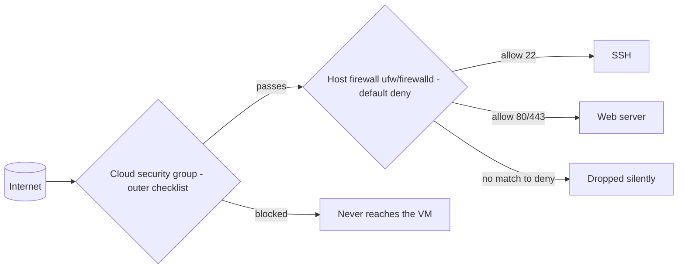

# Firewall Basics (ufw / firewalld)

## 1. What Is This?

A **firewall** controls which network ports/connections are allowed in or out. **ufw** (Uncomplicated Firewall) is Ubuntu/Debian's easy front end; **firewalld** is the RHEL/CentOS/Fedora equivalent.

## 2. Why Is This Needed?

Every open port is a potential way in. A firewall enforces "deny by default, allow only what's needed" — drastically shrinking your attack surface.

## 3. Simple Layman Explanation

A firewall is a **doorman** for your server. By default he turns everyone away, and only opens specific doors (SSH, web) for expected visitors. Everything else stays locked — not because it's suspicious, but because "no one asked for it to be open."

## 4. Technical Explanation

- Both tools manage the kernel's netfilter rules with a friendlier interface.
- Policy: default **deny incoming**, **allow outgoing**, then explicitly allow needed ports (22 SSH, 80 HTTP, 443 HTTPS).
- firewalld uses **zones** (e.g., `public`); ufw uses simple allow/deny rules.
- Cloud servers also have a provider firewall (AWS **security groups**) — both must allow the traffic.

## 5. How It Works Under the Hood

A firewall is just a **checklist the kernel consults for every packet** — and knowing how that checklist is evaluated explains every rule you write:

- **ufw/firewalld are front-ends; the kernel's netfilter does the work.** When a packet arrives, the kernel walks an ordered list of rules and takes the action of the **first match** (allow/accept, deny/drop, reject). ufw and firewalld are friendly generators for those rules — you say `ufw allow 22/tcp`, they translate it into the low-level netfilter/iptables rule. This is why the *order* and the *default policy* matter: the default is the rule that fires when nothing else matched.
- **Default-deny is the whole idea — and it's a whitelist, not a blacklist.** Setting `default deny incoming` means "drop anything I didn't explicitly allow." You then *add back* only what you need (22, 80, 443). This is fundamentally safer than "allow everything, block the bad stuff," because you can't enumerate every threat — but you *can* enumerate the handful of ports you actually use. Everything unknown is denied by construction.
- **Drop vs reject — silence vs a polite "no."** A firewall can **drop** a packet (no reply at all — the port appears to not exist, and scanners time out) or **reject** it (send back "connection refused"). Default-deny firewalls usually *drop*, which makes the server harder to map: an attacker's scan can't even tell a closed-but-filtered port from an unused IP. That silence is a small but real defense.
- **Why "allow SSH before enabling" is a hard rule, not advice.** SSH *is* a network connection subject to the firewall. If you turn on `default deny incoming` without first allowing port 22, the kernel drops your **next** SSH packet — including the ones keeping your current session alive — and you're locked out with no way back except the cloud console. The firewall doesn't know port 22 is "your lifeline"; it's just another port. So the allow-22 rule must exist *before* the deny policy takes effect.
- **Two firewalls in the cloud, both must agree.** On a cloud VM there are *two* checklists in series: the provider's **security group** (outside the VM) and the host firewall (ufw/firewalld, inside). A packet must pass **both**. That's why "the service is running and ufw allows it, but it's still unreachable" is nearly always the security group — the outer checklist dropped it before ufw ever saw it. Conversely, a security group alone doesn't protect against something *already inside* the network; the host firewall is the inner layer (defense in depth, [security-basics](security-basics.md)).
- **Persistence: rules must survive a reboot.** ufw saves rules and re-applies them on boot automatically. firewalld distinguishes **runtime** (live now, lost on reload) from **permanent** (written to disk) — which is why firewalld changes need `--permanent` *and* `--reload`. A rule that only exists at runtime silently vanishes on the next reboot.

So a firewall is an ordered, first-match checklist with a default-deny fallback, mirrored inside and outside the VM — and the classic mistakes (lockout, "unreachable," "rule disappeared") all come straight from those mechanics.

## 6. Diagram



## 7. Real-World Examples

**1. The everyday case.** A new web server should accept SSH and web traffic only. With ufw: allow 22, 80, 443; enable; done. Database port 3306 stays closed to the internet, reachable only internally.

**2. Setting up ufw safely (SSH first!):**

```
$ sudo ufw allow 22/tcp                 # allow SSH BEFORE enabling
Rules updated
$ sudo ufw default deny incoming        # whitelist posture
Default incoming policy changed to 'deny'
$ sudo ufw allow 80,443/tcp             # web
Rules updated
$ sudo ufw enable                       # NOW turn it on
Command may disrupt existing ssh connections. Proceed with operation (y|n)? y
Firewall is active and enabled on system startup
$ sudo ufw status verbose
Status: active
To                         Action      From
--                         ------      ----
22/tcp                     ALLOW IN    Anywhere
80,443/tcp                 ALLOW IN    Anywhere
```

Port 22 was allowed *before* `enable`, so the live SSH session survived — the Section 5 rule in action.

**3. War story — "the app is up, ufw allows 8080, but nobody can reach it."** A team deployed an API on port 8080, ran `ufw allow 8080/tcp`, confirmed the process was listening (`ss -ltnp`), and still got connection timeouts from outside. Hours of debugging the *host* firewall found nothing wrong — because the block was one layer *out*: the AWS **security group** never allowed 8080. The host ufw rule was correct and irrelevant; the packet was dropped by the outer checklist before reaching the VM (Section 5's two-firewalls-in-series). Adding an inbound 8080 rule to the security group fixed it instantly. Lesson: on cloud, always check **both** firewalls — and a *timeout* (not "refused") points at a firewall/security-group drop.

## 8. Worked Walkthrough

Bring up a firewall from scratch without locking yourself out:

```
$ sudo ufw status                       # 1. start disabled
Status: inactive
$ sudo ufw allow OpenSSH                 # 2. ALLOW SSH FIRST (named profile = port 22)
Rules updated
$ sudo ufw default deny incoming         # 3. deny everything else inbound
$ sudo ufw default allow outgoing        #    (outbound stays open)
$ sudo ufw allow 80,443/tcp              # 4. add the services you actually run
$ sudo ufw enable                        # 5. activate (SSH already allowed → safe)
Firewall is active and enabled on system startup
$ sudo ufw status numbered               # 6. review, note rule numbers for deletion
     To                         Action      From
     --                         ------      ----
[ 1] 22/tcp                     ALLOW IN    Anywhere
[ 2] 80,443/tcp                 ALLOW IN    Anywhere
$ sudo ufw delete 2                       # 7. remove a rule by number if needed
```

Allow-SSH-first, then default-deny, then the real services, *then* enable — the exact ordering Section 5 says prevents lockout.

## 9. Commands

ufw (Ubuntu/Debian):

```bash
sudo ufw status verbose            # current rules
sudo ufw default deny incoming     # deny all inbound by default
sudo ufw default allow outgoing    # allow outbound
sudo ufw allow 22/tcp              # allow SSH (do this BEFORE enabling!)
sudo ufw allow 80,443/tcp          # allow web
sudo ufw allow from 203.0.113.5 to any port 22   # SSH from one IP only
sudo ufw enable                    # turn the firewall on
sudo ufw status numbered           # list rules with numbers
sudo ufw delete 3                  # remove rule number 3
```

firewalld (RHEL/Fedora):

```bash
sudo firewall-cmd --state
sudo firewall-cmd --permanent --add-service=ssh
sudo firewall-cmd --permanent --add-service=http --add-service=https
sudo firewall-cmd --reload
sudo firewall-cmd --list-all
```

Sample output (dummy values, for reference):

```text
$ sudo ufw status verbose
Status: active
Logging: on (low)
Default: deny (incoming), allow (outgoing), disabled (routed)
To                         Action      From
--                         ------      ----
22/tcp                     ALLOW IN    Anywhere
80,443/tcp                 ALLOW IN    Anywhere

$ sudo firewall-cmd --list-all
public (active)
  target: default
  services: ssh dhcpv6-client http https
  ports:
```

## 10. Command Explanation

- `ufw default deny incoming` → the crucial default-deny (whitelist) baseline — Section 5.
- `ufw allow 22/tcp` → **always allow SSH before enabling**, or the kernel drops your session (Section 5).
- `ufw allow from <IP> to any port 22` → restrict SSH to a trusted IP (smaller attack surface).
- `ufw enable` → activates the rules (and re-applies them on every boot).
- `ufw status numbered` / `ufw delete N` → list and remove rules by number.
- firewalld: changes need `--permanent` + `--reload` to persist (runtime vs permanent — Section 5); services are named (ssh/http/https).

## 11. In Production (DevOps Context)

- **Two layers, managed as code:** the cloud **security group** (Terraform) and the host firewall (Ansible) are both version-controlled, and reviewers can see exactly what's exposed — no click-ops drift.
- **Security groups do most of the internet-facing work;** host firewalls add defense-in-depth and protect against lateral movement *inside* the VPC (an attacker already on the network).
- **Least-exposure patterns:** SSH restricted to a bastion's IP or a VPN range; databases and internal APIs never open to `0.0.0.0`, only to the app tier's security group.
- **"Unreachable" triage is a reflex:** *timeout* → firewall/security-group drop (check both layers, outer first); *connection refused* → nothing is listening (check the service, Module 05/07). This split (from the war story) saves hours.

## 12. Practice Tasks

1. `sudo ufw status` (or `firewall-cmd --list-all`).
2. Allow SSH **first**, set default-deny, then allow HTTP/HTTPS.
3. Enable the firewall (ensure SSH is allowed first!) and re-verify you're still connected.
4. Add a rule restricting SSH to a single IP, list with `status numbered`, then delete it by number.

## 13. Common Mistakes

- Enabling the firewall **before** allowing SSH → immediate lockout (Section 5).
- Forgetting cloud security groups are a separate, outer firewall layer (the war story).
- firewalld changes without `--permanent` (lost on reload/reboot — runtime vs permanent).
- Confusing a *timeout* (firewall drop) with *connection refused* (nothing listening).

## 14. Troubleshooting

**Locked out after enabling**
- **Cause:** enabled default-deny without an allow rule for port 22.
- **Fix:** access via the cloud serial/console; `sudo ufw allow 22/tcp` (or `sudo ufw disable` temporarily); re-order next time (allow SSH first).

**Service unreachable despite running**
- **Symptom:** the process listens (`ss -ltnp`) but external clients *time out*.
- **Check both layers:** host firewall (`ufw status` / `firewall-cmd --list-all`) **and** the cloud security group — the block is usually the outer one (the war story).

**Rule not persisting (firewalld)**
- **Cause:** you set a runtime-only rule.
- **Fix:** re-add with `--permanent`, then `--reload` (Section 5).

## 15. Best Practices

- Default deny incoming; allow only required ports (whitelist, not blacklist).
- Restrict SSH to known IPs / a bastion where possible.
- Keep a console/second session open when changing rules; allow SSH before enabling.
- Align host firewall with cloud security groups, and manage both as code.

## 16. Connects To

- **Prev:** [SSH Basics](ssh-basics.md). **Next:** [Least Privilege](least-privilege.md).
- **What's listening (attack surface):** [netstat/ss/lsof](../07-networking-basics/netstat-ss-lsof.md), [Ports & Sockets](../07-networking-basics/ports-and-sockets.md).
- **The port you protect first:** [SSH Basics](ssh-basics.md); **cloud security groups:** [Cloud Linux Server](../01-linux-setup/cloud-linux-server.md), [Linux for AWS](../13-real-world-linux-for-devops/linux-for-aws.md).
- **Diagnosing reachability:** [Network Troubleshooting](../07-networking-basics/network-troubleshooting.md).

## 17. Quick Recap

- ufw (Debian/Ubuntu) / firewalld (RHEL) generate netfilter rules; policy is **default-deny + explicit allows** (a whitelist).
- Allow SSH **before** enabling, or the kernel drops your session; open only 22/80/443 as needed.
- Cloud has **two** firewalls in series (security group + host) — both must allow, and *timeout* usually means the outer one dropped it.

## 18. References

- ufw: https://help.ubuntu.com/community/UFW
- firewalld: https://firewalld.org/documentation/
- `man ufw`, `man firewall-cmd`

<!-- NAV-FOOTER -->

---

### 🧭 Navigation

| Previous | Up | Next |
|:---|:---:|---:|
| ⬅️ Prev: [SSH Basics](ssh-basics.md) | ⬆️ Module: [Module 12 — Linux Security Basics](README.md) | ➡️ Next: [Least Privilege](least-privilege.md) |
