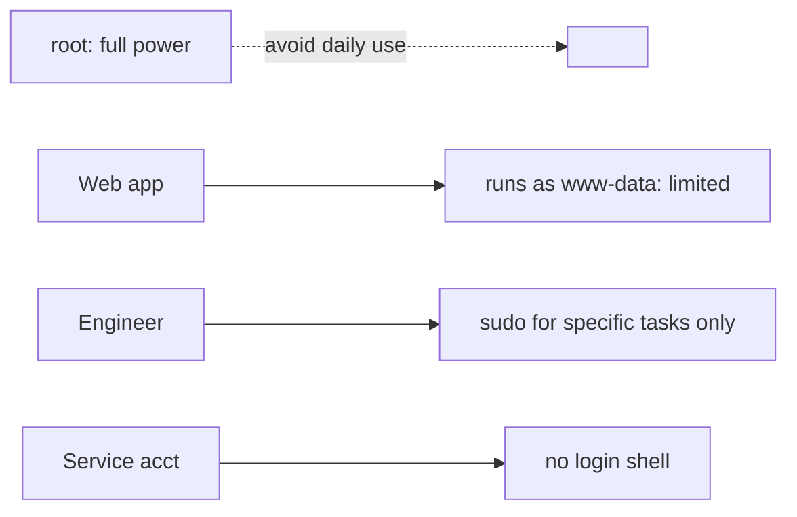

# Least Privilege

## 1. What Is This?

The **principle of least privilege (PoLP)**: every user, process, and service should have only the minimum access needed to do its job — nothing more.

## 2. Why Is This Needed?

If an account or service is compromised, the damage is limited to whatever access it had. Minimal access means minimal blast radius.

## 3. Simple Layman Explanation

Don't give the cleaner the keys to the safe. Give each person only the keys they actually need. If a key is stolen, the thief can open very little.

## 4. Technical Explanation

Applied least privilege:
- Users get only the groups/sudo rights they need (not blanket root).
- Services run as **dedicated, unprivileged users** (e.g., `www-data`), not root.
- Files use tight permissions (Module 04); secrets are `600`.
- sudo grants specific commands, not full root, where possible.
- Service accounts have **no login shell** (`/usr/sbin/nologin`).

## 5. Real-World Example

Nginx runs as `www-data`, not root. If an attacker exploits the web app, they're confined to `www-data`'s limited access — they can't read `/etc/shadow` or other users' data. That confinement is least privilege at work.

## 6. Diagram



## 7. Commands

```bash
sudo -l                              # what can I run as sudo?
id www-data                          # a service account's identity
ps -eo user,comm | sort | uniq -c    # which users run which processes
sudo useradd -r -s /usr/sbin/nologin appsvc   # service account, no login
getent group sudo                    # who has sudo (Debian/Ubuntu)
sudo chmod 600 ~/.ssh/id_ed25519     # secrets readable only by owner
```

Restricting sudo to specific commands (via `visudo`):

```
# Allow 'deploy' to restart only nginx, nothing else
deploy ALL=(root) NOPASSWD: /usr/bin/systemctl restart nginx
```

## 8. Command Explanation

- `sudo -l` → audits your privileges; review regularly.
- `useradd -r -s /usr/sbin/nologin` → creates a **system** service account that can't log in interactively.
- `ps -eo user,comm` → reveals which user each process runs as (look for things needlessly running as root).
- `getent group sudo` → lists who can escalate — keep this list short.
- The sudoers snippet → grants one exact command instead of full root.

## 9. Practice Tasks

1. Run `sudo -l` and review your rights.
2. `ps -eo user,comm | sort -u | head -30` — note services and their users.
3. Create a no-login service account on a test box.
4. List who's in the `sudo`/`wheel` group.

## 10. Common Mistakes

- Running apps/services as root "to avoid permission issues."
- Giving every engineer full sudo.
- Granting `chmod 777` instead of proper ownership/groups.
- Service accounts with real login shells.

## 11. Troubleshooting

- **App needs root for one thing** → grant just that via a specific sudo rule or capabilities, not full root.
- **Permission errors after locking down** → use groups/ownership (Module 04) to grant precise access.

## 12. Best Practices

- Run services as dedicated unprivileged users.
- Grant sudo per-command where feasible; review membership.
- Tight file permissions; secrets `600`.
- Revoke access promptly when no longer needed.

## 13. Quick Recap

- Give the minimum access required — limit the blast radius.
- Services run as non-root; users get scoped sudo.
- Audit privileges (`sudo -l`, group membership) regularly.

## 14. References

- `man sudoers`, `man useradd`
- NIST least privilege: https://csrc.nist.gov/glossary/term/least_privilege
