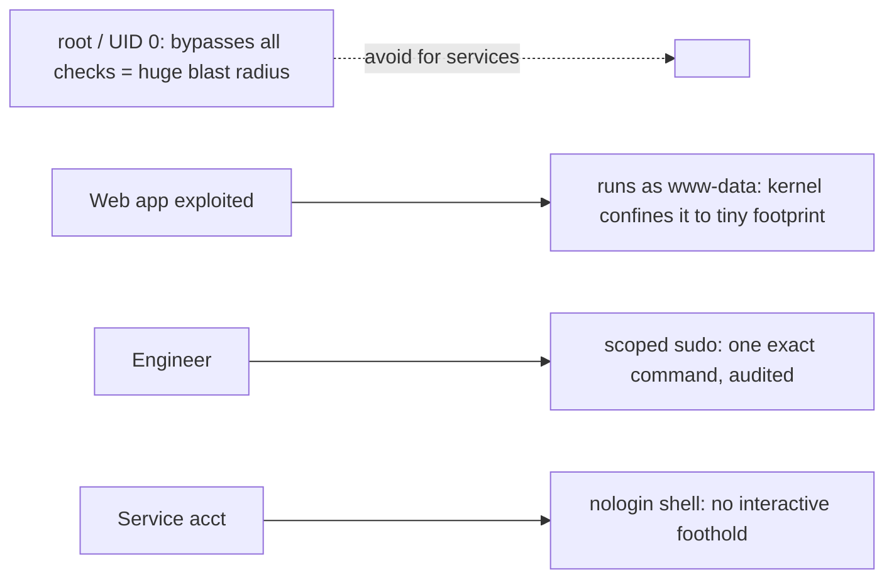

# Least Privilege

## 1. What Is This?

The **principle of least privilege (PoLP)**: every user, process, and service should have only the minimum access needed to do its job — nothing more.

## 2. Why Is This Needed?

If an account or service is compromised, the damage is limited to whatever access it had. Minimal access means minimal blast radius.

## 3. Simple Layman Explanation

Don't give the cleaner the keys to the safe. Give each person only the keys they actually need. If a key is stolen, the thief can open very little — the *harm* of a stolen key is decided long before it's stolen, by how much you handed it.

## 4. Technical Explanation

Applied least privilege:
- Users get only the groups/sudo rights they need (not blanket root).
- Services run as **dedicated, unprivileged users** (e.g., `www-data`), not root.
- Files use tight permissions (Module 04); secrets are `600`.
- sudo grants specific commands, not full root, where possible.
- Service accounts have **no login shell** (`/usr/sbin/nologin`).

## 5. How It Works Under the Hood

Least privilege is really about **blast radius** — the idea that a compromise is inevitable *sometimes*, so you engineer for how *little* it can do:

- **Every process runs *as* a user, and inherits exactly that user's power.** When `sshd` (running as root) accepts your login, it `setuid`s to *your* UID, and from then on everything you do is checked against *your* permissions by the kernel (the same EACCES checks from Module 04). A service is identical: nginx started by root immediately drops to `www-data`, so the worker processes handling untrusted internet traffic have `www-data`'s tiny footprint. If an attacker exploits a bug in that worker, the code they hijack is *already* confined to `www-data` — the kernel won't let it read `/etc/shadow` or another user's files, no matter what the exploit wants. **The confinement is the user identity, enforced by the kernel on every syscall.**
- **Why root is categorically different.** UID 0 (root) *bypasses* the permission checks — the kernel grants it nearly everything. So a compromise of a root process isn't "an attacker with some access"; it's "an attacker with *all* access": read any file, change any config, install a rootkit, cover their tracks. Running a service as root means a single bug in that service = total system compromise. Running it as `www-data` means the same bug = "they can read the web files." That gap *is* least privilege.
- **`nologin` shells: an account that can't be logged into.** A service account with shell `/usr/sbin/nologin` can *own files and run its service*, but if someone tries to `ssh appsvc@host` or `su appsvc`, the shell immediately exits with "This account is currently not available." This removes the account as an interactive foothold: even if its password/key leaked, there's no shell to drop into. Service identities should be *used by the service*, never *logged into by a human*.
- **Scoped sudo vs blanket sudo.** `sudo` is a controlled, audited doorway to more privilege. Blanket `alice ALL=(ALL) ALL` means one compromised `alice` = instant full root. A scoped rule — `deploy ALL=(root) NOPASSWD: /usr/bin/systemctl restart nginx` — lets `deploy` do *exactly one thing* as root and nothing else; the sudo mechanism refuses any other command. Every sudo use is logged to `auth.log`, so scoped sudo also gives you an audit trail of *who ran what as root* (the auditing layer from [security-basics](security-basics.md)).
- **File permissions are the same principle at rest.** `chmod 600 secret.key` says "only the owner can read this"; `chmod 777` says "anyone on the box can read *and write* it." Least privilege on files means secrets are `600`, shared data uses *groups* (Module 04) rather than world-access, and you grant the *narrowest* permission that still works — because every extra bit is a door for a compromised account to walk through.

The unifying model: identity determines power, the kernel enforces it on every operation, and least privilege is the discipline of making each identity's power as small as its job allows — so the day something *is* compromised, the blast radius is a corner, not the whole house.

## 6. Diagram



## 7. Real-World Examples

**1. The everyday case.** Nginx runs as `www-data`, not root. If an attacker exploits the web app, they're confined to `www-data`'s limited access — they can't read `/etc/shadow` or other users' data. That confinement is least privilege at work.

**2. Seeing who runs what, and scoping sudo:**

```
$ ps -eo user,comm | grep -E 'nginx|postgres'
root     nginx                       # master process (binds port 80, then drops)
www-data nginx                       # workers handling traffic run UNPRIVILEGED
postgres postgres                    # DB runs as its own dedicated user, not root
$ sudo -l -U deploy                  # what can the deploy user do as root?
User deploy may run the following commands on web01:
    (root) NOPASSWD: /usr/bin/systemctl restart nginx     # exactly one command
$ id www-data
uid=33(www-data) gid=33(www-data) groups=33(www-data)     # no extra groups = no extra power
```

The internet-facing nginx workers run as `www-data`, and `deploy` can restart nginx but nothing else — blast radius minimized on both fronts (Section 5).

**3. War story — the app that "needed" root and got owned.** A team ran their Node.js app as **root** "so it could bind port 80 and stop fighting permissions." A dependency had a remote-code-execution bug; an attacker exploited it and — because the process was root — read every secret on the box, added an SSH key, and pivoted to the database. Post-incident, the same exploit against the app running as a dedicated `nodeapp` user (with `setcap` to bind low ports, or a reverse proxy in front) would have been contained to `nodeapp`'s files: annoying, not catastrophic. The root cause wasn't the dependency bug — those happen — it was that a single bug had **root's blast radius** instead of a service account's (Section 5).

## 8. Worked Walkthrough

Create a locked-down service account and grant one scoped sudo command:

```
$ sudo useradd -r -s /usr/sbin/nologin appsvc      # 1. system account, NO login shell
$ id appsvc
uid=997(appsvc) gid=997(appsvc) groups=997(appsvc)
$ sudo -u appsvc bash                                # 2. prove it can't be logged into
This account is currently not available.             #    nologin shell refuses — good
$ echo 'deploy ALL=(root) NOPASSWD: /usr/bin/systemctl restart myapp' | sudo tee /etc/sudoers.d/deploy
$ sudo visudo -c                                     # 3. VALIDATE sudoers before trusting it
/etc/sudoers.d/deploy: parsed OK
$ sudo -l -U deploy                                  # 4. confirm the scope
    (root) NOPASSWD: /usr/bin/systemctl restart myapp
$ sudo -u deploy sudo systemctl restart nginx        # 5. anything else is refused
Sorry, user deploy is not allowed to execute '/usr/bin/systemctl restart nginx' as root.
```

The account can't be logged into, and `deploy`'s power is exactly one command — attempts beyond it are rejected and logged (Section 5). Always `visudo -c` so a syntax error can't break sudo entirely.

## 9. Commands

```bash
sudo -l                              # what can I run as sudo?
id www-data                          # a service account's identity (groups = power)
ps -eo user,comm | sort | uniq -c    # which users run which processes
sudo useradd -r -s /usr/sbin/nologin appsvc   # service account, no login
getent group sudo                    # who has sudo (Debian/Ubuntu); 'wheel' on RHEL
sudo chmod 600 ~/.ssh/id_ed25519     # secrets readable only by owner
sudo visudo -c                       # validate sudoers syntax
```

Restricting sudo to specific commands (via `visudo`, ideally a file in `/etc/sudoers.d/`):

```
# Allow 'deploy' to restart only nginx, nothing else
deploy ALL=(root) NOPASSWD: /usr/bin/systemctl restart nginx
```

Sample output (dummy values, for reference):

```text
$ ps -eo user,comm | sort | uniq -c | sort -rn | head -5
     42 root      systemd
     11 www-data  nginx
      6 postgres  postgres
      3 alice     sshd
      1 appsvc    myapp

$ sudo -l
User alice may run the following commands on web01:
    (ALL : ALL) ALL

$ id appsvc
uid=997(appsvc) gid=997(appsvc) groups=997(appsvc)
```

## 10. Command Explanation

- `sudo -l` → audits your privileges; review regularly (the authorization layer).
- `useradd -r -s /usr/sbin/nologin` → creates a **system** service account that can't log in interactively (Section 5).
- `ps -eo user,comm` → reveals which user each process runs as — look for things needlessly running as root.
- `id <user>` → shows the account's groups; extra groups = extra power, so keep them minimal.
- `getent group sudo` / `wheel` → lists who can escalate — keep this list short.
- `visudo -c` → validates sudoers syntax so a typo can't lock out sudo entirely.

## 11. In Production (DevOps Context)

- **Containers embody least privilege:** a container image ships one service, ideally with a `USER` directive so it runs non-root, dropped Linux capabilities, and a read-only filesystem — the app can't touch anything it wasn't given (Module 13).
- **Kubernetes `securityContext`** enforces `runAsNonRoot`, drops capabilities, and blocks privilege escalation, so a compromised pod is boxed in — the same principle, orchestrated.
- **Cloud IAM is least privilege for APIs:** instance roles/service accounts get scoped permissions ("read this bucket" not "admin"), so a stolen credential grants a sliver, not the account (Module 13).
- **Human access is scoped and audited:** engineers get per-command sudo or short-lived elevated roles, and every `sudo` lands in `auth.log` for review — turning "who did what as root?" into an answerable question.

## 12. Practice Tasks

1. Run `sudo -l` and review your rights.
2. `ps -eo user,comm | sort -u | head -30` — note services and their users; flag anything running as root that needn't.
3. Create a `nologin` service account on a test box and confirm `sudo -u <acct> bash` is refused.
4. List who's in the `sudo`/`wheel` group; add a scoped `/etc/sudoers.d/` rule and validate it with `visudo -c`.

## 13. Common Mistakes

- Running apps/services as root "to avoid permission issues" → a single bug becomes total compromise (the war story).
- Giving every engineer full sudo instead of scoped, audited access.
- Granting `chmod 777` instead of proper ownership/groups (Module 04).
- Service accounts with real login shells (leave an interactive foothold).

## 14. Troubleshooting

**App needs root for one thing (e.g., bind port 80)**
- **Fix:** don't run the whole app as root. Grant just that capability (`setcap cap_net_bind_service`), put a reverse proxy in front, or use a scoped sudo rule — never blanket root (Section 5).

**Permission errors after locking down**
- **Cause:** the service account lacks access to a file/dir it legitimately needs.
- **Fix:** use **groups and ownership** (Module 04) to grant the precise access, rather than widening permissions or reverting to root.

**A user can't run a command you scoped**
- **Check:** `sudo -l -U <user>` shows exactly what's allowed; `visudo -c` confirms the sudoers file parses. Match the command path exactly (`/usr/bin/systemctl`, not `systemctl`).

## 15. Best Practices

- Run services as dedicated, unprivileged users with `nologin` shells.
- Grant sudo per-command where feasible; keep `sudo`/`wheel` membership short and review it.
- Tight file permissions; secrets `600`, shared data via groups, never `777`.
- Revoke access promptly when no longer needed; prefer capabilities/proxies over "just run as root."

## 16. Connects To

- **Prev:** [Firewall Basics (ufw / firewalld)](firewall-basics-ufw-firewalld.md). **Next:** [Security Best Practices](security-best-practices.md).
- **The permission model it rests on:** [File Permissions](../04-users-groups-permissions/file-permissions.md), [Users & Groups](../04-users-groups-permissions/users-and-groups.md), [sudo & Root](../04-users-groups-permissions/sudo-and-root.md).
- **Which user runs a process:** [Process Basics](../05-processes-and-services/process-basics.md), [ps/top/htop](../05-processes-and-services/ps-top-htop.md).
- **Least privilege in the cloud/containers:** [Linux for Docker](../13-real-world-linux-for-devops/linux-for-docker.md), [Linux for Kubernetes](../13-real-world-linux-for-devops/linux-for-kubernetes.md).

## 17. Quick Recap

- Identity determines power; the kernel enforces it on every operation — least privilege shrinks the **blast radius** of the inevitable compromise.
- Services run as dedicated non-root users with `nologin` shells; root's power makes any root-service bug catastrophic.
- Scope sudo to exact commands (audited in `auth.log`); tight file permissions, secrets `600`, never `777`.

## 18. References

- `man sudoers`, `man useradd`
- NIST least privilege: https://csrc.nist.gov/glossary/term/least_privilege

<!-- NAV-FOOTER -->

---

### 🧭 Navigation

| Previous | Up | Next |
|:---|:---:|---:|
| ⬅️ Prev: [Firewall Basics (ufw / firewalld)](firewall-basics-ufw-firewalld.md) | ⬆️ Module: [Module 12 — Linux Security Basics](README.md) | ➡️ Next: [Security Best Practices](security-best-practices.md) |
